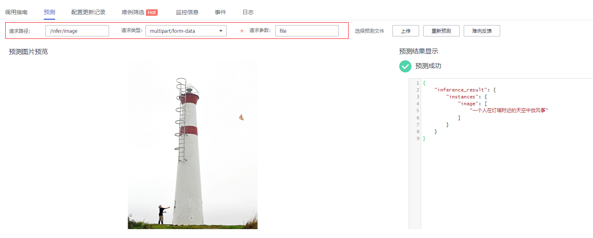

# Caption 使用微调组件在云端快速发布并部署为在线服务

## 前期准备
* 确认当前环境安装了最新版本的 modelarts sdk（>=1.4.13）与微调组件引擎包
* 确认已参照`script/docker/modelarts/README.md`完成自定义镜像构建
* 调整`app_config_deploy.yaml`，将其中参数根据实际情况修改为合法值（注意`deployment`与`swr_endpoint`字段），上传至OBS
* 根据快速上手完成caption微调任务，并将得到的模型文件通过快速上手下载代码中的`src/scripts/export_caption.py`脚本导出为MindIR格式，导出后有一个mindir后缀模型文件和一个包含参数文件的文件夹
```shell
opt_caption_graph.mindir
opt_caption_variables/data_0
```
* 从快速上手需要的数据中获取词表文件`ids_to_tokens_zh.json`并重命名为`vocab.json`
* 将得到的模型与词表拷贝至`model_caption`路径下，并将包含配置文件和模型的文件夹`model_caption`上传至OBS

最终在OBS上model_caption文件夹的文件树如下：
```shell
    model_caption \
       ----service.py
       ----caption.py
       ----opt_caption_graph.mindir
       ----opt_caption_variables \
       --------data_0
       ----vocab.json
       ----start.sh
       ----requirements.txt
```

## 发布与部署
假设文件夹与配置文件上传至OBS后路径为`obs://HwAiUser/model_caption/`与`obs://HwAiUser/app_config_deploy.yaml`，执行以下命令（注意提前执行fm registry完成微调组件注册）
```shell
# modelarts sdk提供的模型服务相关接口为同步接口，发布与部署的命令会较为耗时
export obs_prefix="obs://HwAiUser"
fm config --scenario modelarts --app_config ${obs_prefix}/app_config_caption_deploy.yaml
fm publish --model_version 0.0.1 --model_path ${obs_prefix}/model_caption/
# 假设 publish 命令执行后得到的 model_id 为：ce7732ff-e388-44ec-903b-14460aeaf797
export published_model_id="ce7732ff-e388-44ec-903b-14460aeaf797"
fm deploy --model_id ${published_model_id}
```
## 注意事项
* 导出脚本执行命令参考
```shell
python code/src/scripts/export_caption.py --ckpt_file="***.ckpt"
# 若自定义模型文件名称，请保证模型文件与参数文件夹前缀一致
```
* `--model_path`指定的OBS模型文件夹被加载到容器中的路径为：/home/mind/model/
* 镜像的入口为：/home/mind/model/start.sh
* 部署完成后会获得API调用地址，拼接上在`service.py`脚本中预定义的URL`/infer/image`，即可进行调用
* caption模型部署后，会进行预热，一般需要等待几分钟API才可用
* 在modelarts的前端页面可参照以下配置完成预测

