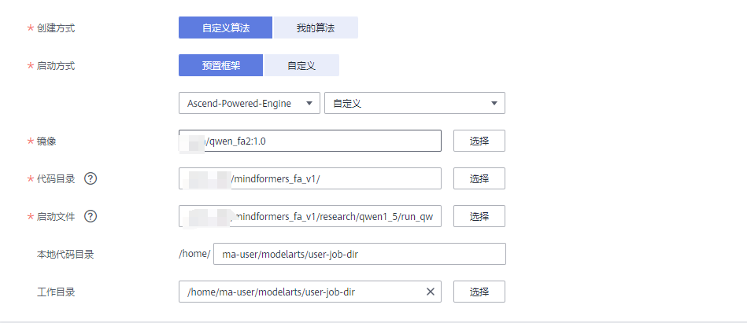
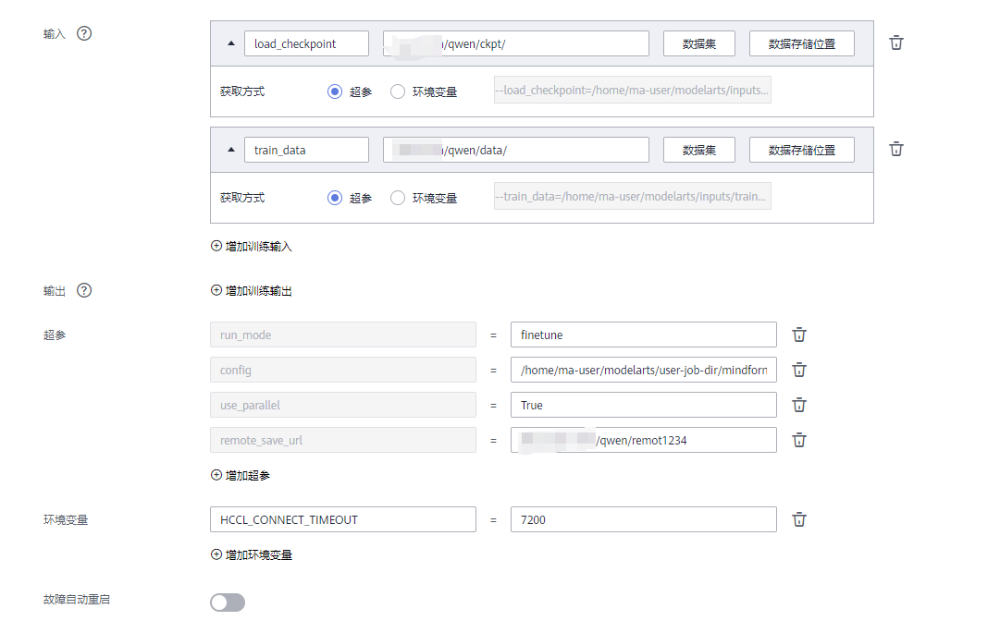

<a name="92e5f4cc"></a>
# Qwen1.5-72B 910A 微调/全参微调/推理指导

<a name="cbb060fd"></a>
## 环境准备

<a name="b6780d84"></a>
### 环境要求

- 硬件：Atlas 800-9000
- MindSpore：2.2.13
- MindFormers 版本：1.0
- Python：3.8+

<a name="2a42a6b7"></a>
### 基础镜像获取

拉取武汉镜像仓镜像：`swr.cn-central-221.ovaijisuan.com/mindformers/mindformers1.0.2_mindspore2.2.13:20240408`

<a name="ae27e195"></a>
### 拉取 MindFormer 仓库切换相应版本

- 进入环境拉取 mindformers 仓库：`cd /home/ma-user/work && git clone https://gitee.com/mindspore/mindformers.git`
- 切换分支：`cd mindforme && git checkpoint origin/r1.0`
- 安装依赖：`pip install -r requirements.txt`
- 配置环境变量：`pip uninstall mindformers && export PYTHONPATH=/home/ma-user/work/mindformers:$PYTHONPATH`

<a name="8d220f8d"></a>
### acctransformer 安装

在 Atlas 800 机型上进行模型的训练、微调、推理，需要安装 acctransformer 套件使能 FlashAttention。执行以下命令克隆源码到本地：

```bash
git clone -b fa1_for_ms2.2.11 https://gitee.com/mindspore/acctransformer.git
```

安装方法如下：

1. 直接克隆源码使用，使用源码方式调用时设置 PYTHONPATH。

```bash
export PYTHONPATH=/yourcodepath/acctransformer/train:$PYTHONPATH
```

2. 安装 whl 包使用

```bash
cd train
python setup.py install
```

<br />or

```bash
cd train
bash build.sh
pip install dist/acctransformer-1.0.0-py3-none-any.whl
```

<a name="3977a6d5"></a>
### RANK_TABLE_FILE 准备

**单节点**<br />运行`python mindformers/tools/hccl_tools.py`，生成 RANK_TABLE_FILE 文件

```bash
# 运行如下命令，生成当前机器的RANK_TABLE_FILE的json文件
python ./mindformers/tools/hccl_tools.py --device_num "[0,8)"
```

> 注：若使用 ModelArts 的 notebook 环境，可从 `/user/config/jobstart_hccl.json` 路径下直接获取 rank table，无需手动生成

`RANK_TABLE_FILE` 单机 8 卡参考样例:

```json
{
    "version": "1.0",
    "server_count": "1",
    "server_list": [
        {
            "server_id": "xx.xx.xx.xx",
            "device": [
                {"device_id": "0","device_ip": "192.1.27.6","rank_id": "0"},
                {"device_id": "1","device_ip": "192.2.27.6","rank_id": "1"},
                {"device_id": "2","device_ip": "192.3.27.6","rank_id": "2"},
                {"device_id": "3","device_ip": "192.4.27.6","rank_id": "3"},
                {"device_id": "4","device_ip": "192.1.27.7","rank_id": "4"},
                {"device_id": "5","device_ip": "192.2.27.7","rank_id": "5"},
                {"device_id": "6","device_ip": "192.3.27.7","rank_id": "6"},
                {"device_id": "7","device_ip": "192.4.27.7","rank_id": "7"}],
             "host_nic_ip": "reserve"
        }
    ],
    "status": "completed"
}
```

**多节点**<br />以 2 机 16 卡为例：

1. 在每个机器上运行`mindformers/tools/hccl_tools.py`，生成各自的`RANK_TABLE_FILE`文件。

```bash
# 运行如下命令，生成当前机器的RANK_TABLE_FILE的json文件
python ./mindformers/tools/hccl_tools.py --device_num "[0,8)" --server_ip xx.xx.xx.xx
```

> 注：需要根据机器的 ip 地址指定 --server_ip，避免由于不同机器 server_ip 不同，导致多节点间通信失败。

2. 将不同机器的`RANK_TABLE_FILE`文件全部拷贝到同一台机器上，运行`mindformers/tools/merge_hccl.py`合并`RANK_TABLE_FILE`文件

```bash
# 运行如下命令，合并每个机器的RANK_TABLE_FILE文件。
python ./mindformers/tools/merge_hccl.py hccl*.json
```

3. 将合并后的`RANK_TABLE_FILE`文件拷贝到所有机器中，保证不同机器上的`RANK_TABLE_FILE`相同。<br />`RANK_TABLE_FILE` 双机 16 卡参考样例:

```json
{
    "version": "1.0",
    "server_count": "2",
    "server_list": [
        {
            "server_id": "xx.xx.xx.xx",
            "device": [
                {
                    "device_id": "0", "device_ip": "192.168.0.0", "rank_id": "0"
                },
                {
                    "device_id": "1", "device_ip": "192.168.1.0", "rank_id": "1"
                },
                {
                    "device_id": "2", "device_ip": "192.168.2.0", "rank_id": "2"
                },
                {
                    "device_id": "3", "device_ip": "192.168.3.0", "rank_id": "3"
                },
                {
                    "device_id": "4", "device_ip": "192.168.0.1", "rank_id": "4"
                },
                {
                    "device_id": "5", "device_ip": "192.168.1.1", "rank_id": "5"
                },
                {
                    "device_id": "6", "device_ip": "192.168.2.1", "rank_id": "6"
                },
                {
                    "device_id": "7", "device_ip": "192.168.3.1", "rank_id": "7"
                }
            ],
            "host_nic_ip": "reserve"
        },
        {
            "server_id": "xx.xx.xx.xx",
            "device": [
                {
                    "device_id": "0", "device_ip": "192.168.0.1", "rank_id": "8"
                },
                {
                    "device_id": "1", "device_ip": "192.168.1.1", "rank_id": "9"
                },
                {
                    "device_id": "2", "device_ip": "192.168.2.1", "rank_id": "10"
                },
                {
                    "device_id": "3", "device_ip": "192.168.3.1", "rank_id": "11"
                },
                {
                    "device_id": "4", "device_ip": "192.168.0.2", "rank_id": "12"
                },
                {
                    "device_id": "5", "device_ip": "192.168.1.2", "rank_id": "13"
                },
                {
                    "device_id": "6", "device_ip": "192.168.2.2", "rank_id": "14"
                },
                {
                    "device_id": "7", "device_ip": "192.168.3.2", "rank_id": "15"
                }
            ],
            "host_nic_ip": "reserve"
        }
    ],
    "status": "completed"
}
```

> 注：多机多卡获取 RANK_TABLE_FILE 步骤同 2 机 16 卡。

<a name="34834bee"></a>
### 权重准备

**torch 权重转 mindspore 权重**<br />从 huggingface 下载预训练权重后根据以下步骤进行权重转换，需要下载整个工程，huggingface 权重的链接如下：

- [Qwen1.5-72B](https://huggingface.co/Qwen/Qwen1.5-72B/tree/main)

> ps. 请将整个文件目录全部下载

转模型环境要求

```bash
pip install torch transformers transformers_stream_generator einops accelerate
# transformers版本不低于4.37.2
```

下载完成后，执行`python3 research/qwen1_5/convert_weight.py`转换脚本，将 huggingface 的权重转换为完整的 ckpt 权重。

```bash
python research/qwen1_5/convert_weight.py \
--torch_ckpt_dir <torch_ckpt_dir> \
--mindspore_ckpt_path <mindspore_ckpt_path>
# 参数说明：
# torch_ckpt_dir: 下载的整个Qwen1.5-72b文件夹，代码会自动索引模型权重，此参数必须。
# mindspore_ckpt_path: 转换后的输出文件存放路径。可选，如果不给出，默认为`./transform.ckpt`
```

<a name="9a0ca25d"></a>
### 数据集准备

目前提供 alpaca 数据集的预处理脚本用于全参微调任务。

数据集下载链接如下：

- [alpaca_data](https://github.com/tatsu-lab/stanford_alpaca/blob/main/alpaca_data.json)<br />执行`python alpaca_converter.py`将原始数据集转换为指定格式。

```bash
python qwen1_5/alpaca_converter.py \
--data_path path/alpaca_data.json \
--output_path /path/alpaca-data-messages.json
# 参数说明
# data_path: 存放alpaca数据的路径
# output_path: 输出转换后对话格式的数据路径
```

转换后格式样例：

```json
  {
    "type": "chatml",
    "messages": [
      {
        "role": "system",
        "content": "You are a helpful assistant."
      },
      {
        "role": "user",
        "content": "Give three tips for staying healthy."
      },
      {
        "role": "assistant",
        "content": "1.Eat a balanced diet and make sure to include plenty of fruits and vegetables. \n2. Exercise regularly to keep your body active and strong. \n3. Get enough sleep and maintain a consistent sleep schedule."
      }
    ],
    "source": "unknown"
  },
```

执行`python qwen1_5_preprocess.py`进行数据预处理和 Mindrecord 数据生成。

> ps.改代码无法覆盖已生成的 mindrecode 文件，否则会报错，请检查保存地址

```bash
python qwen1_5/qwen1_5_preprocess.py \
--input_glob /path/alpaca-data-messages.json \
--vocab_file /path/vocab.json \
--merges_file /path/merges.txt \
--seq_length 2048 \ #此样例lora用的2k数据，finetune用的4k数据，生成不同长度数据集修改此处
--output_file /path/alpaca-messages.mindrecord
```

<a name="44fe78bc"></a>
## 全参微调

<a name="a82a88aa"></a>
### 全参微调操作步骤

请参照数据集准备章节获取 mindrecord 格式的 alpaca 数据集，参照模型权重准备章节获取权重。

1. 当前支持模型已提供 yaml 文件，下文以 Qwen-7B 为例，即使用`run_qwen1_5_72b_finetune.yaml`配置文件进行介绍，请根据实际使用模型更改配置文件。

> 当前模型已支持使用 Flash Attention 算法进行全参微调,修改配置文档即可

2. 修改`run_qwen1_5_72b_finetune.yaml`中相关配置，默认开启自动权重转换，使用完整权重。

    ```yaml
    load_checkpoint: '/path/model_dir' # 使用完整权重，权重按照`model_dir/rank_0/xxx.ckpt`格式存放
    auto_trans_ckpt: True              # 打开自动权重转换
    use_parallel: True
    run_mode: 'finetune'

    model:
      seq_length: 4096 # 与数据集长度保持相同
      use_flash_attention: True # 开启fa

    train_dataset: &train_dataset
      data_loader:
        type: MindDataset
        dataset_dir: "/path/alpaca.mindrecord"  # 配置训练数据集文件夹路径，写到alpaca.mindrecord，目录下确认要有alpaca.mindrecord和alpaca.mindrecord.bd

    # 128卡分布式策略配置
    parallel_config:
      data_parallel: 2
      model_parallel: 4
      pipeline_stage: 16
      micro_batch_num: 64
      vocab_emb_dp: True
      gradient_aggregation_group: 4

    context:
      max_device_memory: "31GB"
    ```

3. 启动全参微调
    裸机运行

      ```bash
      # node1
      cd mindformers/research
      bash run_multinode.sh "python qwen1_5/run_qwen1_5.py \
      --config qwen1_5/run_qwen1_5_72b_finetune.yaml \
      --load_checkpoint /path/model_dir \
      --use_parallel True \
      --run_mode finetune \
      --auto_trans_ckpt True \
      --train_data /path/alpaca.mindrecord" \
      RANK_TABLE_FILE [0,8] 128

      # node2
      cd mindformers/research
      bash run_multinode.sh "python qwen1_5/run_qwen1_5.py \
      --config qwen1_5/run_qwen1_5_72b_finetune.yaml \
      --load_checkpoint /path/model_dir \
      --use_parallel True \
      --run_mode finetune \
      --auto_trans_ckpt True \
      --train_data /path/alpaca.mindrecord" \
      RANK_TABLE_FILE [8,16] 128
      #中间3-15节点修改RANK_TABLE_FILE [x,x+8] 128
      ...
      # node16
      cd mindformers/research
      bash run_multinode.sh "python qwen1_5/run_qwen1_5.py \
      --config qwen1_5/run_qwen1_5_72b_finetune.yaml \
      --load_checkpoint /path/model_dir \
      --use_parallel True \
      --run_mode finetune \
      --auto_trans_ckpt True \
      --train_data /path/alpaca.mindrecord" \
      RANK_TABLE_FILE [122,128] 128
      # 参数说明
      # config: 配置文件路径
      # load_checkpoint: 权重文件夹路径，权重按照'model_dir/rank_0/xxx.ckpt'格式存放
      # auto_trans_ckpt: 自动权重转换开关
      # run_mode: 运行模式，微调时设置为finetune
      # train_data: 训练数据集文件夹路径
      ```

    aicc运行
     
     

| config | task | datasets | seqlength | train performance | device_num |
| --- | --- | --- | --- | --- | --- |
| run_qwen1_5_72b_finetune.yaml | text_generation | alpaca | 4096 | 110 tokens/s/卡 | 128 |

> ps.<br />load_checkpoint 指定 ckpt 的加载路径，也可通过 yaml 配置文件中 load_checkpoint 字段确定。路径径格式需满足{model_dir}/rank_{0...7}/{ckpt_name}.ckpt，只需指定到{model_dir}该层目录即可

<a name="29d6625d"></a>
## MindSpore 推理

注意事项：

当前支持模型已提供 yaml 文件，下文以 qwen1_5 为例，即使用 run_qwen1_5_72b_infer.yaml 配置文件进行介绍，请根据实际使用模型更改配置文件。

运行下面的代码需要在 research/qwen1_5 目录下，或者先将 research/qwen1_5 目录所在路径加入到 PYTHONPATH 环境变量中。

<a name="58376239"></a>
### 基于高阶接口推理

#### 八卡推理

1. 推理配置参考<br />开启自动切分，指定权重及词表文件，开启181并行策略 修改显存为31GB

    ```yaml
    load_checkpoint: '/path/model_dir'       # 使用完整权重，权重存放格式为"model_dir/rank_0/xxx.ckpt"
    auto_trans_ckpt: True                    # 打开自动权重转换
    use_past: True                           # 使用增量推理
    use_parallel: True                       # 使用并行模式

    processor:
    tokenizer:
    vocab_file: "/{path}/vocab.json"     # vocab.json文件路径
    merges_file: "/{path}/merges.txt"    # merges.txt文件路径
    parallel_config:
    data_parallel: 1
    model_parallel: 8
    pipeline_stage: 1
    micro_batch_num: 1
    vocab_emb_dp: True
    gradient_aggregation_group: 4
    context:
    max_device_memory: "31GB"
    ```

> 注：可配置 model_config:param_init_type 为 float32 提高推理精度，但同时会影响在线推理性能。

1. 启动推理<br />aicc环境通过 env|grep RANK_TABLE_FILE 取得rank table file

    ```bash
      cd mindformers/research
      # 推理命令中参数会覆盖yaml文件中的相同参数
      python qwen1_5/run_qwen1_5.py
      --config qwen1_5/run_qwen1_5_72b_infer.yaml
      --run_mode predict
      --use_parallel True
      --load_checkpoint /path/model_dir
      --auto_trans_ckpt True
      --predict_data 帮助我制定一份去上海的旅游攻略"
      RANK_TABLE_FILE [0,8] 8

     # 推理结果:  
     # 帮助我制定一份去上海的旅游攻略，但括最点、美舍、住等信息，
     # 上海是中国最繁华的城市之一。拥有丰富的历史和文化，以及现代化的建筑和设施。以下是一份去上海的旅游攻略。包括景点、美食、住宿等信息
     # 景点:
     # 1. 外滩:上海最著名的景点之一。可以欣赏到黄浦江两岸的美景。
     # 2. 上海博物馆:展示了上海的历史和文化，包括古代文物、艺术品和现代科技。
     # 3. 东方明珠塔:上海的标志性建筑之一，可以俯瞰整个城市。
     # 4. 上海城隍庙:一座古老的寺庙，是上海最著名的景点之一。
     # 5. 上海科技馆:展示了最新的科技和发明，适合家庭和儿童。
     # 美食:
     # 1. 小笼包:上海最著名的美食之一，是一种蒸熟的小包子，里面包着肉馅和汤汁。
     # 2. 红烧肉:上海的传统美食之一。是一道用猪肉和酱油烧制的菜肴。
     # 3. 生煎包:类似于小笼包，但煎制而成，口感更加酥脆。
     # 4. 糖醋排骨:一道酸甜可口的菜肴，用排骨和糖醋汁烧制而成。
     # 5. 蟹黄汤包:一种用蟹黄和猪肉馅制成的小包子，口感鲜美。
     # 住宿:
     # 1. 上海外滩华尔道夫酒店：位于外滩，是一家五星级酒店，提供豪华的住宿和设施。
     # 2. 上海和平饭店: 位于外滩，是一家历史悠久的酒店，提供豪华的住宿和设施。
     # 3. 上海瑞吉酒店: 位于市中心，是一家五星级酒店，提供豪华的住宿和设施。
     # 4. 上海浦东香格里拉大酒店: 位于浦东新区,是一家五星级酒店,提供豪华的住宿和设施。
     # 5. 上海锦江之星清息: 位于市中心，是一家经济型酒店，提供干净舒适的住宿和设施。
     # 以上是一份去上海的旅游攻略，希望对您有所帮助。
    ```

<a name="f8dcaae4"></a>
#### mindspore lite 推理

1. mslite推理转换mindir<br />修改配置文件:

    ```yaml
    model:
      model_config:
        seq_length: 8192
        batch_size: 1
        checkpoint_name_or_path: "/path/to/run_qwen1_5_72b_infer.yaml"
    ```

    ```bash
    cd ./research/qwen1_5/
    rm -rf output/*
    bash ../run_singlenode.sh "
    python run_qwen1_5.py
    --run_mode export
    --config run_qwen1_5_72b_infer.yaml
    --use_parallel True
    --auto_trans_ckpt True
    --load_checkpoint /path/to/qwen_1.5_72b.ckpt" \ #可选上一步autotraansform后的ckpt
    <RANK_TABLE_FILE> [0,8] 8
    ```

运行成功后可在output下生成 mindir_full_checkpoint 以及indir_inc_checkpoint/

2. 运行mslite推理

在./research/qwen1_5/下 添加 lite.ini 文件

  ```ini
  [ascend_context]
  provider=ge
  rank_table_file=<RANK_TABLE_FILE>  #此处修改为具体路径

  [ge_session_options]
  ge.externalWeight=1
  ge.exec.atomicCleanPolicy=1
  ge.event=notify
  ge.exec.staticMemoryPolicy=2
  ge.exec.formatMode=1
  ge.exec.precision_mode=must_keep_origin_dtype
  ```

运行lite推理

```bash
rm -rf output/log/rank_*
bash ../run_singlenode.sh "
python run_qwen1_5_mslite_infer.py
--mindir_root_dir output
--seq_length 8192
--batch_size 1
--do_sample False
--vocab_file /path/vocab.json
--merge_file /path/merges.txt
--ge_config_path lite.ini
--predict_data 帮助我制定一份去上海的旅游攻略 "
<RANK_TABLE_FILE> [0,8] 8

# 推理结果:  
# 帮助我制定一份去上海的旅游攻略，但括最点、美舍、住等信息，
# 上海是中国最繁华的城市之一。拥有丰富的历史和文化，以及现代化的建筑和设施。以下是一份去上海的旅游攻略。包括景点、美食、住宿等信息
# 景点:
# 1. 外滩:上海最著名的景点之一。可以欣赏到黄浦江两岸的美景。
# 2. 上海博物馆:展示了上海的历史和文化，包括古代文物、艺术品和现代科技。
# 3. 东方明珠塔:上海的标志性建筑之一，可以俯瞰整个城市。
# 4. 上海城隍庙:一座古老的寺庙，是上海最著名的景点之一。
# 5. 上海科技馆:展示了最新的科技和发明，适合家庭和儿童。
# 美食:
# 1. 小笼包:上海最著名的美食之一，是一种蒸熟的小包子，里面包着肉馅和汤汁。
# 2. 红烧肉:上海的传统美食之一。是一道用猪肉和酱油烧制的菜肴。
# 3. 生煎包:类似于小笼包，但煎制而成，口感更加酥脆。
# 4. 糖醋排骨:一道酸甜可口的菜肴，用排骨和糖醋汁烧制而成。
# 5. 蟹黄汤包:一种用蟹黄和猪肉馅制成的小包子，口感鲜美。
# 住宿:
# 1. 上海外滩华尔道夫酒店：位于外滩，是一家五星级酒店，提供豪华的住宿和设施。
# 2. 上海和平饭店: 位于外滩，是一家历史悠久的酒店，提供豪华的住宿和设施。
# 3. 上海瑞吉酒店: 位于市中心，是一家五星级酒店，提供豪华的住宿和设施。
# 4. 上海浦东香格里拉大酒店: 位于浦东新区,是一家五星级酒店,提供豪华的住宿和设施。
# 5. 上海锦江之星清息: 位于市中心，是一家经济型酒店，提供干净舒适的住宿和设施。
# 以上是一份去上海的旅游攻略，希望对您有所帮助。
```
