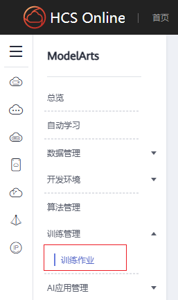
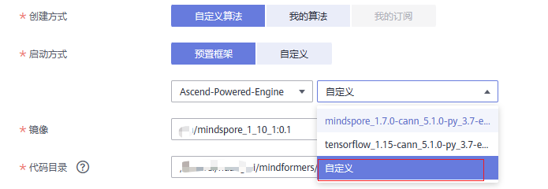
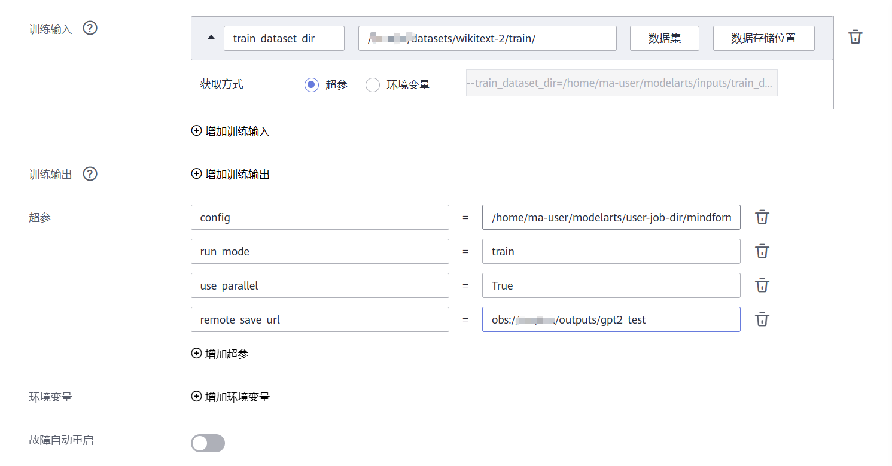
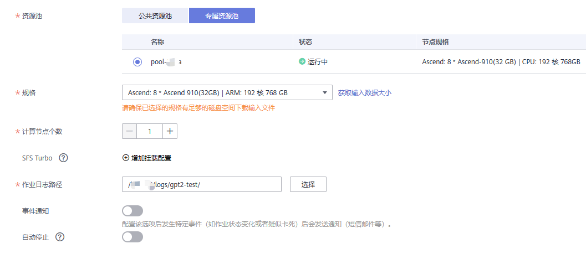
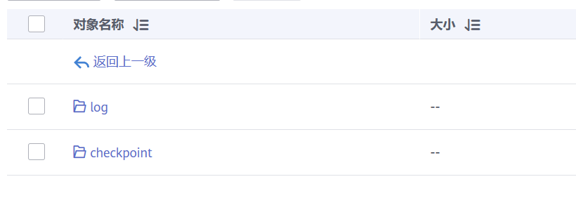

# AICC上使用Mindformers教程

AICC，人工智能计算中心，提供[ModelArts](https://support.huaweicloud.com/bestpractice-modelarts/modelarts_10_0080.html)服务和Ascend 910算力。

MindFormers套件当前具备AICC适配的特性，用户在ModelArts平台启动集群训练时，无需额外增加上云训练适配代码，套件将自动进行：

1. 从OBS拉取训练所需数据至训练镜像
2. 统一训练输出路径
3. 训练后将训练输出整体回传指定文件夹
4. 训练过程中，通过回调函数将训练输出回传至指定文件夹

下面将提供在AICC上完成GPT2模型的训练样例，用户可以按照此样例学习MindFormers套件在ModelArts训练作业上的使用方式

使用前需对AICC的[AI开发平台ModelArts](https://support.huaweicloud.com/modelarts/index.html)，[对象存储服务 OBS](https://support.huaweicloud.com/obs/index.html)和[容器镜像服务 SWR](https://support.huaweicloud.com/swr/index.html)有初步的了解

## 准备工作

### 模型准备

本案例使用MindFormers套件内的GPT2模型作为教程案例，请参照[GPT2 model card](https://gitee.com/mindspore/mindformers/blob/dev/docs/model_cards/gpt2.md)进行模型代码和训练数据集的准备

- 模型代码

```bash
git clone https://gitee.com/mindspore/mindformers.git
```

- 数据集预处理
    以Wikitext2数据集为例

  - 数据集下载：[WikiText2数据集](https://gitee.com/link?target=https%3A%2F%2Fs3.amazonaws.com%2Fresearch.metamind.io%2Fwikitext%2Fwikitext-2-v1.zip)
  - 词表下载：[vocab.json](https://gitee.com/link?target=https%3A%2F%2Fhuggingface.co%2Fgpt2%2Fblob%2Fmain%2Fvocab.json)，[merges.txt](https://gitee.com/link?target=https%3A%2F%2Fhuggingface.co%2Fgpt2%2Fresolve%2Fmain%2Fmerges.txt)
  - 参考[ModelZoo](https://gitee.com/mindspore/models/tree/master/research/nlp/gpt2#language-modeling-%E8%AF%AD%E8%A8%80%E5%BB%BA%E6%A8%A1%E4%BB%BB%E5%8A%A1)，将数据处理成Mindrecord格式。注：训练数据处理时，长度应等于模型接收长度加一

### 云上对象存储准备

准备好代码与数据集后，需将其上传至AICC的对象存储服务上

- 进入`存储`标题下的`对象存储服务`，将训练代码和数据等输入内容上传，并准备好用于回传训练输出的路径；
    
- 进入`对象存储服务`的任一文件夹，点击界面上方的复制按钮，即可获得当前文件夹的OBS路径映射
    如：obs://huawei/xxx/mindformers

    

### 镜像准备

ModelArts上的所提供的预置训练镜像，通常MindSpore的版本较为老旧，不满足MindFormers套件的运行需求，所以通常需要自定义镜像，安装合适版本的MindSpore包以运行套件

我们在[镜像仓库网 (hqcases.com)](http://ai.hqcases.com/mirrors.html)上发布了一些经过验证的**标准镜像版本**，可以通过几行简单的docker命令的形式，直接使用验证过的标准镜像拉起MindFormers套件的训练任务，而无需进行较为繁琐的自定义镜像并上传的步骤

- 在镜像仓库网上找到当前版本的[MindFormers镜像](http://ai.hqcases.com/detail/78.html)，打开显示如下


> 可以复制其docker pull命令拉取该镜像，在镜像仓库网上的镜像权限均为公开，无需登录可以直接拉取
>
> 注：当前版本镜像为每日开发版，稳定版将在后续推送至镜像仓库网

* 镜像列表
```text
1. swr.cn-central-221.ovaijisuan.com/mindformers/mindformers_dev_mindspore_1_11:mindformers_0.6.0dev_20230615_py39
2. swr.cn-central-221.ovaijisuan.com/mindformers/mindformers_dev_mindspore_1_10_1:mindformers_0.6.0dev_20230615_py39
3. swr.cn-central-221.ovaijisuan.com/mindformers/mindformers_dev_mindspore_1_10_1:mindformers_0.6.0dev_20230615_py37
```

- 在一台准备好docker引擎的计算机上，root用户执行docker pull命令拉取该镜像

```bash
docker pull swr.cn-central-221.ovaijisuan.com/mindformers/mindformers_dev_mindspore_1_10_1:mindformers_0.6.0dev_20230615_py39
```

- 进入`容器镜像服务`的控制台界面，找到`客户端上传`镜像按钮，将会提示如何上传上一步拉取的镜像


按照操作执行完后将会在该镜像列表中看到上传的镜像，并能够在ModelArts中选取

## 拉起训练流程

### 训练作业配置

- 进入`ModelArts控制台`的训练作业功能区，点击页面右上角的`创建作业`按钮，开始创建训练作业
    
    

下面将较为详细地解释拉起训练时**所需的每个入参及其含义**

- 名称/描述/新建实验名称：按实际填写即可
- 创建方式/启动方式：
    我们需要使用之前准备的镜像环境，但拉取方式仍可复用预置命令
    
    这里选择自定义，即可在镜像一栏选择之前准备并上传好的镜像
- 代码目录选择上传的代码路径
- 启动文件选择run_mindformers.py脚本
    > 注意，在AICC上拉起训练任务时，即使需要多卡启动，也只需指定python脚本作为启动文件，作业启动引擎会自动完成ranktable与环境变量等内容的配置，并多进程拉起python脚本，不需要额外的分布式启动shell脚本
- 本地代码目录与工作目录保持默认即可



- 训练输入：
  - `train_dataset_dir`：选择数据集在云上的数据存储文件夹位置，作为训练数据集的路径；该参数名应当能够被启动脚本识别
    > 选择后，ModelArts将会在拉起训练作业时，将**云上的数据集拉取至指定的目录下**，然后将该入参的值从云上路径修改为镜像上被拉取的路径
- 训练输出：
  - 启用时，需要将文件输出在超参传入的路径下，训练结束后会进行回传；
  - 由于输出通常较大，默认的路径下磁盘空间不足，我们会将输出统一放在/cahce目录下，因此MindFormers**不启用**该项参数
- 必需超参：
  - `config`：填入对应config文件在镜像上的绝对路径，在本案例下为 `/home/ma-user/modelarts/user-job-dir/mindformers/configs/gpt2/run_gpt2.yaml`
  - `run_mode`：train，训练模式，将不加载权重进行训练
  - `use_parallel`：True，在所选规格参数大于1卡时需要设置为True，单卡运行为False
  - `remote_save_url`：obs://xxx/xxx/outputs/gpt2_test，填入对象存储服务中实际准备的OBS路径，**训练输出将会回传至该路径下**
  > 其余可选超参可参照 `run_mindformers.py` 脚本入参进行选择



- 按需求选择资源池，规格和计算节点数，配置作业日志回传路径
  卡数=单节点规格数 \* 节点数

### 训练结果查看

完成后拉起训练作业，耐心等待输出作业日志
如果一切正常，将会输出如下日志：


**并且在 `remote_save_url` 参数所对应的OBS路径下有输出回传**：


### 常见问题

- 启动作业后报**module not found**：
  标准镜像可能缺少几个pip安装包，将相应的包名加入代码主目录下的requirements.txt文件下，拉起时会自动读取并安装相应的包
