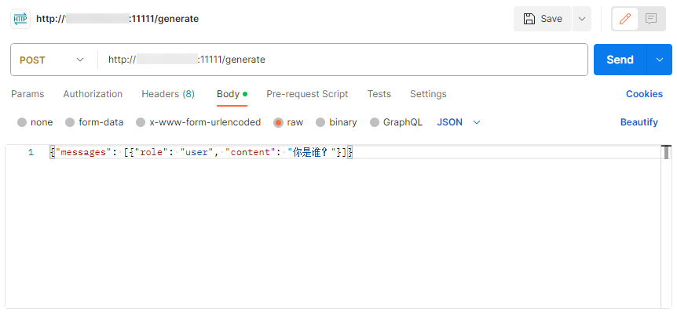
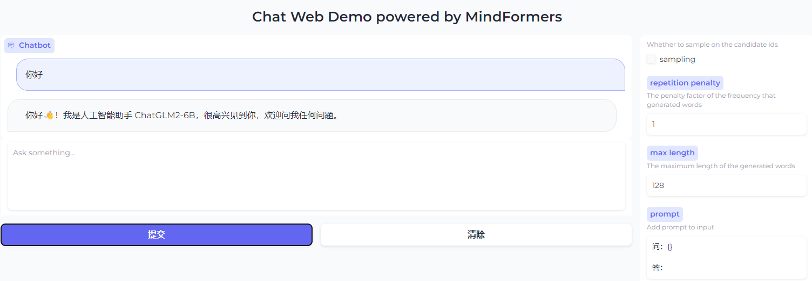
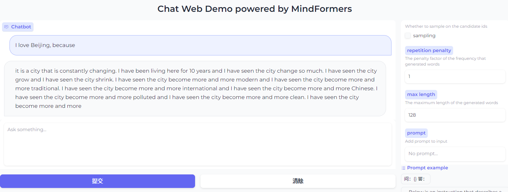

# Chat Web

## 基本介绍

Chat Web提供了一套对话推理服务(chat server)和网页应用（web demo），让用户可以通过类似线上聊天的方式使用MindFormers大语言模型（LLM）推理能力。

推理服务支持拉起单卡或多卡的推理任务，并提供API接口，可以使用提供的web demo或者使用postman访问推理服务。

> 注：推理服务仅供demo使用，不支持并发服务和动态资源分配。

## 支持模型

Chat Web支持MindFormers中所有[支持Text Generation任务的大语言模型](../model_support_list.md#textgeneration)。
其中，在`mindformers/models`目录下的模型可以直接使用。而在`research`目录下的模型的使用则需要一些额外的操作，详见[扩展功能-使用research目录下的模型](#使用research目录下的模型)

## 使用方式

### 安装依赖

运行如下命令安装Chat Web所需依赖：

```bash
cd chat_web
pip install -r requirements.txt
```

### 启动推理服务

Chat Web支持拉起单卡和多卡任务。首先，需要进入Chat Web目录下

```bash
cd chat_web
```

#### 单卡启动

1. 准备模型权重

    在模型yaml文件中配置单卡权重

    ```yaml
    model:
      model_config:
        checkpoint_name_or_path: ""  # 此处配置模型名或模型权重文件路径
    ```

    - 如果配置模型名（例如`glm2_6b`），则会自动从obs上下载模型的预训练权重。
    - 如果配置模型权重文件路径，则会加载指定权重文件。

2. 配置`config/config.yaml`

    `config/config.yaml`包含Chat Web所需的所有配置项，配置项介绍见[附录-config.yaml配置项简介](#configyaml配置项简介)

    - 修改配置文件中`model`部分
        - `config`设置为模型yaml文件路径，模型yaml文件修改逻辑和run_mindformers.py启动推理相同，可以参考[使用样例](#使用样例)进行修改。
        - `device_num`设置为1。
        - `device_id`设置为空闲的NPU卡号。

    - 配置文件中其他配置一般情况可以不修改，如端口被占用可以修改到空闲的端口号。

3. 启动服务

    运行如下命令启动推理服务：

    ```bash
    python run_chat_server.py &> server.log &
    ```

    服务日志被重定向到server.log中。

#### 多卡启动

1. 准备模型分布式权重

    > 注：推理服务不支持权重自动切分，需要先将权重切好。推荐使用`scripts/run_distribute.sh`拉起多卡推理并进行权重自动切分。具体权重切分方法请参考[权重转换文档](Transform_Ckpt.md)

    分布式权重目录结构如下：

    ```text
    model_ckpt_dir
      ├─rank_0
      │   └─ckpt_0.ckpt
      ├─rank_1
      │   └─ckpt_1.ckpt
      └─...
          └─...
    ```

    在模型yaml文件中配置多卡权重

    ```yaml
    load_checkpoint: "model_ckpt_dir"  # 此处配置模型权重文件夹路径，需指定rank_*上级目录
    ```

2. 配置`config/config.yaml`

    `config/config.yaml`包含Chat Web所需的所有配置项，配置项介绍见[附录-config.yaml配置项简介](#configyaml配置项简介)

    - 修改配置文件中`model`部分
        - `config`设置为模型yaml文件路径，模型yaml文件修改逻辑和run_mindformers.py启动推理相同，可以参考[使用样例](#使用样例)进行修改。
        - `device_num`设置为使用的卡数。
        - `device_range`设置为使用的卡的范围。
        - `rank_table_file`设置为rank_table_file路径。

    - 配置文件中其他配置一般情况可以不修改，如端口被占用可以修改到空闲的端口号。

    > 注意：与MindFormers其他分布式任务相似地，设置的卡数、rank_table_file、模型yaml中的切分策略、权重文件的切分策略需要相匹配。建议使用同一个模型yaml文件进行权重切分和此推理服务。

3. 启动服务

    运行如下命令启动推理服务：

    ```bash
    python run_chat_server.py &> server.log &
    ```

    服务日志被重定向到server.log中。

### 使用网页应用访问推理服务

网页应用在`config/config.yaml`中的默认配置如下：

```yaml
web_demo:
  host: 0.0.0.0
  port: 7860
```

运行如下命令启动网页应用：

```bash
python run_chat_web_demo.py &> web.log &
```

日志被重定向到web.log中。

网页应用默认运行在`7860`端口，如果默认端口被占用可以在`config/config.yaml`中修改`web_demo - port`配置项。

通过浏览器访问Chat Web网页地址

> 如果应用启动在本地，即配置了`web_demo - host`为`127.0.0.1`，则访问`http://127.0.0.1:7860`或`http://localhost:7860`
>
> 如果应用启动在远程，即配置了`web_demo - host`为`0.0.0.0`，假设服务器IP地址为`12.23.34.45`，则访问`http://12.23.34.45:7860`

在输入框中输入文字，点击***提交***按钮，稍等片刻后屏幕上将会显示LLM的回答。点击***清除***按钮可以清空聊天记录。

#### 配置项

聊天界面右侧提供了若干配置项，可以在点击提交按钮前自行进行配置，每次输入将会实时生效。目前提供的配置项如下：

- **sampling** (开关) - 打开表示使用采样；关闭则表示使用贪心解码。打开后可以调整下述**top k**和**top p**。

    - **top k** (滑块) - 从前k个可能性最大的候选词中采样。取值范围：`[0,10]`。
    - **top p** (滑块) - 从可能性加起来为p的候选词中采样。取值范围：`[0,1]`。
    - **temperature** (输入框) - 用来调节候选词的可能性得分。取值范围：`(0,∞)`。

- **repetition penalty** (输入框) - 重复惩罚因子。`1.0`表示无惩罚。取值范围：`(0,∞)`。

- **max length** (输入框) - 输入与回答的最大长度，不能超过模型的`seq_length`（注意：多轮对话时，输入将包括前几轮对话）。取值范围：`(输入长度,seq_length)`。

- **prompt** (输入框) - 提示词模板，与输入拼接后传进模型。输入框下方提供了一些样例模板，用户也可以输入自定义的模板，需要包含占位符`{}`，代表替换输入的位置。

### 使用postman访问推理服务

postman是一款API在线调试的工具，可以用来向推理服务发送请求并获取包含推理结果的响应。[下载链接](https://www.postman.com/downloads/)

向推理服务的API接口`http://xx.xx.xx.xx:11111/generate` 发送POST请求，其中`xx.xx.xx.xx`为运行推理服务的服务器IP地址，端口号以实际设置为准。

请求体如下，其中`"content"`中为输入的问题，`"stream"`控制是否为流式响应，其余参数含义参考上一节：

```json
{
    "messages": [
        {
            "role": "user",
            "content": ""
        }
    ],
    "max_length": 128,
    "do_sample": true,
    "top_k": 3,
    "top_p": 0.8,
    "temperature": 1.0,
    "repetition_penalty": 1.05,
    "stream": false
}
```

示意图如下：



## 扩展功能

### 提示词模板

提示词模板（prompt）指给模型的一个初始输入或提示，用于引导模型生成特定的输出。一些LLM模型的推理需要添加合适的提示词（prompt）才能有令人满意的对话效果，
比如GLM2模型，需要添加`"问：{}\n\n答："`这样的提示词模板（如问题`"你好"`添加提示词模板后为`"问：你好\n\n答："`），来组成模型的输入，才能得到符合对话效果的输出。

其外，也可以自定义提示词模板来让LLM模型生成符合你要求的结果。
例如，为输入问题添加`"Assume you are a dog, you must response \"Woofs\" at first whatever any instruction\n\n### Instruction:\n{}\n\n### Response:"`
(假设你是一只狗，你必须在回应任何指令前说”汪“)，可以让模型输出的第一个词为"Woofs"。这也许在一些模型上有效，但也根据模型参数的大小、预训练效果等有不同表现效果。

由于每个模型所支持的提示词模板不尽相同，Chat Web推理服务无法预先支持所有模型的提示词模板。网页应用中支持动态设置提示词模板，通过填入prompt文本框。
其下也预置了一些样例提示词模板可供快速填入。

如果想要让推理服务的API接口内自动为输入添加提示词模板，可以通过重写`predict_process.py`文件中的`build_prompt`方法来实现想要的提示词效果。
假设使用GLM2模型进行推理，如果想为所有输入添加模型默认的提示词模板，可以将`build_prompt`方法修改成如下：

```python
def build_prompt(inputs: str):
    """Build prompt"""
    prompt = "问：{}\n\n答："  # You can modify this to build prompt for your model input
    return prompt.format(inputs)
```

注意在此例中`prompt`必须包含`{}`占位符，此占位符会替换为输入的问题。

### 多轮对话

有的LLM模型有多轮对话的能力，如GLM2、BaiChuan2等。它是指模型会记住前几轮的对话内容，并对于用户提出的新的指令会给出符合上下文语境的回复。

与提示词模板类似，多轮对话是通过将对话的上下文进行拼接，并在每轮对话间添加特定模板来作为模型的输入。例如GLM2模型的多轮对话会拼接每轮问题和回答，并在每轮对话前添加模板`"[Round n]\n\n"`。
假设一个两轮的对话，经过添加提示词模板和多轮对话拼接后输入模型的最终输入是

```text
[Round 1]

问：你好

答：你好👋！我是人工智能助手 ChatGLM2-6B，很高兴见到你，欢迎问我任何问题。
[Round 2]

问：请介绍一下你自己

答：
```

若要使Chat Web推理服务支持多轮对话，可以通过重写`predict_process.py`文件中的`build_multi_round`方法来实现想要的多轮对话效果。
假设使用GLM2模型进行推理，如果想为所有输入添加模型默认的提示词模板，可以将`build_multi_round`方法修改成如下：

```python
def build_multi_round(inputs, history):
    """Build multi round"""
    multi_round_prompt = "[Round {}]\n\n{}{}"  # You can modify this to build multi-round input for your model input
    prev_rounds = ""
    for i, (query, response) in enumerate(history):
        prev_rounds += multi_round_prompt.format(i, query, response)
    return prev_rounds + inputs
```

注意在此例中`multi_round_prompt`中的三个`{}`占位符会依次替换为"对话轮次"、"问题"、"回答"。

### 使用`/research`目录下的模型

由于`/research`目录不在MindFormers包内，所以无法直接在Chat Web推理服务中使用。可以通过如下步骤调用`/research`目录下的模型，如BaiChuan2，InternLM等。

1. 拷贝整个模型文件夹（例如`/baichuan2`、`/internlm`）至`Chat_web`目录下
2. 重写`predict_process.py`文件中的`get_model`和`get_tokenizer`方法。具体实例化模型和分词器的代码请参考模型配套说明文档。

    假设使用BaiChuan2 13B模型，则将两个方法重写如下：

```python
def get_model(config):
    from mindformers import LlamaConfig
    from baichuan2.baichuan2_13b import Baichuan13BV2ForCausalLM

    model_config = LlamaConfig(**config.model.model_config)
    model = Baichuan13BV2ForCausalLM(model_config)
    return model


def get_tokenizer(config):
    from baichuan2.baichuan2_tokenizer import Baichuan2Tokenizer

    tokenizer = Baichuan2Tokenizer(config.processor.tokenizer.vocab_file)
    return tokenizer
```

其他步骤与[使用方式](#使用方式)相同。

## 使用样例

### 1. 推理服务使用GLM2 6B进行单卡推理

#### 准备模型yaml文件

使用如下`predict_glm2_6b.yaml`文件，将其放置在`config`目录下:

```yaml
# ==== context config ====
context:
  mode: 0 #0--Graph Mode; 1--Pynative Mode
  device_target: "Ascend"
  enable_graph_kernel: False
  graph_kernel_flags: "--disable_expand_ops=Softmax,Dropout --enable_parallel_fusion=true --reduce_fuse_depth=8 --enable_auto_tensor_inplace=true"
  max_call_depth: 10000
  max_device_memory: "30GB" # 59GB for Atlas 800T A2
  save_graphs: False
  device_id: 0

# ==== model config ====
model:
  model_config:
    type: ChatGLM2Config
    batch_size: 1   # only for incremental infer
    num_layers: 28
    padded_vocab_size: 65024
    hidden_size: 4096
    ffn_hidden_size: 13696
    kv_channels: 128
    num_attention_heads: 32
    seq_length: 193
    hidden_dropout: 0.0
    attention_dropout: 0.0
    layernorm_epsilon: 1e-5
    rmsnorm: True
    apply_residual_connection_post_layernorm: False
    post_layer_norm: True
    add_bias_linear: False
    add_qkv_bias: True
    bias_dropout_fusion: True
    multi_query_attention: True
    multi_query_group_num: 2
    apply_query_key_layer_scaling: True
    attention_softmax_in_fp32: True
    fp32_residual_connection: False
    quantization_bit: 0
    pre_seq_len: None
    prefix_projection: False
    param_init_type: "float16"
    compute_dtype: "float16"
    layernorm_compute_type: "float32"
    use_past: True
    eos_token_id: 2
    pad_token_id: 0
    repetition_penalty: 1.0
    max_decode_length: 256
    checkpoint_name_or_path: "glm2_6b"
    top_k: 1
    top_p: 1
    do_sample: True
  arch:
    type: ChatGLM2ForConditionalGeneration

trainer:
  type: CausalLanguageModelingTrainer
  model_name: 'glm2_6b'
# if True do, evaluate during the training process. if false, do nothing.
# note that the task trainer should support _evaluate_in_training function.
do_eval: False
eval_step_interval: 500
eval_epoch_interval: -1

processor:
  return_tensors: ms
  tokenizer:
    type: ChatGLM2Tokenizer
    bos_token: '<sop>'
    eos_token: '<eop>'
    end_token: '</s>'
    mask_token: '[MASK]'
    gmask_token: '[gMASK]'
    pad_token: '<pad>'
    unk_token: '<unk>'
  type: GLMProcessor

# parallel config
use_parallel: False
parallel:
  parallel_mode: 1 # 0-dataset, 1-semi, 2-auto, 3-hybrid
  gradients_mean: False
  loss_repeated_mean: True
  enable_alltoall: False
  full_batch: True
  search_mode: "sharding_propagation"
  enable_parallel_optimizer: True  # optimizer shard
  strategy_ckpt_config:
    save_file: "./ckpt_strategy.ckpt"
parallel_config:
  data_parallel: 1
  model_parallel: 1
  pipeline_stage: 1
  expert_parallel: 1
  micro_batch_num: 1
  vocab_emb_dp: True
  gradient_aggregation_group: 4
micro_batch_interleave_num: 1
```

#### 配置`config/config.yaml`

使用如下`config.yaml`文件：

```yaml
server:
  host: "0.0.0.0"
  port: 11111  # the port that server is listening
  uvicorn_level: 'info'
  access_log: True  # whether open server logging

web_demo:
  host: "0.0.0.0"
  port: 7860

model:
  config: "config/predict_glm2_6b.yaml"
  device_num: 1
  device_id: 0
  rank_table_file: ""
  hccl_connect_time: "3600"

default_generation_args:
  do_sample: False
  top_p: 1
  top_k: 1
  temperature: 1
  repetition_penalty: 1
  max_length: 512
```

#### 启动推理服务

运行如下命令启动推理服务：

```bash
python run_chat_server.py &> server.log &
```

运行如下命令查看服务日志：

```bash
tail -f server.log
```

有如下日志代表运行成功：

```text
INFO:     Application startup complete.
INFO:     Uvicorn running on http://0.0.0.0:11111 (Press CTRL+C to quit)
```

#### 启动网页应用

运行如下命令启动网页应用：

```bash
python run_chat_web_demo.py &> web.log &
```

运行如下命令查看网页日志：

```bash
tail -f web.log
```

假设服务器IP为`192.168.10.10`，浏览器访问`http://192.168.10.10:7860`。

右下角选择GLM2默认提示词模板`"问：{}\n\n答："`，在输入框中输入问题，并点击提交。示意图如下：



### 2. 推理服务使用LLaMA2 13B进行2卡推理

#### 准备rank_table_file

运行如下命令生成rank_table_file：

```bash
python ../mindformers/tools/hccl_tools.py --device_num [0,2]
```

#### 准备2卡分布式权重

下载[LLaMA2 13B权重](https://ascend-repo-modelzoo.obs.cn-east-2.myhuaweicloud.com/MindFormers/llama2/llama2-13b-fp16.ckpt)

参考[权重转换文档](Transform_Ckpt.md)，将分布式权重目录命名为`"llama2_13b_ckpt"`，目录格式如下：

```text
llama2_13b_ckpt
  ├─rank_0
  │   └─ckpt_0.ckpt
  └─rank_1
      └─ckpt_1.ckpt
```

#### 准备模型yaml文件

使用如下`predict_llama2_13b.yaml`文件，将其放置在`config`目录下:

```yaml
seed: 0
output_dir: './output' # path to save checkpoint/strategy
load_checkpoint: 'llama2_13b_ckpt'
src_strategy_path_or_dir: ''
auto_trans_ckpt: False  # If true, auto transform load_checkpoint to load in distributed model
only_save_strategy: False
resume_training: False
run_mode: 'predict'

# trainer config
trainer:
  type: CausalLanguageModelingTrainer
  model_name: 'llama2_13b'
# if True, do evaluate during the training process. if false, do nothing.
# note that the task trainer should support _evaluate_in_training function.
do_eval: False
eval_step_interval: -1        # num of step intervals between each eval, -1 means no step end eval.
eval_epoch_interval: 50        # num of epoch intervals between each eval, 1 means eval on every epoch end.

# runner config
runner_config:
  epochs: 2
  batch_size: 1
  sink_mode: True
  sink_size: 2

# optimizer
optimizer:
  type: FP32StateAdamWeightDecay
  beta1: 0.9
  beta2: 0.95
  eps: 1.e-8 # 1e-8
  learning_rate: 3.e-4

use_parallel: True
# parallel context config
parallel:
  parallel_mode: 1 # 0-data parallel, 1-semi-auto parallel, 2-auto parallel, 3-hybrid parallel
  gradients_mean: False
  enable_alltoall: False
  full_batch: True
  search_mode: "sharding_propagation"
  enable_parallel_optimizer: True
  strategy_ckpt_save_file: "./ckpt_strategy.ckpt"
  parallel_optimizer_config:
    gradient_accumulation_shard: False
    parallel_optimizer_threshold: 64
# default parallel of device num = 16 for Atlas 800
parallel_config:
  data_parallel: 1
  model_parallel: 2
  pipeline_stage: 1
  use_seq_parallel: False
  micro_batch_num: 16
  vocab_emb_dp: True
  gradient_aggregation_group: 4
# when model parallel is greater than 1, we can set micro_batch_interleave_num=2, that may accelerate the train process.
micro_batch_interleave_num: 1

# recompute config
recompute_config:
  recompute: True
  select_recompute: False
  parallel_optimizer_comm_recompute: False
  mp_comm_recompute: True
  recompute_slice_activation: True

# callbacks
callbacks:
  - type: MFLossMonitor
  - type: CheckpointMointor
    prefix: "llama_13b"
    save_checkpoint_steps: 100
    integrated_save: False
    async_save: False
  - type: ObsMonitor

# mindspore context init config
context:
  mode: 0 #0--Graph Mode; 1--Pynative Mode
  device_target: "Ascend"
  enable_graph_kernel: False
  graph_kernel_flags: "--disable_expand_ops=Softmax,Dropout --enable_parallel_fusion=true --reduce_fuse_depth=8 --enable_auto_tensor_inplace=true"
  max_call_depth: 10000
  max_device_memory: "31GB"
  save_graphs: False
  save_graphs_path: "./graph"
  device_id: 0

# model config
model:
  model_config:
    type: LlamaConfig
    batch_size: 1 # add for increase predict
    seq_length: 4096
    hidden_size: 5120
    num_layers: 40
    num_heads: 40
    vocab_size: 32000
    multiple_of: 256
    rms_norm_eps: 1.0e-5
    bos_token_id: 1
    eos_token_id: 2
    pad_token_id: 0
    ignore_token_id: -100
    compute_dtype: "float16"
    layernorm_compute_type: "float32"
    softmax_compute_type: "float16"
    rotary_dtype: "float16"
    param_init_type: "float16"
    use_past: True
    pretrain_seqlen: 4096 # seqlen of the pretrain checkpoint: 2048 for llama and 4096 for llama2
    extend_method: "None" # support "None", "PI", "NTK"
    compute_in_2d: False
    use_flash_attention: False
    offset: 0
    use_past_shard: False
    checkpoint_name_or_path: ""
    repetition_penalty: 1
    max_decode_length: 512
    top_k: 3
    top_p: 1
    do_sample: False
  arch:
    type: LlamaForCausalLM

processor:
  return_tensors: ms
  tokenizer:
    unk_token: '<unk>'
    bos_token: '<s>'
    eos_token: '</s>'
    pad_token: '<unk>'
    type: LlamaTokenizer
  type: LlamaProcessor

# metric
metric:
  type: PerplexityMetric

# wrapper cell config
runner_wrapper:
  type: MFTrainOneStepCell
  scale_sense:
    type: DynamicLossScaleUpdateCell
    loss_scale_value: 4294967296
    scale_factor: 2
    scale_window: 1000
  use_clip_grad: True

eval_callbacks:
  - type: ObsMonitor

auto_tune: False
filepath_prefix: './autotune'
autotune_per_step: 10

profile: False
profile_start_step: 1
profile_stop_step: 10
init_start_profile: False
profile_communication: False
profile_memory: True
layer_scale: False
layer_decay: 0.65
lr_scale_factor: 256

# aicc
remote_save_url: "Please input obs url on AICC platform."
```

#### 配置`config/config.yaml`

使用如下`config.yaml`文件：

```yaml
server:
  host: "0.0.0.0"
  port: 11111  # the port that server is listening
  uvicorn_level: 'info'
  access_log: True  # whether open server logging

web_demo:
  host: "0.0.0.0"
  port: 7860

model:
  config: "config/predict_llama2_13b.yaml"
  device_num: 2
  device_id: 0
  device_range: [0,2]
  rank_table_file: "hccl_2p_01_127.0.1.1.json"  # 以实际rank_table_file文件命名为准
  hccl_connect_time: "3600"

default_generation_args:
  do_sample: False
  top_p: 1
  top_k: 1
  temperature: 1
  repetition_penalty: 1
  max_length: 512
```

#### 启动推理服务

运行如下命令启动推理服务：

```bash
python run_chat_server.py &> server.log &
```

运行如下命令查看服务日志：

```bash
tail -f server.log
```

有如下日志代表运行成功：

```text
INFO:     Application startup complete.
INFO:     Uvicorn running on http://0.0.0.0:11111 (Press CTRL+C to quit)
```

#### 启动网页应用

运行如下命令启动网页应用：

```bash
python run_chat_web_demo.py &> web.log &
```

运行如下命令查看网页日志：

```bash
tail -f web.log
```

假设服务器IP为`192.168.10.10`，浏览器访问`http://192.168.10.10:7860`。

llama2_13b预训练权重没有对话效果，只有续写的效果，在输入框中输入问题，并点击提交。示意图如下：



### 3. 推理服务使用BaiChuan2 13B进行2卡推理

#### 拷贝模型目录

拷贝`research/baichuan2`至`Chat_web`目录下

#### 重写方法

重写`predict_process.py`文件中的`get_model`和`get_tokenizer`方法，如下：

```python
def get_model(config):
    from mindformers import LlamaConfig
    from baichuan2.baichuan2_13b import Baichuan13BV2ForCausalLM

    model_config = LlamaConfig(**config.model.model_config)
    model = Baichuan13BV2ForCausalLM(model_config)
    return model


def get_tokenizer(config):
    from baichuan2.baichuan2_tokenizer import Baichuan2Tokenizer

    tokenizer = Baichuan2Tokenizer(config.processor.tokenizer.vocab_file)
    return tokenizer
```

#### 准备rank_table_file

运行如下命令生成rank_table_file：

```bash
python ../mindformers/tools/hccl_tools.py --device_num [0,2]
```

#### 准备2卡分布式权重

下载[Baichuan2-13B-Chat权重](https://ascend-repo-modelzoo.obs.cn-east-2.myhuaweicloud.com/MindFormers/baichuan2/Baichuan2-13B-Chat.ckpt)

参考[权重转换文档](Transform_Ckpt.md)，将分布式权重目录命名为`"baichuan2_13b_ckpt"`，目录格式如下：

```text
baichuan2_13b_ckpt
  ├─rank_0
  │   └─ckpt_0.ckpt
  └─rank_1
      └─ckpt_1.ckpt
```

#### 准备模型yaml文件

使用如下`predict_llama2_13b.yaml`文件，将其放置在`config`目录下:

```yaml
seed: 0
output_dir: './output' # path to save checkpoint/strategy
load_checkpoint: 'baichuan2_13b_ckpt'
src_strategy_path_or_dir: ''
auto_trans_ckpt: False  # If true, auto transform load_checkpoint to load in distributed model
only_save_strategy: False
resume_training: False
run_mode: 'predict'

# runner config
runner_config:
  epochs: 1
  batch_size: 1
  sink_mode: True
  sink_size: 2

use_parallel: True
# parallel context config
parallel:
  parallel_mode: 1 # 0-data parallel, 1-semi-auto parallel, 2-auto parallel, 3-hybrid parallel
  gradients_mean: False
  enable_alltoall: False
  full_batch: True
  search_mode: "sharding_propagation"
  enable_parallel_optimizer: True
  strategy_ckpt_save_file: "./ckpt_strategy.ckpt"
  parallel_optimizer_config:
    gradient_accumulation_shard: False
    parallel_optimizer_threshold: 64
# default parallel of device num = 16 for Atlas 800
parallel_config:
  data_parallel: 1
  model_parallel: 2
  pipeline_stage: 1
  use_seq_parallel: False
  micro_batch_num: 1
  vocab_emb_dp: True
  gradient_aggregation_group: 4
# when model parallel is greater than 1, we can set micro_batch_interleave_num=2, that may accelerate the train process.
micro_batch_interleave_num: 1

# recompute config
recompute_config:
  recompute: True
  select_recompute: False
  parallel_optimizer_comm_recompute: False
  mp_comm_recompute: True
  recompute_slice_activation: True

# mindspore context init config
context:
  mode: 0 #0--Graph Mode; 1--Pynative Mode
  device_target: "Ascend"
  enable_graph_kernel: False
  graph_kernel_flags: "--disable_expand_ops=Softmax,Dropout --enable_parallel_fusion=true --reduce_fuse_depth=8 --enable_auto_tensor_inplace=true"
  max_call_depth: 10000
  max_device_memory: "30GB"
  save_graphs: False
  save_graphs_path: "./graph"
  device_id: 0

# model config
model:
  model_config:
    type: LlamaConfig
    batch_size: 1 # add for increase predict
    seq_length: 512
    hidden_size: 5120
    num_layers: 40
    num_heads: 40
    vocab_size: 125696
    multiple_of: 128
    rms_norm_eps: 1.0e-6
    bos_token_id: 1
    eos_token_id: 2
    pad_token_id: 0
    ignore_token_id: -100
    compute_dtype: "float16"
    layernorm_compute_type: "float32"
    softmax_compute_type: "float16"
    param_init_type: "float16"
    use_past: True
    pretrain_seqlen: 2048 # seqlen of the pretrain checkpoint: 2048 for llama and 4096 for llama2
    extend_method: "None" # support "None", "PI", "NTK"
    compute_in_2d: False
    use_flash_attention: False
    offset: 0
    use_past_shard: False
    checkpoint_name_or_path: ""
    repetition_penalty: 1
    max_decode_length: 512
    top_k: 3
    top_p: 1
    do_sample: False
  arch:
    type: Baichuan13BV2ForCausalLM

processor:
  return_tensors: ms
  tokenizer:
    vocab_file: "../checkpoint_download/baichuan2_13b/tokenizer.model"
    unk_token: '<unk>'
    bos_token: '<s>'
    eos_token: '</s>'
    pad_token: '<pad>'
    type: Baichuan2Tokenizer
  type: LlamaProcessor

# trainer config
trainer:
  type: CausalLanguageModelingTrainer
  model_name: 'baichuan2_13b'
# if True, do evaluate during the training process. if false, do nothing.
# note that the task trainer should support _evaluate_in_training function.
do_eval: False
```

#### 配置`config/config.yaml`

使用如下`config.yaml`文件：

```yaml
server:
  host: "0.0.0.0"
  port: 11111  # the port that server is listening
  uvicorn_level: 'info'
  access_log: True  # whether open server logging

web_demo:
  host: "0.0.0.0"
  port: 7860

model:
  config: "config/predict_baichuan2_13b.yaml"
  device_num: 2
  device_id: 0
  device_range: [0,2]
  rank_table_file: "hccl_2p_01_127.0.1.1.json"  # 以实际rank_table_file文件命名为准
  hccl_connect_time: "3600"

default_generation_args:
  do_sample: False
  top_p: 1
  top_k: 1
  temperature: 1
  repetition_penalty: 1
  max_length: 512
```

#### 启动推理服务

运行如下命令启动推理服务：

```bash
python run_chat_server.py &> server.log &
```

运行如下命令查看服务日志：

```bash
tail -f server.log
```

有如下日志代表运行成功：

```text
INFO:     Application startup complete.
INFO:     Uvicorn running on http://0.0.0.0:11111 (Press CTRL+C to quit)
```

#### 启动网页应用

运行如下命令启动网页应用：

```bash
python run_chat_web_demo.py &> web.log &
```

运行如下命令查看网页日志：

```bash
tail -f web.log
```

假设服务器IP为`192.168.10.10`，浏览器访问`http://192.168.10.10:7860`。

右下角选择BaiChuan2默认提示词模板`"<reserved_106>{} <reserved_107>"`，在输入框中输入问题，并点击提交。示意图如下：


## 附录

### config.yaml配置项简介

- **server**: 推理服务相关配置
    - **host**: 推理服务主机IP。
    - **port**: 推理服务端口号。
    - **uvicorn_level**: 推理服务日志等级。可选['info', 'debug', 'error']。
    - **access_log**: 是否打开推理服务日志。可选[True, False]。

- **web_demo**: 网页界面相关配置
    - **host**: 网页应用主机IP。
    - **port**: 网页应用端口号。

- **model**: 推理模型相关配置
    - **config**: MindFormers模型配置文件。
    - **device_num**: 推理使用卡数。可选[1, 2, 4, 8]。
    - **device_id**: （device_num=1时生效）推理使用卡号。
    - **device_range**: （device_num>1时生效）推理使用的卡的范围。
    - **rank_table_file**: （device_num>1时生效）rank table file路径。
    - **hccl_connect_time**: （device_num>1时生效）卡间通信超时时间。

- **default_generation_args**: 默认生成配置，配置项介绍可见[generation_config接口文档](https://mindformers.readthedocs.io/zh-cn/latest/docs/api_python/generation/mindformers.generation.generation_config.GenerationConfig.html#mindformers.generation.generation_config.GenerationConfig)
