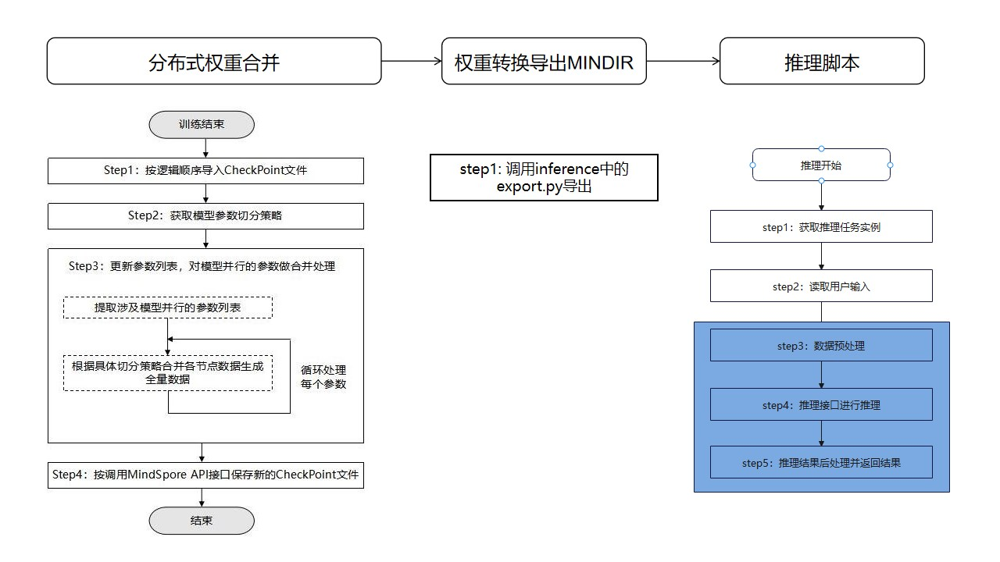
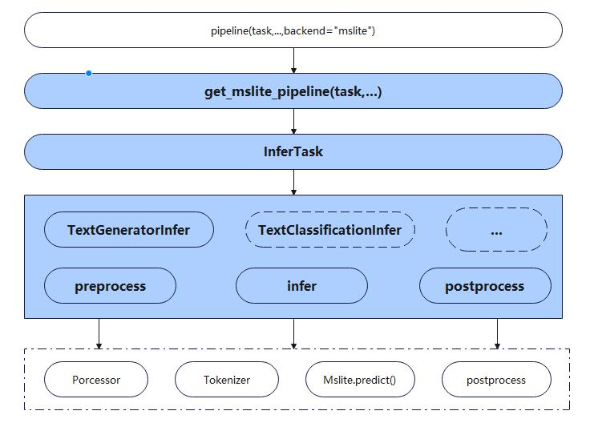

# MindSpore Lite离线推理

## 基本介绍

MindFormers定位打造训练->微调->部署的端到端大模型工具套件，为了更好性能地部署已经微调训练好的大模型；我们利用MindSpore打造的推理引擎[MindSpore_lite](https://www.mindspore.cn/lite)，为用户提供了开箱即用的推理部署方案，为用户提供端到端的大模型解决方案，帮助用户使能大模型业务。

使用MindSpore Lite + Ascend硬件进行推理时，一般都会基于预训练或者微调后的权重进行推理部署。当前使用MindSpore Lite进行推理部署时，主要三个步骤：
1）进行权重合并
2）进行权重转换
3）最后部署推理服务



## 设计概述

Inference采用的后端是MindSpore Lite，为了兼容已有的MindSpore的前向预测的流水线接口，对外部开发者呈现统一的推理接口，保持调用推理的一致性。Inference模块按照任务类别设计推理流水线，支持任务类别的可扩展，针对同一类任务兼容不同模型进行推理，实现模型可扩展的设计。`注：当前Inference模块仅支持LLM模型的生成式任务。`

具体设计如下：



## 接口设计

### pipeline

pipeline是Inference模块对外提供的推理API入口

```python
pipeline(
        task: str = None,
        model: Optional[Union[str, PreTrainedModel, Model, Tuple[str, str]]] = None,
        tokenizer: Optional[PreTrainedTokenizerBase] = None,
        image_processor: Optional[BaseImageProcessor] = None,
        audio_processor: Optional[BaseAudioProcessor] = None,
        backend: str = "ms",
        **kwargs)

功能
    获取推理流水线

参数
    - task(str):任务类型
    - model(Optional[Union[str, PreTrainedModel, Model, Tuple[str, str]]]):模型参数,在backend="mslite"时，是启动inference的推理能力
    - config(PetConfig):微调算法的配置,包含微调算法的超参或者需要实例化的预训练模型
    - tokenizer(PreTrainedTokenizerBase):文本输入序预处理器
    - image_processor(BaseImageProcessor):图像预处理
    - audio_processor(BaseAudioProcessor):音频预处理
    - backend(str):推理后端,支持"ms"和"mslite"两个后端

返回值
    返回推理流水线
```

### InferTask

InferTask是Inference模块是支持开发者在Inference框架中拓展推理任务类型的工厂类，主要提供get_infer_task()、check_task_valid()和support_list()三个接口；支持用户查询已经支持的推理任务类型和获取对应的推理任务实例进行推理。

```python
InferTask.get_infer_task(cls, task_type: str, task_config: InferConfig, **kwargs)

功能
    获取推理任务实例

参数
    - task_type(str):任务类型
    - task_config(InferConfig):推理任务配置参数

返回值
    返回推理任务
```

```python
InferTask.check_task_valid(cls, task_type: str)

功能
    获取所有支持的推理任务列表

参数
    - task_type(str):待校验的任务类型。

返回值
    返回推理模块是否支持该任务类型(bool)
```

``` python
InferTask.support_list(cls)

功能
    获取所有支持的推理任务列表

返回值
    返回推理任务列表
```

### InferConfig

InferConfig是用户调用MindSpore Lite进行推理时，需要配置的参数项来初始化推理任务，具体如下：

```python
class InferConfig(DictConfig):
    """
    Inference config class.
    """
    def __init__(self,
                 prefill_model_path: str = "",
                 increment_model_path: str = "",
                 model_type: str = "mindir",
                 model_name: str = "common",
                 infer_seq_length: int = 1024,
                 target: str = "Ascend",
                 device_id: int = 0,
                 rank_id: int = 0,
                 ge_config_path: str = "",

参数
    prefill_model_path:全量图路径
    increment_model_path:增量图路径
    model_type:推理模型类型
    model_name:模型名称
    infer_seq_length:推理序列长度
    target:推理硬件类型
    device_id:设备ID
    rank_id:设备逻辑Rank ID
    ge_config_path:Ascend图引擎配置文件路径
```

## 快速使用

### 模型导出（增量推理为例）

#### 方式1：调用run_mindformers

step1. 修改配置文件中参数，设置run_mindformers使用“export”模式

```yaml
run_mode: "export"
load_checkpoint: "/path/of/ckpt"
src_strategy_path_or_dir: "/path/of/strategy"
model:
  model_config:
    use_past: True
```

step2. 启动run_mindformers.py（与训练和推理相同）

```shell
python run_mindformers.py
```

step3. 运行结束后，在output/mindir_full_ckeckpoint以及output/mindir_inc_checkpoint路径下找到导出的全量和增量mindir文件

#### 方式2：实例化Trainer.export方法做导出

```shell
from mindformers import Trainer, TrainingArguments
from mindspore.dataset import GeneratorDataset
from mindformers.models.llama.llama import LlamaForCausalLM
from mindformers.models.llama.llama_config import LlamaConfig
from numpy as np
import mindspore as ms

def generator_train():
  seq_len = 513
  input_ids = np.random.randint(low=0, high=15, size=(seq_len,)).astype(np.int32)
  train_data = (input_ids)
  for _ in range(16):
    yield train_data

def generator_eval():
  seq_len = 512
  input_ids = np.random.randint(low=0, high=15, size=(seq_len,)).astype(np.int32)
  eval_data = (input_ids)
  for _ in range(16):
    yield eval_data

training_args = TrainingArguments(num_train_epochs=1, batch_size=2)
train_dataset = GeneratorDataset(generator_train, column_name=["input_ids"])
eval_dataset = GeneratorDataset(generator_eval, column_name=["input_ids"])
train_dataset = train_dataset.batch(batch_size=4)
eval_dataset = eval_dataset.batch(batch_size=4)
model_config = LlamaConfig(num_layers=2, hidden_size=32, num_heads=2, seq_length=512)
model = LlamaForCausalLM(model_config)

task = Trainer(task='text_generation',
               model=model,
               args=training_args)
task.export()
```

#### 方式3：针对Configs下已支持模型的导出方式（以bloom_560m为例）

step1. 修改配置文件，在配置文件中新增infer配置项，在run_bloom_560m.yaml中添加如下配置

```yaml
infer:
    prefill_model_path: "/path/bloom/bloom_560m_prefill.mindir"
    increment_model_path: "/path/bloom/bloom_560m_inc.mindir"
    infer_seq_length: 512
    model_type: mindir

# 参数说明：参考InferConfig的说明
# 由于配置了prefill_model_path和increment_model_path两个路径，因此需要导出增量图，因此需要在模型配置中打开增量开关，如下所示
# 如果想用bloom的后处理加速，则需要配置is_sample_acceleration开关，如下所示
model：
    model_config：
        use_past: True
        is_sample_acceleration: True # 后处理加速开关，部分模型不支持，当前bloom和glm支持
```

step2.执行export.py，完成模型转换

```shell
python mindformers/tools/export.py --config_path ../../configs/bloom/run_bloom_560m.yaml
```

#### 方式4：针对research或者用户自定义模型的导出方式

step1. 准备好模型相关的配置文件、权重文件放置在一个文件夹

```bash
test_model_dir
    ├── test.yaml       # test模型的配置文件
    └── test.ckpt       # test模型的权重文件
```

step2. 在test.yaml中添加infer相关的配置项，参考方式1中的step1

step3. 执行export.py，完成模型转换

```shell
python mindformers/tools/export.py --model_dir /path/test_model_dir
```

### 推理体验（以bloom为例）

推理模块提供了一键启动脚本，帮助用户快速上手使用Inference模块进行模型推理。

step1. 利用执行`模型导出`章节，得到MindIR图，如果是增量模型，则会得到两个MindIR图（bloom_560m_prefill.mindir和bloom_560m_inc.mindir）。

step2. 执行run_infer_main.py脚本，调起推理：

```shell
python run_infer_main.py --device_id 0 --model_name bloom --prefill_model_path /path/bloom/bloom_560m_prefill.mindir --increment_model_path /path/bloom/bloom_560m_inc.mindir --config_path /path/ge_config.ini --is_sample_acceleration True
```

```text
run_infer_main支持的参数详细说明如下：

    device_id: 设备物理ID
    model_name: 模型名称，当前支持bloom，glm，llama，glm2
    seq_length: 推理序列长度
    prefill_model_path: 全量图路径
    increment_model_path: 增量图路径
    config_path: GE配置文件路径
    is_sample_acceleration: 后处理加速开关
    add_special_tokens: 对输入token化时是否添加特殊字符
    stream: 是否采用流式结果返回
```

### 推理APIs调用说明（增量推理为例）

Inference模块是由pipeline() API来对外进行调用，目前支持四种方式进行调用：

- `模型名称进行调用，（以bloom_560m为例）`

step1. 参考模型导出章节完成MindIR模型的导出

step2. 在configs/bloom/run_bloom_560m.yaml中配置infer配置项

```yaml
infer:
    prefill_model_path: "/path/bloom/bloom_560m_prefill.mindir"
    increment_model_path: "/path/bloom/bloom_560m_inc.mindir"
    infer_seq_length: 512
    model_type: mindir
    ge_config_path: "/path/ge_config.ini"
# 参数说明：参考InferConfig的说明
```

step3. 调用inference API完成模型推理调用

```python
from mindformers.models import BloomTokenizer
from mindformers.pipeline import pipeline

# 定义bloom 560m模型的tokenizer
model_name = "bloom_560m"
tokenizer = BloomTokenizer.from_pretrained(model_name)
ge_config_path = "/path/ge_config_path"

# 定义推理流水线
lite_pipeline = pipeline(
    task="text_generation",
    model=model_name,
    tokenizer=tokenizer,
    backend="mslite",
    ge_config_path=ge_config_path,
    device_id=0,
    infer_seq_length=512,
)

# 推理
output = lite_pipeline("I love Beijing,because", is_sample_acceleration=True,add_special_tokens=False)

print(output)
```

- `模型路径进行调用`

```python
from mindformers.models import BloomTokenizer
from mindformers.pipeline import pipeline

prefill_model_path = "/path/prefill_model_path"
increment_model_path = "/path/increment_model_path"
ge_config_path = "/path/ge_config_path"

# 定义tokenizer
tokenizer = BloomTokenizer.from_pretrained(model_name)
# 定义推理流水线
lite_pipeline = pipeline(
    task="text_generation",
    model=(prefill_model_path, increment_model_path),
    tokenizer=tokenizer,
    backend="mslite",
    model_name="bloom_560m",
    ge_config_path=ge_config_path,
    device_id=0,
    infer_seq_length=512,
)

# 推理
output = lite_pipeline("I love Beijing,because", is_sample_acceleration=True,add_special_tokens=False)

print(output)
```

- `模型文件夹进行调用`

针对于灵活切换模型的部署，我们支持从指定文件夹目录读取相关配置启动推理。首先需要按照指定格式准备模型文件夹，具体如下：

```bash
test_model_dir
    ├── test.yaml                       # test模型的配置文件,只能存在一个yaml文件
    ├── xxx_prefill_graph.mindir        # test模型的全量图,此处需要以prefill_graph.mindir为后缀名
    ├── xxx_inc_graph.mindir            # test模型的增量图,此处需要以inc_graph.mindir为后缀名,当前只能存在不多于两个mindir文件
    └── config.ini                      # ge的配置参数,文件名不可变
```

```python
from mindformers.models import BloomTokenizer
from mindformers.pipeline import pipeline

test_model_dir = "/path/test_model_dir"
ge_config_path = "/path/ge_config_path"
# 定义tokenizer
tokenizer = BloomTokenizer.from_pretrained("bloom_560m")

lite_pipeline = pipeline(
    task="text_generation",
    model=test_model_dir,
    tokenizer=tokenizer,
    backend="mslite",
    model_name="bloom_560m",
    ge_config_path=ge_config_path,
    device_id=0,
    infer_seq_length=512,
)

# 推理
output = lite_pipeline("I love Beijing,because", is_sample_acceleration=True,add_special_tokens=False)

print(output)
```

- `自定义配置config的方式`

```python
from mindformers.models import BloomTokenizer
from mindformers.pipeline import pipeline
from mindformers.infer.infer_config import InferConfig

prefill_model_path = "/path/prefill_model_path"
increment_model_path = "/path/increment_model_path"
ge_config_path = "/path/ge_config_path"

lite_config = InferConfig(
    prefill_model_path=prefill_model_path,
    increment_model_path=increment_model_path,
    model_type="mindir",
    model_name="bloom_560m",
    ge_config_path=ge_config_path,
    device_id=0,
    infer_seq_length=512,
)
tokenizer = BloomTokenizer.from_pretrained("bloom_560m")
lite_pipeline = InferTask.get_infer_task("text_generation", lite_config, tokenizer=tokenizer)

# 推理
output = lite_pipeline("I love Beijing,because", is_sample_acceleration=True,add_special_tokens=False)

print(output)
```

### 如何配置GE图引擎配置

#### 针对Atlas 800，推荐的GE配置参数如下(config.ini)：

```ini
[ascend_context]
plugin_custom_ops=All
provider=ge

[ge_session_options]
ge.externalWeight=1
ge.exec.atomicCleanPolicy=1
ge.event=notify
ge.exec.staticMemoryPolicy=2
ge.exec.precision_mode=must_keep_origin_dtype
```

#### 针对Atlas 800T A2，推荐的GE配置参数如下(config.ini)：

```ini
[ascend_context]
plugin_custom_ops=All
provider=ge

[ge_session_options]
ge.externalWeight=1
ge.exec.formatMode=1
ge.exec.atomicCleanPolicy=1
ge.event=notify
ge.exec.staticMemoryPolicy=2
ge.exec.precision_mode=must_keep_origin_dtype
```

针对于GE参数的详细说明可以参考[GE options参数说明](https://www.hiascend.com/document/detail/zh/CANNCommunityEdition/70RC1alpha002/infacldevg/graphdevg/atlasgeapi_07_0118.html)

## 自定义开发（text generation任务为例）

### 如何支持新增LLM模型的MINDIR导出

在export.py中，已经完成了增量推理模型的导出流程，由于不同的LLM模型可能存在不同的输入，因此，为了统一的导出流程，我们支持用户自定义输入接口，添加到已有的流程中去，从而完成对新模型的适配。

例如以bloom为例：

step1. 在export.py中首先实现了`get_bloom_inc_model_input()`接口

step2. 在export.py的增量输入表`PREFILL_MODEL_INPUT_MAP`中，添加bloom的输入映射：

```python
PREFILL_MODEL_INPUT_MAP = {
    "bloom": get_llm_common_prefill_model_input,
}
```

完成上述两个步骤后，则完成了bloom模型在export工具中的添加。

### 如何支持新增LLM模型的推理

由于导出时，确定了LLM模型在MindIR图中的输入顺序以及shape信息，而由于模型差异，因此无法按照统一的输入处理，为实现不同模型的统一处理，则需要将模型输入接口类似export时一样添加到任务中。

例如以bloom为例：

step1. 在`text_generator_infer.py`中，实现bloom模型的输入类定义，如下，我们定义一个通用输入处理类：

```python
class CommonInputsOfInfer(BaseInputsOfInfer):
    """
    common infer inputs of llm models.
    """
    def get_inputs(self, model: Model, input_ids=None, current_index=None, valid_length=None,
                   init_reset=None, is_first_iteration=True, **kwargs):
        if not is_first_iteration:
            inputs_tmp = []
            for i in range(len(current_index)):
                current_index_tmp = int(current_index[i]) - i * input_ids.shape[1]  # multibatch
                # use numpy to slice array to avoid complie ascend slice op
                inputs_tmp.append(input_ids[i][current_index_tmp:current_index_tmp + 1])
            input_ids = np.array(inputs_tmp, dtype=np.int32)
        inputs = [input_ids, current_index, init_reset, valid_length]
        lite_inputs = self.get_lite_tensor_list(inputs, model)
        return lite_inputs
```

step2. 在`text_generator_infer.py`的输入工厂类`InputOfInfer`中的`MAPPING`表中添加输入类映射关系：

```python
class InputOfInfer:
    """
    Input of llm model.
    """
    MAPPING = {
        "bloom": CommonInputsOfInfer,
    }
```
