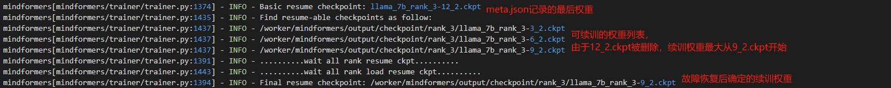

# 断点续训

> ## 🚨 弃用说明
>
> 本文档已过时，不再进行维护，并将在 *1.5.0* 版本下架，其中可能包含过时的信息或已被更新的功能替代。建议参考最新的 **[官方文档](https://www.mindspore.cn/mindformers/docs/zh-CN/dev/index.html)** ，以获取准确的信息。
>
> 如果您仍需使用本文档中的内容，请仔细核对其适用性，并结合最新版本的相关资源进行验证。
>
> 如有任何问题或建议，请通过 **[社区Issue](https://gitee.com/mindspore/mindformers/issues/new)** 提交反馈。感谢您的理解与支持！

## 介绍

Mindformers支持**step级断点续训**，在训练过程中如果遇到意外情况导致训练中断，可以使用断点续训的方式恢复之前的状态继续训练。

Mindformers在输出目录下会保存`checkpoint`和`checkpoint_network`两个权重输出文件夹，只有`checkpoint`可用于断点续训。

| 文件夹             | 描述                                                         |
| ------------------ | ------------------------------------------------------------ |
| checkpoint         | 保存权重、优化器、step、epoch、loss_scale等参数信息，主要用于**断点恢复训练**，可完全恢复至中断处的训练状态。 |
| checkpoint_network | 仅保存权重参数，可用作**预训练权重**或**推理评估**，不支持**断点恢复训练**。 |

`checkpoint`保存权重的文件格式如下：

```text
checkpoint
  ├── rank_0
    ├── meta.json
    └── {prefix}-{epoch}_{step}.ckpt
  ...
  └── rank_x
    ├── meta.json
    └── {prefix}-{epoch}_{step}.ckpt
```

| 文件                         | 描述                                                         |
| ---------------------------- | ------------------------------------------------------------ |
| meta.json                    | 记录最后保存的权重的epoch、step和权重名，每个rank进程单独维护一个meta.json。 |
| {prefix}-{epoch}_{step}.ckpt | 保存的权重文件名，prefix为唯一的权重名前缀，包含了rank_id信息。<br />如"llama_7b_rank_0"，若保存权重时使用该prefix的权重已存在，则prefix自动扩展为"llama_7b_rank_0_1"。<br />若"llama_7b_rank_0_1"继续存在，则prefix为"llama_7b_rank_0_2"，以此类推。 |

- **yaml参数说明**

  | 参数                          | 描述                                                         | 默认值 |
  | ----------------------------- | ------------------------------------------------------------ | ------ |
  | load_checkpoint               | 断点续训加载的权重路径。<br />- 如果加载**分布式权重**，配置为`checkpoint`文件夹路径。<br />- 如果加载**完整权重**，配置为权重文件绝对路径。 | ""     |
  | resume_training               | 断点续训开关，可以是布尔值或字符串。<br />为**True**时，开启断点续训功能，支持故障恢复功能。<br />为字符串时，必须指定为任意rank下任一权重的文件名**"{prefix}-{epoch}_{step}.ckpt"**，所有rank将基于该权重所指定的epoch和step进行断点续训。 | False  |
  | resume_by_last_timestamp_ckpt | 续训是否加载最后时间戳权重。<br />为**True**时，所有rank将加载各自rank文件夹下最后时间戳的权重用于续训，**无法保证权重的step数一致**。 | None   |
  | load_ckpt_async               | ckpt与模型编译并行开关（在线切分权重场景下该配置不生效），布尔值默认为False不开启。<br />为**True**时，开启ckpt和编译并行功能，将异步执行加载权重，减少总体耗时加速拉起续训<br />为**False**时，不开启ckpt和编译并行功能，加载权重和模型编译串行执行 | False  |

- **故障恢复**

  Mindformers支持断点续训故障恢复，`resume_training`为`True`时，起始将会基于`meta.json`记录的权重续训，若某rank对应的权重文件缺失、损坏、不完整，会自动搜索上一个step的权重用于续训。

  比如使用2卡断点续训，假设权重保存情况如下：

  ```text
  checkpoint_file_or_dir_path
    ├── rank_0
      ├── xxx_rank_0-3_2.ckpt
      ├── xxx_rank_0-6_2.ckpt (缺失、损坏、不完整)
      └── xxx_rank_0-9_2.ckpt
    └── rank_1
      ├── xxx_rank_1-3_2.ckpt
      ├── xxx_rank_1-6_2.ckpt
      └── xxx_rank_1-9_2.ckpt (缺失、损坏、不完整)
  ```

  此时配置`resume_training`为`True`，所有rank将会基于`xxx_rank_x-3_2.ckpt`续训。

  ① 该功能只在`resume_training`为`True`时生效，`resume_training`为权重名时，将会严格按照指定epoch和step的权重续训。

  ② **多机**场景下，该功能需保证所有节点的续训权重在**同一共享目录**下。

  可以手动配置环境变量`SHARED_PATHS`来设置共享路径。

  ```bash
  # 将"/mnt/shared1","/mnt/shared2"两个路径设置为共享路径，权重路径若在这两个目录下，均视为共享路径。
  export SHARED_PATHS="/mnt/shared1,/mnt/shared2"

  # Docker容器内设置共享路径
  docker run -e SHARED_PATHS="/mnt/shared1,/mnt/shared2" -v /mnt/shared1:/mnt/shared1 -v /mnt/shared2:/mnt/shared2 my_container
  ```

- **功能说明**

  | load_checkpoint | resume_training | 功能描述                                                     | 是否为推荐使用方式 |
  | --------------- | --------------- | ------------------------------------------------------------ | ------------------ |
  | 权重文件路径    | True            | 基于load_checkpoint指代的权重续训                            | √                  |
  | 权重文件路径    | 权重文件名      | resume_training指代的文件名无效，基于load_checkpoint指代的权重续训 | ×                  |
  | 权重文件夹路径  | True            | **场景①："单机"\|"多机+共享目录"\|"ModelArts"**<br />① 基于meta.json记录的权重续训，支持故障恢复。<br />② 若任一rank文件夹下缺少meta.json，所有rank基于最后时间戳的权重续训。<br />**场景②："多机+非共享目录"**<br />所有rank基于最后时间戳的权重续训。 | √                  |
  | 权重文件夹路径  | 权重文件名      | 基于resume_training指代的权重续训                            | √                  |

## 脚本启动场景

### yaml配置

```yaml
load_checkpoint: checkpoint_file_or_dir_path
resume_training: True # 或者"{prefix}-{epoch}_{step}.ckpt"
```

### 单卡启动

```bash
python run_mindformer.py --config xxx.yaml --run_mode train --use_parallel False --train_dataset dataset_dir
```

### 分布式启动

```bash
# 以8卡为例
bash scripts/msrun_launcher.sh "run_mindformer.py --config xxx.yaml --run_mode train --use_parallel True --train_dataset dataset_dir" 8
```

详细分布式启动方式参考[Mindformers主页介绍](https://gitee.com/mindspore/mindformers/tree/r1.1.0/#单机多卡)。

## Trainer高阶接口启动场景

在Trainer.train()中，配置`resume_from_checkpoint`参数为`checkpoint_file_or_dir_path`，将`resume_training`参数设置为`True`，并可指定`resume_ckpt`。

### 训练脚本

```python
# 新建run_trainer.py
import mindspore as ms
from mindformers import TrainingArguments, Trainer, AutoModelForCausalLM
from mindformers import build_context

# 初始化参数配置，除了model和processor，基本涵盖yaml中的所有配置
# 包括环境配置、分布式配置、训练超参配置、数据集配置、评估、权重保存配置等
train_args = TrainingArguments(
    ...
)

# 初始化环境
build_context(train_args)

# 初始化模型
model = AutoModelForCausalLM.from_pretrained("xxx")

# 初始化训练器
trainer = Trainer(args=train_args,
                  model=model,
                  train_dataset="train_dataset")

# 启动断点续训
trainer.train(
    resume_from_checkpoint="checkpoint_file_or_dir_path",
    resume_training=True # 或者 "{prefix}-{epoch}_{step}.ckpt"
)
```

### 单卡启动

```python
python run_trainer.py
```

### 分布式启动

```bash
# 以8卡为例
bash scripts/msrun_launcher.sh "run_trainer.py" 8
```

## 使用案例

### 概述

本章节主要演示基于llama-7b的断点续训案例，分别介绍**单卡断点续训**以及**分布式断点续训**，启动方式分为**脚本启动**和**Trainer高阶接口启动**两种。

单卡训练支持**数据下沉**和**非下沉**两种模式，分布式训练默认开启**数据下沉**。

- 案例1：单卡断点续训，打开数据下沉，通过run_mindformer.py脚本启动；

- 案例2：单卡断点续训，关闭数据下沉，通过Trainer高阶接口启动；
- 案例3：分布式断点续训，通过run_mindformer.py脚本启动，指定续训权重；

> 注：案例仅为演示不同场景下如何启动断点续训，验证断点续训的效果，训练参数/loss等不具备参考价值。

### 前期准备

#### 数据集

下载并解压已经转成MindRecord格式的[Wikitext数据集](https://ascend-repo-modelzoo.obs.cn-east-2.myhuaweicloud.com/MindFormers/features/resume_training/data/wikitext_512_llama1_40/wikitext_512_llama1_40.zip)，该数据集使用llama的词表转换，共包含40条文本数据，每条数据的seq_length为512。

#### 公共配置

修改`configs/llama/run_llama_7b.yaml`配置文件

```yaml
# 设置训练相关参数
runner_config:
  epochs: 5

# 设置数据集
train_dataset: &train_dataset
  data_loader:
    type: MindDataset
    dataset_dir: "path/to/wikitext_512_llama1_40" # 填写数据集文件夹路径
    shuffle: True

# 设置权重保存参数
callbacks:
  - type: CheckpointMonitor
    save_checkpoint_steps: 5 # 每隔5step保存一次
    keep_checkpoint_max: 20 # 设置checkpoint最大保存数，设置为20以保存全部的checkpoint，如不设置默认为5。

# 设置模型参数，减少seq_length、hidden_size和num_layers，以缩短训练验证时间。
seq_length: 512
hidden_size: 512
num_layers: 2
```

### 案例1：单卡断点续训，打开数据下沉模式，通过脚本启动

#### ① 单卡完整训练

**描述**：获取完整训练日志和保存的权重文件。

**step1**：在[前期准备-公共配置](#公共配置)基础上，修改`configs/llama/run_llama_7b.yaml`配置文件

```yaml
# 设置训练相关参数
runner_config:
  batch_size: 4
  sink_mode: True # 打开数据下沉
use_parallel: False
```

**step2**：启动单卡训练

```shell
python run_mindformer.py --config configs/llama/run_llama_7b.yaml
```

**step3**：查看训练日志


#### ② 单卡断点续训

**描述**：验证基于中间保存的权重进行断点续训的loss和完整训练对齐。

**step1**：在**① 单卡完整训练**配置基础上，修改`configs/llama/run_llama_7b.yaml`配置文件

```yaml
# 设置权重加载参数
load_checkpoint: './output/checkpoint/rank_0/llama_7b_rank0-12_2.ckpt'
resume_training: True # 打开断点续训开关
```

>注：由于开启了数据下沉，epoch3-step4保存的权重名并非"llama_7b_rank_0-3_4.ckpt"。epoch计算方式为"当前step数/sink_size = ((cur_epoch-1)\*steps_per_epoch+cur_step_in_epoch)/sink_size=((3-1)\*10+4)/2=12"，step固定为"sink_size=2"，即数据下沉模式下，epoch3-step4保存的权重，权重名为"llama_7b_rank_0-12_2.ckpt"

**step2**：启动单卡训练

```shell
python run_mindformer.py --config configs/llama/run_llama_7b.yaml
```

**step3**：查看训练日志，loss和完整训练日志对齐


### 案例2：单卡断点续训，关闭数据下沉模式，通过高阶接口启动

#### ① 单卡完整训练

**描述**：获取完整训练日志和保存的权重文件。

**step1**：新建`run_trainer.py`文件

```python
# 新建run_trainer.py
from mindformers import TrainingArguments, Trainer, AutoModelForCausalLM
from mindformers import build_context

# 初始化参数配置，除了model和processor，基本涵盖yaml中的所有配置
# 包括环境配置、分布式配置、训练超参配置、数据集配置、评估、权重保存配置等
train_args = TrainingArguments(
    use_parallel=False,
    num_train_epochs=5,
    sink_mode=False,
    save_steps=6,
    save_total_limit=20,
    logging_steps=2,
    per_device_train_batch_size=4,
    train_dataset_in_columns=["input_ids"],
    dataset_task="CausalLanguageModelDataset",
    dataset_type="MindDataset",
)

# 初始化环境
build_context(train_args)

# 初始化模型
model = AutoModelForCausalLM.from_pretrained("llama_7b", download_checkpoint=False)

# 初始化训练器
trainer = Trainer(args=train_args,
                  model=model,
                  train_dataset="path/to/wikitext_512_llama1_40")

# 启动训练
trainer.train()
```

**step2**：启动单卡训练

```shell
python run_trainer.py
```

**step3**：查看训练日志


#### ② 单卡断点续训

**描述**：验证基于中间保存的权重进行断点续训的loss和完整训练的loss对齐。

**step1**：修改`run_trainer.py`文件，增加断点续训参数配置

```python
trainer.train(
    resume_from_checkpoint="./output/checkpoint/rank_0/CKP_rank_0-3_4.ckpt",
    resume_training=True,
)
```

**step2**：启动单卡训练

```shell
python run_trainer.py
```

**step3**：查看训练日志，loss和完整训练日志对齐


### 案例3：分布式断点续训，通过脚本启动，指定续训权重

#### ① 分布式完整训练

**描述**：获取完整训练日志和保存的权重文件。

**step1**：在[前期准备-公共配置](#公共配置)基础上，修改`configs/llama/run_llama_7b.yaml`配置文件

```yaml
# 设置训练相关参数
runner_config:
  batch_size: 2 # batch_size设置为2
  sink_mode: True # 打开数据下沉
use_parallel: True

# 设置分布式并行策略
parallel_config:
  data_parallel: 1
  model_parallel: 2
  pipeline_stage: 2
  micro_batch_num: 2
```

**step2**：通过`msrun`启动4卡分布式训练

```shell
bash scripts/msrun_launcher.sh "run_mindformer.py --config ./output/configs/llama/run_llama_7b.yaml --run_mode train --use_parallel True --train_dataset path/to/wikitext_512_llama1_40" 4
```

**step3**：查看训练日志


#### ② 分布式断点续训：指定权重

**描述**：指定中间保存的权重进行断点续训，验证loss和完整训练的loss对齐。

**step1**：在**① 分布式完整训练**配置基础上，修改`configs/llama/run_llama_7b.yaml`配置文件

```yaml
# 设置权重加载参数
load_checkpoint: './output/checkpoint'       # 填写checkpoint文件夹路径
resume_training: 'llama_7b_rank_0-12_2.ckpt' # 指定断点续训的权重名
```

**step2**：通过`msrun`启动4卡分布式训练

```shell
bash scripts/msrun_launcher.sh "run_mindformer.py --config ./output/configs/llama/run_llama_7b.yaml --run_mode train --use_parallel True --train_dataset path/to/wikitext_512_llama1_40" 4
```

**step3**：查看训练日志

- loss和完整训练日志对齐


#### ③ 分布式断点续训：故障恢复

**描述**：基于meta.json记录的权重进行断点续训，验证故障恢复以及loss和完整训练的loss对齐。

**step1**：删除`output/checkpoint/rank_3/llama_7b_rank_3-12_2.ckpt`。

**step2**：在**① 分布式完整训练**配置基础上，修改`configs/llama/run_llama_7b.yaml`配置文件

```yaml
# 设置权重加载参数
load_checkpoint: './output/checkpoint'       # 填写checkpoint文件夹路径
resume_training: True
```

**step3**：通过`msrun`启动4卡分布式训练

```shell
bash scripts/msrun_launcher.sh "run_mindformer.py --config ./output/configs/llama/run_llama_7b.yaml --run_mode train --use_parallel True --train_dataset path/to/wikitext_512_llama1_40" 4
```

**step3**：查看训练日志

- 故障恢复相关日志，由于rank_3下的`llama_7b_rank_3-12_2.ckpt`缺失，所有rank进程基于`llama_7b_rank_x-9_2.ckpt`续训。



- loss和完整训练日志对齐


## 注意事项

1. 分布式断点续训必须开启数据下沉模式，配置`sink_mode=True`。

2. 如果断点续训加载的权重已经是最后训练完保存的权重，将会报以下错误

   ```log
   RuntimeError: Exception thrown from dataset pipeline. Refer to 'Dataset Pipeline Error Message'.
   ```
