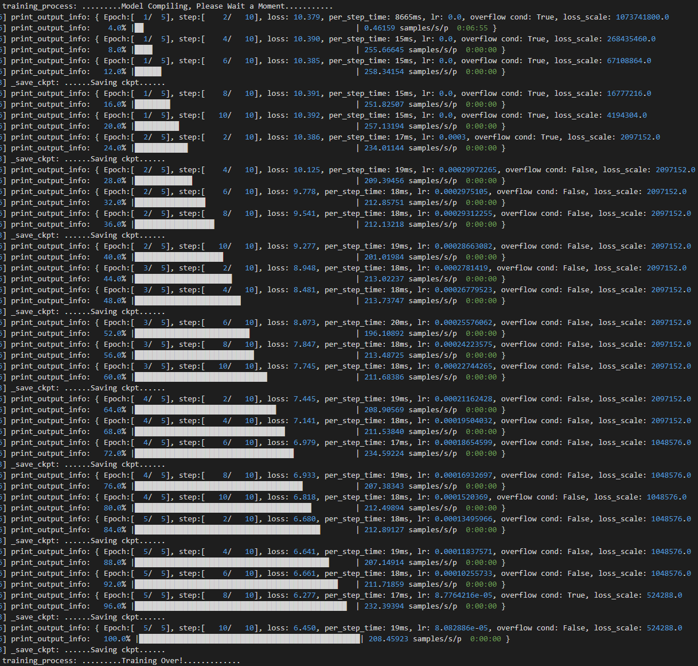
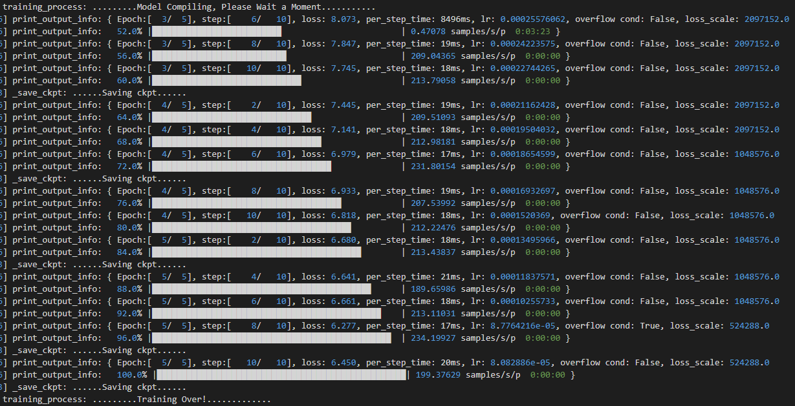
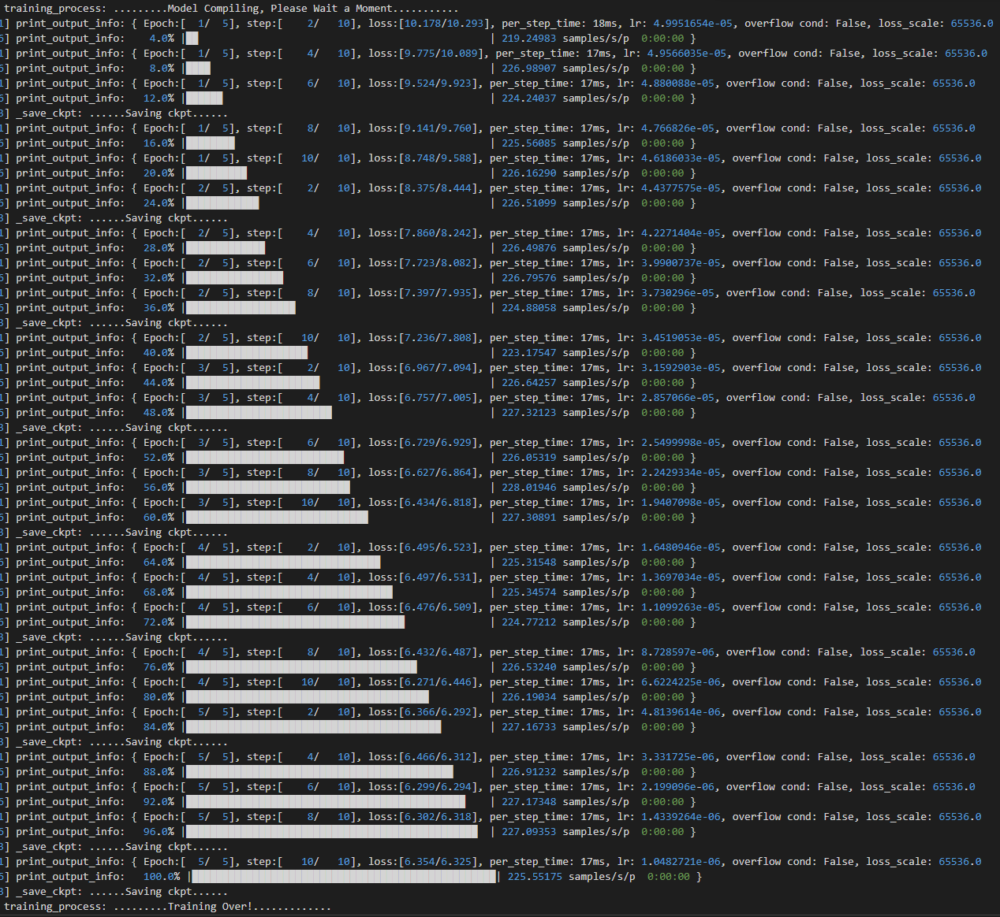
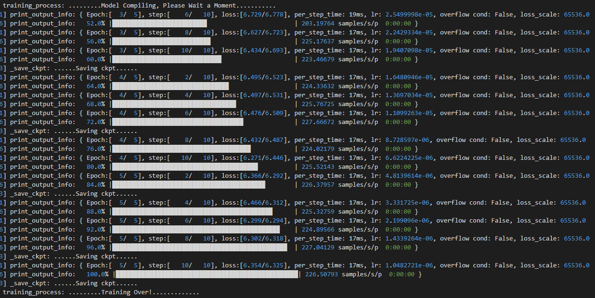
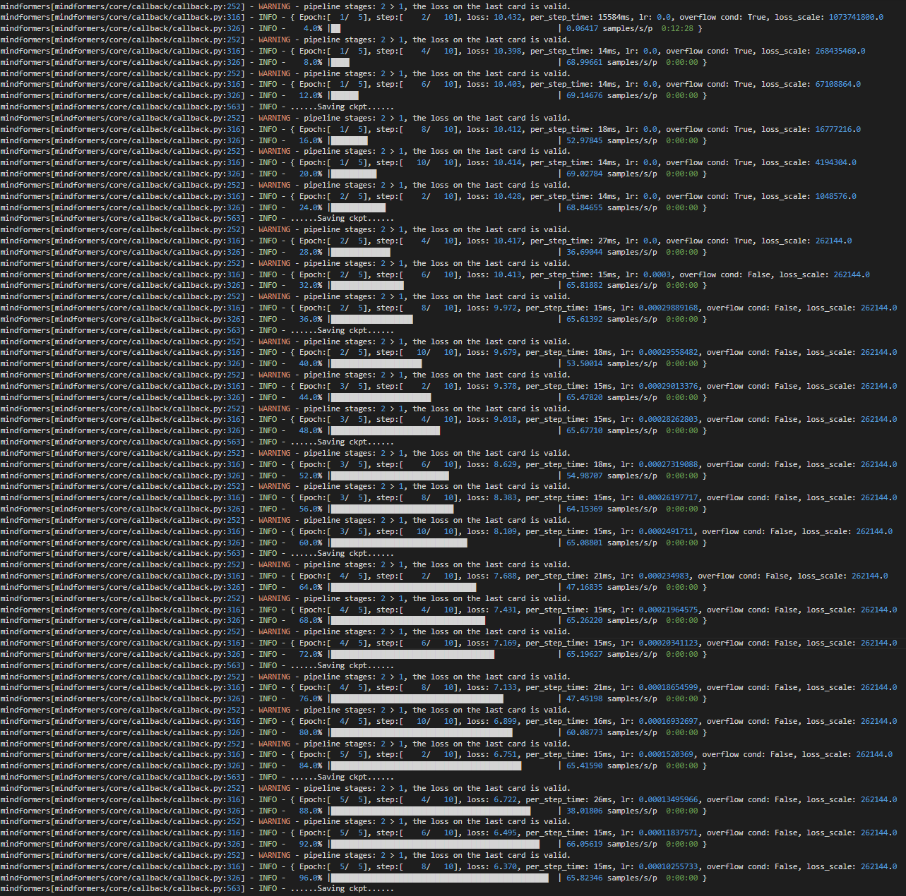
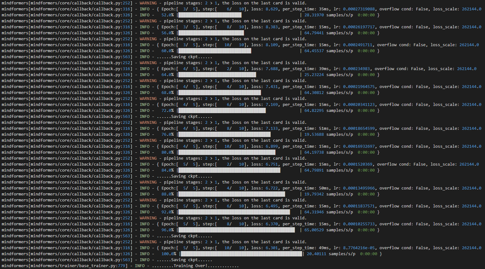

# 断点续训

## 介绍

Mindformer支持**step级断点续训**，在训练过程中如果遇到意外情况导致训练中断，可以使用断点续训的方式恢复之前的状态继续训练。

Mindformer在输出目录下会保存`checkpoint`和`checkpoint_network`两个权重输出文件夹：

- **checkpoint**：保存权重、优化器、step、epoch、loss_scale等参数信息，主要用于**断点恢复训练**，可完全恢复至中断处的训练状态；
- **checkpoint_network**：仅保存权重参数，可用作**预训练权重**或**推理评估**，不支持**断点恢复训练**。

> 注：分布式断点续训必须在数据下沉模式下使用，配置文件中sink_mode设置为True即可打开数据下沉模式。数据下沉可参考：[MindSpore下沉模式](https://www.mindspore.cn/tutorials/experts/zh-CN/master/optimize/execution_opt.html)

## 使用

### 脚本启动场景

在run_xxx.yaml中配置`load_checkpoint`，并将`resume_training`改为**True**：

- 如果加载**分布式权重**，配置为checkpoint文件夹路径，权重按照`checkpoint_file_or_dir_path/rank_x/xxx.ckpt`格式存放。
- 如果加载**完整权重**，配置为checkpoint文件绝对路径。

```yaml
load_checkpoint: checkpoint_file_or_dir_path
resume_training: True
```

> 注：如果load_checkpoint配置为文件路径，则认为是完整权重，如果配置为文件夹，则认为是分布式权重。下同。

### Trainer高阶接口启动场景

- **方式1：在Trainer.train()或Trainer.finetune()中配置**

在Trainer.train()或Trainer.finetune()中，配置`train_checkpoint`或`finetune_checkpoint`参数为checkpoint文件或文件夹路径，并将`resume_training`参数设置为**True**。

```python
import mindspore as ms
from mindformers import Trainer

ms.set_context(mode=0) # 设定为图模式加速

cls_trainer = Trainer(task='image_classification', # 已支持的任务名
                      model='vit_base_p16', # 已支持的模型名
                      train_dataset="/data/imageNet-1k/train", # 传入标准的训练数据集路径，默认支持ImageNet数据集格式
                      eval_dataset="/data/imageNet-1k/val") # 传入标准的评估数据集路径，默认支持ImageNet数据集格式

cls_trainer.train(train_checkpoint="", resume_training=True) # 启动训练
cls_trainer.finetune(finetune_checkpoint="", resume_training=True) # 启动微调
```

- **方式2：在TrainingArguments中配置**

在TrainingArguments中配置`resume_from_checkpoint`为checkpoint文件或文件夹路径，并将`resume_training`参数设置为**True**。

```python
import mindspore as ms
from mindformers import Trainer, TrainingArguments

ms.set_context(mode=0) # 设定为图模式加速

training_args = TrainingArguments(resume_from_checkpoint="", resume_training=True)

cls_trainer = Trainer(task='image_classification', # 已支持的任务名
                      args=training_args,
                      model='vit_base_p16', # 已支持的模型名
                      train_dataset="/data/imageNet-1k/train", # 传入标准的训练数据集路径，默认支持ImageNet数据集格式
                      eval_dataset="/data/imageNet-1k/val") # 传入标准的评估数据集路径，默认支持ImageNet数据集格式

cls_trainer.train() # 启动训练
cls_trainer.finetune() # 启动微调
```

### 使用案例

#### 概述

本章节主要演示基于llama-7b的断点续训实战案例，分别介绍**单卡断点续训**以及**分布式断点续训**，启动方式分为**脚本启动**和**Trainer高阶接口启动**两种。单卡断点续训支持**数据下沉开/关**两种，分布式断点续训仅支持**数据下沉开**模式。综上一共介绍以下3个案例：

- 案例1：单卡断点续训，打开数据下沉模式，通过run_mindformer.py脚本/Trainer高阶接口启动；
- 案例2：单卡断点续训，关闭数据下沉模式，通过run_mindformer.py脚本/Trainer高阶接口启动；
- 案例3：分布式断点续训，打开数据下沉模式，通过run_distribute.sh脚本启动；

> 注：案例仅为演示不同场景下如何启动断点续训，验证断点续训的效果，训练参数/loss等不具备参考价值。

#### 前期准备

- 数据集

下载并解压已经转成Mindrecod格式的[Wikitext数据集](https://ascend-repo-modelzoo.obs.cn-east-2.myhuaweicloud.com/MindFormers/features/resume_training/data/wikitext_512_llama1_40/wikitext_512_llama1_40.zip)，该数据集使用llama的词表转换，共包含40条文本数据，每条数据的seq_length为512。

- RANK_TABLE_FILE

分布式训练需要`RANK_TABLE_FILE`，通过以下命令获取8卡的`RANK_TABLE_FILE`。

```shell
python mindformers/tools/hccl_tools.py --device_num [0,8]
```

- 公共配置

修改`configs/llama/run_llama_7b.yaml`配置文件

```yaml
# 设置训练相关参数
runner_config:
  epochs: 5

# 设置数据集
train_dataset: &train_dataset
  data_loader:
    type: MindDataset
    dataset_dir: "dataset_dir" # 填写数据集文件夹路径
    shuffle: True

# 设置权重保存参数
callbacks:
  - type: CheckpointMointor
    save_checkpoint_steps: 5 # 每隔5step保存一次
    keep_checkpoint_max: 20 # 设置checkpoint最大保存数，设置为20以保存全部的checkpoint，如不设置默认为5。

# 设置模型参数，seq_length和num_layers设置小一点，以减少训练时间。
seq_length: 512
num_layers: 2
```

#### 案例1：单卡断点续训，打开数据下沉模式

**一、单卡完整训练**：获取完整训练日志和保存的权重文件

**step1**：在**前期准备-公共配置**基础上，修改`configs/llama/run_llama_7b.yaml`配置文件

```yaml
# 设置训练相关参数
runner_config:
  batch_size: 4
  sink_mode: True # 打开数据下沉
use_parallel: False
```

**step2**：通过`run_mindformer.py`启动单卡训练

```shell
python run_mindformer.py --config configs/llama/run_llama_7b.yaml
```

**step3**：查看训练日志



**二、单卡断点续训**：基于epoch3-step4保存的权重，验证loss对齐

**step1**：在**"一、单卡完整训练"**配置基础上，修改`configs/llama/run_llama_7b.yaml`配置文件

```yaml
# 设置权重加载参数
load_checkpoint: 'path/to/checkpoint' # 填写checkpoint路径；也可填写文件夹路径dir/to/checkpoint，当填写文件夹路径时，权重需按照dir/to/checkpoint/rank_0/xxx.ckpt保存。
resume_training: True # 打开断点续训开关
```

**step2**：通过`run_mindformer.py`脚本/Trainer高阶接口启动训练

- 方式1：通过`run_mindformer.py`启动单卡训练

```shell
python run_mindformer.py --config configs/llama/run_llama_7b.yaml
```

- 方式2：通过Trainer高阶接口启动单卡训练

① 新建训练脚本run_trainer.py

```python
# run_trainer.py
import mindspore as ms
from mindformers import Trainer

ms.set_context(mode=0)

cls_trainer = Trainer(task='text_generation', # 已支持的任务名
                      model='llama_7b', # 已支持的模型名
                      train_dataset="dataset_dir") # 填写数据集文件夹路径

# 填写checkpoint路径；也可填写文件夹路径dir/to/checkpoint，当填写文件夹路径时，权重需按照dir/to/checkpoint/rank_0/xxx.ckpt保存。
cls_trainer.train(train_checkpoint="path/to/checkpoint", resume_training=True) # 启动训练
```

② 启动单卡训练

```shell
python run_trainer.py
```

**step3**：查看训练日志，loss和完整训练日志对齐



#### 案例2：单卡断点续训，关闭数据下沉模式

**一、单卡完整训练**：获取完整训练日志和保存的权重文件

**step1**：在**前期准备-公共配置**基础上，修改`configs/llama/run_llama_7b.yaml`配置文件

```yaml
# 设置训练相关参数
runner_config:
  batch_size: 4
  sink_mode: False # 关闭数据下沉
use_parallel: False
```

**step2**：通过`run_mindformer.py`启动单卡训练

```shell
python run_mindformer.py --config configs/llama/run_llama_7b.yaml
```

**step3**：查看训练日志



**二、单卡断点续训**：基于epoch3-step5保存的权重

**step1**：在**"一、单卡完整训练"**配置基础上，修改`configs/llama/run_llama_7b.yaml`配置文件

```yaml
# 设置权重加载参数
load_checkpoint: 'path/to/checkpoint' # 填写checkpoint路径；也可填写文件夹路径dir/to/checkpoint，当填写文件夹路径时，权重需按照dir/to/checkpoint/rank_0/xxx.ckpt保存。
resume_training: True # 打开断点续训开关
```

**step2**：通过`run_mindformer.py`脚本/Trainer高阶接口启动训练

- 方式1：通过`run_mindformer.py`启动单卡训练

```shell
python run_mindformer.py --config configs/llama/run_llama_7b.yaml
```

- 方式2：通过Trainer高阶接口启动单卡训练

① 新建训练脚本run_trainer.py

```python
# run_trainer.py
import mindspore as ms
from mindformers import Trainer

ms.set_context(mode=0)

cls_trainer = Trainer(task='text_generation', # 已支持的任务名
                      model='llama_7b', # 已支持的模型名
                      train_dataset="dataset_dir") # 填写数据集文件夹路径

# 填写checkpoint路径；也可填写文件夹路径dir/to/checkpoint，当填写文件夹路径时，权重需按照dir/to/checkpoint/rank_0/xxx.ckpt保存。
cls_trainer.train(train_checkpoint="path/to/checkpoint", resume_training=True) # 启动训练
```

② 启动单卡训练

```shell
python run_trainer.py
```

**step3**：查看训练日志，loss和完整训练日志对齐



#### 案例3：分布式断点续训，打开数据下沉模式

**一、分布式完整训练**：获取完整训练日志和保存的权重文件

**step1**：在**前期准备-公共配置**基础上，修改`configs/llama/run_llama_7b.yaml`配置文件

```yaml
# 设置训练相关参数
runner_config:
  batch_size: 2 # batch_size设置为2
  sink_mode: True # 打开数据下沉
use_parallel: True

# 设置数据集
train_dataset: &train_dataset
  repeat: 2 # repeat设置为2，主要是演示案例为了控制训练数据量，和断点续训无关

# 设置分布式并行策略
parallel_config:
  data_parallel: 2
  model_parallel: 2
  pipeline_stage: 2
  micro_batch_num: 2
```

**step2**：通过`run_distribute.sh`启动8卡分布式训练

```shell
cd scripts
bash run_distribute.sh RANK_TABLE_FILE ../configs/llama/run_llama_7b.yaml [0,8] train
```

**step3**：查看训练日志



2. **分布式断点续训，基于epoch3-step4保存的权重**

**step1**：在"**一、分布式完整训练**"配置基础上，修改`configs/llama/run_llama_7b.yaml`配置文件

```yaml
# 设置权重加载参数
load_checkpoint: 'dir/to/checkpoint' # 填写checkpoint文件夹路径，权重需按照dir/to/checkpoint/rank_x/xxx.ckpt保存。
resume_training: True # 打开断点续训开关
```

**step2**：通过`run_distribute.sh`脚本启动8卡分布式训练

```shell
cd scripts
bash run_distribute.sh RANK_TABLE_FILE ../configs/llama/run_llama_7b.yaml [0,8] train
```

**step3**：查看训练日志，loss和完整训练日志对齐


