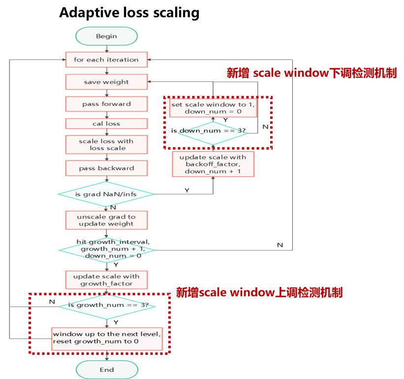

# 训练优化算法

> ## 🚨 弃用说明
>
> 本文档已过时，不再进行维护，并将在 *1.6.0* 版本下架，其中可能包含过时的信息或已被更新的功能替代。建议参考最新的 **[官方文档](https://www.mindspore.cn/mindformers/docs/zh-CN/r1.5.0/index.html)** ，以获取准确的信息。
>
> 如果您仍需使用本文档中的内容，请仔细核对其适用性，并结合最新版本的相关资源进行验证。
>
> 如有任何问题或建议，请通过 **[社区Issue](https://gitee.com/mindspore/mindformers/issues/new)** 提交反馈。感谢您的理解与支持！

MindFormers套件集成了许多模型训练中通用的优化算法，并提供了便捷的使用方式，在本文档中集中进行说明。

目录：

- [训练优化算法](#训练优化算法)
    - [梯度累积](#梯度累积)
    - [梯度裁剪](#梯度裁剪)
    - [Token分布](#token分布)
    - [Flash Attention](#flash-attention)
    - [Adaptive loss scaling](#adaptive-loss-scaling)
    - [Lazy Inline](#lazy-inline)
    - [MoE冷热门专家优化](#moe冷热门专家优化)

## 梯度累积

梯度累积算法是业界常用的扩大batch_size，解决OOM的一种算法，可参考[MindSpore文档](https://www.mindspore.cn/docs/zh-CN/r2.4.0/model_train/parallel/distributed_gradient_accumulation.html)

MindSpore在2.1.1之后的版本中增加了 `mindspore.nn.wrap.cell_wrapper.GradAccumulationCell` 这一梯度累积实现接口，通过拆分MiniBatch的形式实现了梯度累积

MindFormers套件对上述实现接口进行了适配，在需要开启梯度累积的场景下，只需在配置文件中的 `runner_config` 项下新增 `gradient_accumulation_steps` 项，并配置为所需的梯度累积步数即可，如下：

```yaml
runner_config:
  ...
  gradient_accumulation_steps: 4
  ...
```

除配置文件外，其余几种常用使用方式也提供了梯度累积的配置接口：

1. run_mindformer.py脚本启动时，可指定 `--gradient_accumulation_steps` 入参；

2. trainer接口启动时，可通过 `TrainingArguments` 类指定 `gradient_accumulation_steps` 入参；

**限制**：由于 `GradAccumulationCell` 的实现依赖并行特性，梯度累积当前仅支持在**半自动并行模式**下使用；此外，pipeline并行场景下，梯度累积含义与micro_batch相同，将不会生效，请配置 `micro_batch_num` 项以增大训练batch_size

## 梯度裁剪

梯度裁剪算法可以避免反向梯度过大，跳过最优解的情况

MindFormers中，默认的训练流程 `MFTrainOneStepCell` 中集成了梯度裁剪逻辑，通过 `use_clip_grad` 配置项来控制在训练过程中是否开启梯度裁剪，默认为False；并可通过 `max_grad_norm` 项控制梯度裁剪的最大norm值，默认为1.0；如下以开启梯度裁剪：

```yaml
runner_wrapper:
  type: MFTrainOneStepCell
  ...
  use_clip_grad: True
  max_grad_norm: 1.0
  ...
```

## Token分布

在MoE大模型训练过程中，常见的TopK Router算法会导致Token分发不均匀，存在Router给少数热门专家分配大量Token，多数冷门专家分配少量Token的情况。专家受限于专家容量，会将超过专家容量的Token丢弃，不足专家容量的Padding。所以获取Token分布情况能帮助用户合理确定专家容量。
MindFormers配置文件中的`MoE_config`新增了`save_token_distribution`配置项，默认False，需要搭配`callbacks`中的`SummaryMonitor`一同开启，如下：

```yaml
moe_config:
  expert_num: 8
  save_token_distribution: true

callbacks:
- type: SummaryMonitor
  summary_dir: "../summary_dir/token_distribution_dir"
  keep_default_action: False
  collect_freq: 1
  collect_tensor_freq: 1
  export_options: {'tensor_format':'npy'}
```

在开启该配置之后，会在`summary_dir`路径下生成`export_xxx/tensor`文件夹，其中包含每层MoE中Token分布数据，再使用`mindformers/tools/moe_token_distribution_tools.py`脚本，输入参数：`num_layers`、`hot_expert_num`、`npy_files_load_path`、`save_path_prefix`。会在保存路径中生成Token分布图。

## Flash Attention

Flash Attention（简称FA），是深度学习业界主流的注意力计算加速算法；MindSpore+Ascend架构也提供了FA实现，当前MindFormers对部分模型进行了FA的适配，可使用 `model_config` 中的 `use_flash_attention` 配置项控制模型是否使用FA

注意，FA特性依赖于MindSpore 2.2.10+版本，且目前仅针对Atlas A2训练系列硬件进行了适配，请使用正确的版本配套

由于FA特性并非全版本全硬件支持，当前默认关闭FA，需手动打开配置项以使用FA

举例如下，llama可通过修改配置项以使能FA，而后可使用该配置项进行训练

```yaml
# model config
model:
  model_config:
    type: LlamaConfig
    ...
    use_flash_attention: True   # True to enable FA, False to disable FA
    ...
  arch:
    type: LlamaForCausalLM
```

FA的模型支持度可参见 [模型能力表格](../model_support_list.md#llm大模型能力支持一览)

## Adaptive loss scaling

### Adaptive loss scaling 基本介绍

现有dynamic loss scaling方案使用固定scale window，在FP16或更低精度(8bit浮点格式)混合精度训练训练时，如果选用较大的scale window，存在loss scaling 调整不及时的风险，影响模型收敛性和收敛速度；如果选用较小的scale window，loss scale调整至合适的值时，仍会频繁上调，损失大量训练数据。 Adaptive loss scaling方案，通过动态调节scale window，实现自适应调整loss scale，实时将loss scale调整至FP16和8bit浮点格式正常训练所需的合适的值，同时避免损失大量训练数据。

### 使用场景及针对的问题

#### 使用场景

##### 大模型预训练

包含：FP16混合精度训练、全FP16训练、FP8混合精度训练、其他低精度浮点格式混合精度训练

##### 大模型断点续训

包含：FP16混合精度训练、全FP16训练、FP8混合精度训练、其他低精度浮点格式混合精度训练

##### 微调

FT、SFT、RLHF等模型微调场景

#### 针对的问题

##### 大模型训练早期

由于使用FP16和FP8等低精度数据格式引入的数值动态范围不足或精度不足导致的梯度弥散及loss回升问题

##### 大模型训练中后期

loss scale不稳定，异常波动，需频繁手动调整scale window进行断点重训的现象

### 设计概述

根据用户输入的max scale window，和默认的min scale window 20。根据最大和最小scale window， 自动生成一个scale window list，包含多个档位的scale window。

scale window 1为隐藏窗口，其下一档scale window为 min scale window 20。

针对模型训练过程loss scale变化趋势，设计两种检测机制：

scale window上调检测机制：训练开始初始使用第一档scale window 20进行训练，新增一个上调计数growth_num，初始为0，每次上调loss scale时，计数+1；每上调三次loss scale (上调计数为3时)，窗口随之上调，同时重置上调计数，直到达到最大窗口；

scale window下调检测机制：新增一个下调计数down_num，初始为0，每次下调loss scale时，计数+1，出现连续三次loss scale下降 (若中间出现loss scale上调，则重置下调计数)，且当前窗口不为min scale window，则将窗口调到1，同时重置下调计数。



### 使用示例

使用方法与Mindspore中支持的dynamic loss scaling和fixed loss scale类似，新增用户指定的超参max_scale_window和min_scale_window

Mindformers用法:

```python
import numpy as np
from mindspore.dataset import GeneratorDataset
from mindspore.nn import Momentum
from mindformers import Trainer, TrainingArguments, AutoModel
from mindformers import init_context, ContextConfig
from mindformers.wrapper import MFTrainOneStepCell, AdaptiveLossScaleUpdateCell


def context_init():
    """init context for mindspore."""
    context_config = ContextConfig(mode=0, device_target="Ascend", device_id=0)
    rank_id, device_num = init_context(use_parallel=False, context_config=context_config)


def generator():
    """text dataset generator."""
    seq_len = 1025
    input_ids = np.random.randint(low=0, high=15, size=(seq_len,)).astype(np.int32)
    for _ in range(512):
        yield input_ids

# 环境初始化
context_init()
# 自定义训练超参数
training_args = TrainingArguments(num_train_epochs=3, batch_size=2, learning_rate=0.001,
                                  warmup_steps=1000, sink_mode=True)
# 自定义模型
pangu_model = AutoModel.from_pretrained("pangualpha_2_6b")
opt = Momentum(learning_rate=0.1, momentum=0.9,
               params=pangu_model.trainable_params(),)
manager = AdaptiveLossScaleUpdateCell(1, 2, 20, 1000, 20)
train_network = MFTrainOneStepCell(pangu_model, opt, scale_sense=manager)
train_network.set_train()
# 自定义数据集
dataset = GeneratorDataset(generator, column_names=["input_ids"])
train_dataset = dataset.batch(batch_size=4)
eval_dataset = dataset.batch(batch_size=4)
# 定义文本生成任务，传入自定义模型、数据集、超参数
text_generation = Trainer(task='text_generation', model_name='pangualpha_2_6b',
                          wrapper=train_network, args=training_args,
                          train_dataset=train_dataset, eval_dataset=eval_dataset)
```

模型训练yaml中设置方式runner_config中声明使用adaptive loss scaling

```yaml
# runner
runner_config:
  epochs: 3
  batch_size: 4
  sink_mode: True
  sink_size: 2
runner_wrapper:
  type: MFTrainOneStepCell
  scale_sense:
    type: AdaptiveLossScaleUpdateCell
    loss_scale_value: 4294967296
    scale_factor: 2
    scale_window: 20
    max_scale_window: 1000
    min_scale_window: 20
  use_clip_grad: True
```

## Lazy Inline

### Lazy Inline 基本介绍

神经网络模型的编译过程往往采用默认inline的方式，把层级的代码表达最终展开成一张扁平的计算图，一方面寻求最大的编译优化机会，另一方面也可以简化自动微分以及执行的逻辑。inline后形成的计算图包含了所有的计算节点，可以在更大的范围内进行优化，比如常量折叠、节点融合、并行分析等，也可以更好地实现内存分配，减少内存申请和性能开销。虽然inline优化对于运行期性能提升帮助非常大，但过度inline也带来了编译期的负担。例如随着计算图节点数量膨胀，执行pass的耗时也在急剧增长。

为了减轻inline对编译性能带来的损耗，对于重复调用相同计算单元的场景（典型的场景是在for循环中调用同一个Cell类的不同实例），我们支持通过环境变量的方式调用Mindspore的`lazy_inline`方法来减少编译时间。

mindspore实现参考：

[mindspore.lazy_inline](https://www.mindspore.cn/docs/zh-CN/r2.2/api_python/mindspore/mindspore.lazy_inline.html)

具体原理参考：

[Lazy inline-百亿/千亿大语言模型静态图编译性能提升N倍的的思路和实践](https://www.mindspore.cn/news/newschildren?id=2657)

当启用`pipeline`并行时，模型规模和节点数加大，如果原来图的规模是`O`，那开启`pipeline`并行，单节点图的规模变为`(O/X)*Y`，其中`X`为`pipeline`的`stage`数量，`Y`为`microbatch`的数量，在实际的配置过程中，`Y`比`X`大很多，比如`X`为`16`，而`Y`一般设置到`64-192`，这样开启流水线并行后，图编译的规模会进一步增大到原来的`4-12`倍。

开启流水线并行，各个`micro batch`的`Layer`层是完全一样的。按照`micro batch`为边界，保留`micro batch`的子图结构，那么理论上编译时间可以变为原来的`Y`分之一。具体做法为在相关的`layer`类上打标记，给编译器提示，打上标记的`layer`不论是在循环体内被调用，还是其他方式被调用，在编译期间都不内联，直到执行前，才进行内联展开，从而大幅提升了编译性能。

### 使用说明

**注：此特性在mindspore≥2.2.0下适用。通常在`pipeline`并行时使用以提高编译性能。**

对于模型，可以通过在`__init__`函数上注册装饰器`lazy_inline`，指定一个cell是可复用的。此装饰器会按照`attrs`的值去添加`__init__`函数对应的入参作为cell的属性。示例如下：

```python
from mindformers.models.utils import lazy_inline
from mindformers.modules.transformer.op_parallel_config import _check_config
from mindformers.models import PreTrainedModel
from mindformers.models.llama.llama_config import LlamaConfig

class Baichuan7BV2ForCausalLM(PreTrainedModel):
    #注册装饰器
    @lazy_inline
    def __init__(self, config: LlamaConfig = None):
        super(Baichuan7BV2ForCausalLM, self).__init__(config, auto_prefix=True)
        _check_config(config.parallel_config)
        self.ignore_token_id = config.ignore_token_id
```

在pipeline并行模式下将默认使能lazy inline特性，可通过设置环境变量`ENABLE_LAZY_INLINE=0`关闭；  
在非pipeline并行模式下，lazy inline特性默认不生效，如需在非pipeline并行模式下使能lazy inline特性，可以通过设置环境变量 `ENABLE_LAZY_INLINE_NO_PIPELINE=1` ，并开启梯度累积功能以启用；
详情请参考[环境变量使用说明](../readthedocs/source_zh_cn/docs/practice/Environment.md)

## MoE冷热门专家优化

在MoE大模型训练过程中，常见的TopK Router算法会导致Token分发不均匀，存在Router给少数热门专家分配大量Token，多数冷门专家分配少量Token的情况。专家受限于专家容量，会将超过专家容量的Token丢弃，不足专家容量的Padding。所以提出热门专家容量和冷门专家容量，减少热门专家Token丢弃和冷门专家Padding。同时将热门专家迁移到所有训练设备上，减少其Token的AllToAll传输，所有设备上的热门专家副本采用数据并行，并通过AllReduce同步参数。

MindFormers配置文件中的`MoE_config`新增以下配置项：

`enable_cold_hot_expert`：默认为False，设置为True可开启MoE冷热门专家优化；

`hot_expert_num`：默认为0，当开启enable_cold_hot_expert时需要配置迁移的热门专家数量；

`cold_token_percent`：默认为1.0，取值范围(0.0, 1.0]，冷门专家容量因子为capacity_factor * cold_token_percent，热门专家容量因子仍为capacity_factor；

`moe_module_name`：本优化提供自动调整热门专家副本功能，需要指明MoE模型路径。

```yaml
moe_config:
  expert_num: 8
  capacity_factor: 2.0
  enable_cold_hot_expert: True
  hot_expert_num: 1
  cold_token_percent: 0.7
  moe_module_name: "network._backbone.backbone.blocks"
```

在模型方面，需要在传入moe_config前配置每层MoE的cur_layer:

```python
if config.moe_config.save_token_distribution or config.moe_config.enable_cold_hot_expert:
    moe_config = [copy.deepcopy(config.moe_config) for i in range(config.num_layers)]
    for i in range(config.num_layers):
        moe_config[i].cur_layer = i

    self.blocks = nn.CellList()
    for i in range(config.num_layers):
        block = GPTTransformerDecoderLayer(
            ......
            moe_config=moe_config if not (config.moe_config.save_token_distribution or
                                          config.moe_config.enable_cold_hot_expert) else moe_config[i],
            ......
        )
```

在训练的前期，热门Expert会发生变化，需要在训练过程中动态调整Expert副本所代表的Expert。使用本优化需要在callbacks中传入ColdHotExpertMonitor，ColdHotExpertMonitor中需要传入以下参数:

`moe_config`：config.moe_config

`hidden_size`：config.model.model_config.hidden_size

`ffn_hidden_size`：config.model.model_config.ffn_hidden_size ，对于model_config中没有配置ffn_hidden_size的模型，可以添加该配置或修改此处传入代码

`expert_parallel`：config.parallel_config.expert_parallel

`model_parallel`：config.parallel_config.model_parallel

`save_checkpoint_steps`：CheckpointMonitor中配置的'save_checkpoint_steps'

```python
from mindformers.core.callback.callback import ColdHotExpertMonitor

if config.moe_config.enable_cold_hot_expert:
    save_checkpoint_steps = -1
    for callback in config.callbacks:
        if callback['type'] == 'CheckpointMonitor':
            save_checkpoint_steps = callback['save_checkpoint_steps']
    cold_hot_monitor = ColdHotExpertMonitor(
        moe_config=config.moe_config,
        hidden_size=config.model.model_config.hidden_size,
        ffn_hidden_size=config.model.model_config.ffn_hidden_size,
        expert_parallel=config.parallel_config.expert_parallel,
        model_parallel=config.parallel_config.model_parallel,
        save_checkpoint_steps=save_checkpoint_steps)
    # ColdHotExpertMonitor needs to be placed before CheckpointMonitor
    callbacks.insert(1, cold_hot_monitor)
```

需要注意：在callbacks中ColdHotExpertMonitor需要放置在CheckpointMonitor前面，先执行ColdHotExpertMonitor，不然副本的权重还没复制回其代表的Expert就保存ckpt，导致ckpt保存的Expert权重并非最新训练结果。
