# 权重离线切分转换

该特性适用于：1.  权重过大，单卡无法加载；2. 权重为切分权重且与目标网络和运行卡数不匹配；

此时可利用本特性进行权重的切分和转换，以适配目标网络运行；

使用场景：1. 分布式恢复训练（恢复时卡数或者并行策略发生改变）；2. 评估/推理场景（权重需要进一步切分或者合并）

## 方案1：源码执行

- step1（默认已有待切分权重相对应的策略文件，若没有，也可参考以下方法生成）

在config中配置`only_save_strategy: True`，正常启动分布式训练/评估/推理，生成目标卡数的分布式策略文件后将会退出。生成的分布式策略文件保存在`output/strategy`目录下。

```yaml
only_save_strategy: True
```

- step2

运行如下脚本完成权重切分转换

```shell
python mindformers/tools/transform_ckpt.py --src_ckpt_strategy SRC_CKPT_STRATEGY --dst_ckpt_strategy DST_CKPT_STRATEGY --src_ckpt_dir SRC_CKPT_DIR --dst_ckpt_dir DST_CKPT_DIR
```

参数说明:

`src_ckpt_strategy`：待转权重的分布式策略文件路径。
  若为None,表示待转权重为完整权重;
  若为切分策略文件,表示原始的权重对应的策略文件;
  若为文件夹,表示需要合并文件夹内策略文件(仅在流水并行生成的策略文件时需要),合并后的策略文件保存在`SRC_CKPT_STRATEGY/merged_ckpt_strategy.ckpt`路径下;

`dst_ckpt_strategy`：目标权重的分布式策略文件路径。即step1中生成的分布式策略文件路径。
  若为None,表示将待转权重合并为完整权重;
  若为切分策略文件,表示目标卡数对应的策略文件
  若为文件夹,表示需要合并文件夹内策略文件(仅在流水并行生成的策略文件时需要),合并后的策略文件保存在`DST_CKPT_STRATEGY/merged_ckpt_strategy.ckpt`路径下;

`src_ckpt_dir`: 待转权重路径，须按照`SRC_CKPT_DIR/rank_{i}/checkpoint_{i}.ckpt`存放，比如单一权重存放格式为`SRC_CKPT_DIR/rank_0/checkpoint_0.ckpt`。

`dst_ckpt_dir`：目标权重保存路径，为自定义空文件夹路径，转换后模型以`DST_CKPT_DIR/rank_{i}/xxx.ckpt`存放。

- step3

将`config`的配置文件中`load_checkpoint`关键字指定为转换的目标权重保存路径，若转换后仍为切分权重，传入转换后的权重文件夹路径即可；若转换后为完整权重，传入权重文件路径即可正常启动训练。

```yaml
load_checkpoint: "{转换后权重文件夹/文件路径}"
```

## 方案2：高阶API 执行

参考Trainer API使用

使用`TrainingArguments`类打开`only_save_strategy`字段，其余步骤可参考**方案1**

# 权重自动切分转换

## 概述

目前分布式训练/推理，当权重与分布式策略不匹配时，往往涉及到离线转ckpt，大致需要以下3个步骤：

1、获取分布式权重策略文件；

2、离线转换，将权重转换为分布式训练/推理所需权重；

3、启动分布式训练/推理。

以上流程对外部客户来说易用性较差，因此设计**分布式权重自动转换方案**，在分布式训练/推理时能够无痛转换，提升分布式训练/推理任务启动效率。

以下为原分布式训练/推理流程：模型创建后，只能加载对应分布式策略的分布式权重，再进行训练和推理。因此用户需要按照**权重离线切分转换**手动转换权重。


以下为改进后的分布式推理/训练流程：中间插入**权重转换**，方便用户无需手动转换权重。


**权重自动切分转换**会在`output`文件夹下生成两个结果文件夹，分别是**strategy**和 **transformed_checkpoint**：

- strategy：保存**分布式策略文件**，主要有以下两种文件：

  ① **ckpt_strategy_rank_x.ckpt**：rank x的分布式策略文件；

  ② **merged_ckpt_strategy.ckpt**: 所有rank的分布式策略文件合并后的分布式策略文件；（开启流水线并行时才会合并）

- transformed_checkpoint：保存**转换后的权重**，按照`transformed_checkpoint/rank_x/checkpoint_x.ckpt`格式保存权重文件：

**注：**每次转换结束后需要**将strategy和transformed_checkpoint保存到自定义文件夹**，因为每次拉起新的任务，如果开启了权重自动转换，会将这两个文件夹清空，然后保存最新任务的转换结果。

## 适用场景

### 1. 完整权重转为分布式权重

- 适用：**使用完整权重进行分布式训练/推理**

① 配置`load_checkpoint`参数为**完整权重文件夹路径**，权重需要按照`{path}/rank_0/xxx.ckpt`格式存放；

② 配置`auto_trans_ckpt`参数为**True**；

③ 正常拉起分布式训练/推理；

### 2.分布式权重转为分布式权重

- 适用：**修改分布式策略后训练/推理**，如：16卡训练，4卡推理；16卡预训练，8卡微调等场景。

① 配置`load_checkpoint`参数为**分布式权重文件夹路径**，权重需要按照`{path}/rank_x/xxx.ckpt`格式存放；

② 配置`src_strategy_path_or_dir`参数为**分布式策略文件路径**，如果有**merged_ckpt_strategy.ckpt**，则填写之，如果没有，则填写任一 **ckpt_strategy_rank_x.ckpt**的路径；

② 配置`auto_trans_ckpt`参数为**True**；

③ 正常拉起分布式训练/推理；

### 3.分布式权重转为完整权重

- 适用：**分布式训练结束，使用单卡推理**，如：16卡训练，单卡推理

① 配置`load_checkpoint`参数为**分布式权重文件夹路径**，权重需要按照`{path}/rank_x/xxx.ckpt`格式存放；（注意：rank_k文件夹下可能保存了多个ckpt文件，来自不同step，每个rank_k文件夹仅保留一个相同step的ckpt文件）

② 配置`src_strategy_path_or_dir`参数为**分布式策略文件路径**，如果有**merged_ckpt_strategy.ckpt**，则填写之，如果没有，则填写任一 **ckpt_strategy_rank_x.ckpt**的路径；

② 配置`auto_trans_ckpt`参数为**True**；

③ 正常拉起推理；

#### **注**：分布式推理的并行策略目前仅支持"数据并行"和"模型并行"，暂时不支持"流水线并行"。

## 自动转换案例

### 一、Llama-7b模型的分布式训练案例(物理机)

- **完整权重自动切分为8卡分布式权重**

**案例描述**：基于一份完整的llama-7B预训练权重，使用8卡进行分布式训练。

完整权重如下


**步骤**：

① 配置参数

```yaml
# 配置预训练权重路径，预训练权重需要按照{dir}/rank_0/xxx.ckpt格式存放
load_checkpoint: "/home/zhangsenzhen/2023Q2/checkpoint_download/llama/llama_7b/"

# 设置auto_trans_ckpt为True
auto_trans_ckpt: True

# 8卡分布式配置参考
# default parallel of device num = 8 910A
parallel_config:
  data_parallel: 2
  model_parallel: 1
  pipeline_stage: 4
  optimizer_shard: True
  micro_batch_num: 4
  vocab_emb_dp: True
  gradient_aggregation_group: 4
# when model parallel is greater than 1, we can set micro_batch_interleave_num=2, that may accelerate the train process.
micro_batch_interleave_num: 1
```

② 启动训练

```shell
# step1：生成rank_table，rank_table_8.json为自行重命名的文件，原文件为hccl_xxx.json
python mindformers/tools/hccl_tools.py --device_num [0,8]
mv hccl*.json rank_table_8.json
# step2：拉起训练
cd script
./run_distribute.sh ../rank_table_8.json ../configs/llama/run_llama_7b.yaml [0,8] train
```

③ 查看训练日志

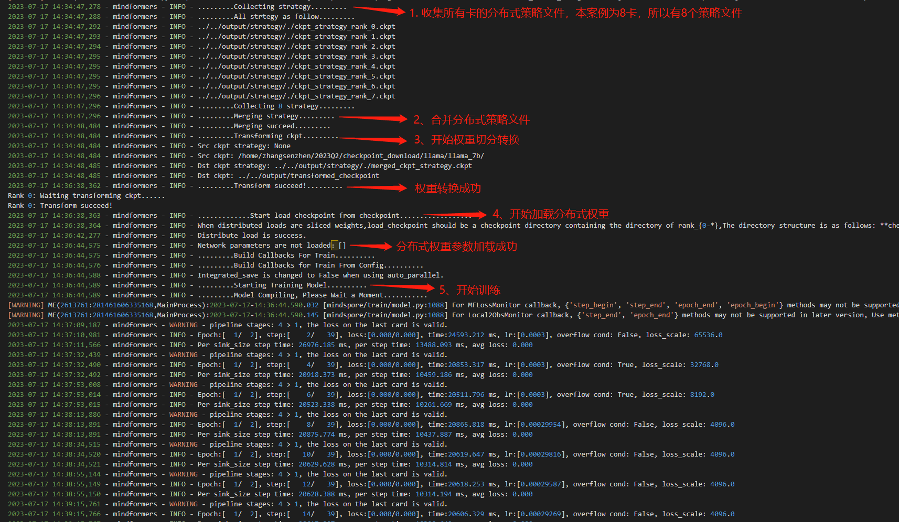

④ 查看转换生成的文件

**分布式策略文件**：保存在`output/strategy`文件夹下，由于开启了**流水线并行**，会对所有`ckpt_strategy_rank_x.ckpt`进行合并，得到`merged_ckpt_strategy.ckpt`。若不开启流水线并行，则不会合并。


**分布式权重**：保存在`output/transformed_checkpoint`文件夹下

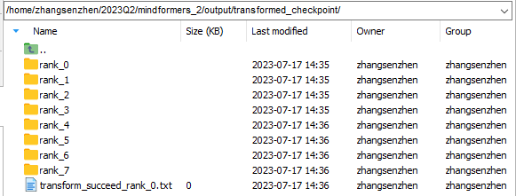

注：**strategy**和**transformed_checkpoint**两个文件夹请及时保存到**自定义文件夹**中，以免被后续转换任务清空。

- **8卡分布式权重自动切分为4卡分布式权重**

**案例描述**：基于8卡的分布式权重，转换到4卡进行分布式训练。

**步骤**：

① 将**完整权重自动切分为8卡分布式权重案例**得到的**分布式策略文件**和**转换权重**保存到**自定义文件夹**下，本案例中保存到`llama_7b_transformed`文件夹下

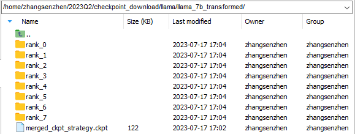

注：有`merged_ckpt_strategy.ckpt`的话，策略文件仅保存`merged_ckpt_strategy.ckpt`即可。若没有，保存任一`merged_ckpt_strategy.ckpt`即可。

② 配置参数

```yaml
# 配置预训练权重路径，预训练权重需要按照{dir}/rank_0/xxx.ckpt格式存放
load_checkpoint: "/home/zhangsenzhen/2023Q2/checkpoint_download/llama/llama_7b_transformed/"

# 配置分布式策略文件路径
src_strategy_path_or_dir: "/home/zhangsenzhen/2023Q2/checkpoint_download/llama/llama_7b_transformed/merged_ckpt_strategy.ckpt"

# 设置auto_trans_ckpt为True
auto_trans_ckpt: True

# 4卡分布式配置参考
# default parallel of device num = 8 910A
parallel_config:
  data_parallel: 1
  model_parallel: 2
  pipeline_stage: 2
  optimizer_shard: True
  micro_batch_num: 2
  vocab_emb_dp: True
  gradient_aggregation_group: 4
# when model parallel is greater than 1, we can set micro_batch_interleave_num=2, that may accelerate the train process.
micro_batch_interleave_num: 1
```

③ 启动训练

```shell
# step1：生成rank_table，rank_table_4.json为自行重命名的文件，原文件为hccl_xxx.json
python mindformers/tools/hccl_tools.py --device_num [0,4]
mv hccl*.json rank_table_4.json
# step2：拉起训练
cd script
./run_distribute.sh ../rank_table_4.json ../configs/llama/run_llama_7b.yaml [0,4] train
```

④ 查看训练日志

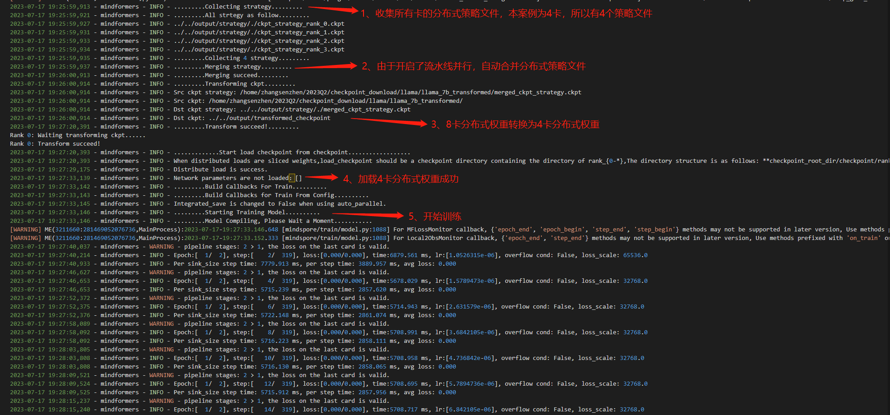

⑤ 查看转换生成的文件

**分布式策略文件**：保存在`output/strategy`文件夹下，由于开启了**流水线并行**，会对所有`ckpt_strategy_rank_x.ckpt`进行合并，得到`merged_ckpt_strategy.ckpt`。若不开启流水线并行，则不会合并。


**分布式权重**：保存在`output/transformed_checkpoint`文件夹下


注：**strategy**和**transformed_checkpoint**两个文件夹请及时保存到**自定义文件夹**中，以免被后续转换任务清空。

### 二、Llama-7b单卡/分布式推理案例(物理机)

- **8卡分布式权重自动合并为完整权重**

**案例描述**：基于8卡的分布式权重，合并为完整权重进行单卡推理。

**步骤**：

① 将**完整权重自动切分为8卡分布式权重案例**得到的**分布式策略文件**和**转换权重**保存到**自定义文件夹**下，本案例中保存到`llama_7b_transformed`文件夹下


注：有`merged_ckpt_strategy.ckpt`的话，策略文件仅保存`merged_ckpt_strategy.ckpt`即可。若没有，保存任一`merged_ckpt_strategy.ckpt`即可。

② 配置参数

```yaml
# 配置预训练权重路径，预训练权重需要按照{dir}/rank_0/xxx.ckpt格式存放
load_checkpoint: "/home/zhangsenzhen/2023Q2/checkpoint_download/llama/llama_7b_transformed/"

# 配置分布式策略文件路径
src_strategy_path_or_dir: "/home/zhangsenzhen/2023Q2/checkpoint_download/llama/llama_7b_transformed/merged_ckpt_strategy.ckpt"

# 设置auto_trans_ckpt为True
auto_trans_ckpt: True

# 设置use_paralle为False
use_parallel: False

# 设置run_mode为predict
run_mode: 'predict'

# 打开增量推理
use_past: True
```

③ 启动推理

```shell
python run_mindformer.py --config configs/llama/run_llama_7b.yaml --predict_data "I love beijing, because"
```

④ 查看推理日志


⑤ 查看合并后的权重

**完整权重**：保存在`output/transformed_checkpoint`文件夹下

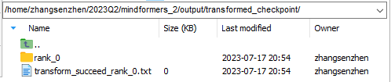

注：**transformed_checkpoint**请及时保存到**自定义文件夹**中，以免被后续转换任务清空。

- **8卡分布式权重自动切分为2卡分布式权重**

**案例描述**：基于8卡的分布式权重，自动切分为2卡分布式权重进行分布式推理。

**步骤**：

① 将**完整权重自动切分为8卡分布式权重案例**得到的**分布式策略文件**和**转换权重**保存到**自定义文件夹**下，本案例中保存到`llama_7b_transformed`文件夹下


注：有`merged_ckpt_strategy.ckpt`的话，策略文件仅保存`merged_ckpt_strategy.ckpt`即可。若没有，保存任一`merged_ckpt_strategy.ckpt`即可。

② 配置参数

```yaml
# 配置预训练权重路径，预训练权重需要按照{dir}/rank_0/xxx.ckpt格式存放
load_checkpoint: "/home/zhangsenzhen/2023Q2/checkpoint_download/llama/llama_7b_transformed/"

# 配置分布式策略文件路径
src_strategy_path_or_dir: "/home/zhangsenzhen/2023Q2/checkpoint_download/llama/llama_7b_transformed/merged_ckpt_strategy.ckpt"

# 设置auto_trans_ckpt为True
auto_trans_ckpt: True

# 设置use_paralle为False
use_parallel: False

# 设置run_mode为predict
run_mode: 'predict'

# 打开增量推理
use_past: True

# 2卡分布式配置参考
# default parallel of device num = 8 910A
parallel_config:
  data_parallel: 1
  model_parallel: 2
  pipeline_stage: 1
  optimizer_shard: True
  micro_batch_num: 1
  vocab_emb_dp: True
  gradient_aggregation_group: 4
# when model parallel is greater than 1, we can set micro_batch_interleave_num=2, that may accelerate the train process.
micro_batch_interleave_num: 1
```

③ 启动推理

```shell
# step1：生成rank_table，rank_table_2.json为自行重命名的文件，原文件为hccl_xxx.json
python mindformers/tools/hccl_tools.py --device_num [0,2]
mv hccl*.json rank_table_2.json
# step2：拉起训练
cd script
./run_distribute.sh rank_table_2.json configs/llama/run_llama_7b.yaml [0,2] predict "I love beijing, because"
```

④ 查看推理日志


⑤ 查看转换生成的文件

**分布式策略文件**：保存在`output/strategy`文件夹下


**分布式权重**：保存在`output/transformed_checkpoint`文件夹下

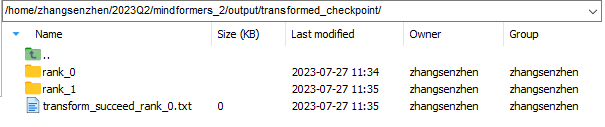

注：**strategy**和**transformed_checkpoint**两个文件夹请及时保存到**自定义文件夹**中，以免被后续转换任务清空。

- **完整权重自动切分为2卡分布式权重**

**案例描述**：基于ziya-llama-13B完整权重，自动切分为2卡分布式权重进行分布式推理。

完整权重如下

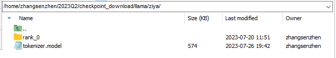

**步骤**：

① 配置参数

```yaml
# 配置预训练权重路径，预训练权重需要按照{dir}/rank_0/xxx.ckpt格式存放
load_checkpoint: "/home/zhangsenzhen/2023Q2/checkpoint_download/llama/ziya/"

# 设置auto_trans_ckpt为True
auto_trans_ckpt: True

# 设置use_paralle为False
use_parallel: False

# 设置run_mode为predict
run_mode: 'predict'

# 打开增量推理
use_past: True

# 2卡分布式配置参考
# default parallel of device num = 8 910A
parallel_config:
  data_parallel: 1
  model_parallel: 2
  pipeline_stage: 1
  optimizer_shard: True
  micro_batch_num: 1
  vocab_emb_dp: True
  gradient_aggregation_group: 4
# when model parallel is greater than 1, we can set micro_batch_interleave_num=2, that may accelerate the train process.
micro_batch_interleave_num: 1
```

② 启动推理

```shell
# step1：生成rank_table，rank_table_2.json为自行重命名的文件，原文件为hccl_xxx.json
python mindformers/tools/hccl_tools.py --device_num [0,2]
mv hccl*.json rank_table_2.json
# step2：拉起训练
cd script
./run_distribute.sh rank_table_2.json configs/llama/run_llama_13b.yaml [0,2] predict "<human>:你是谁？\n<bot>:"
```

③ 查看推理日志


④ 查看转换生成的文件

**分布式策略文件**：保存在`output/strategy`文件夹下


**分布式权重**：保存在`output/transformed_checkpoint`文件夹下

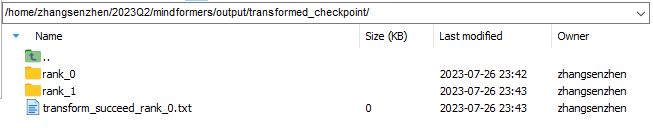

注：**strategy**和**transformed_checkpoint**两个文件夹请及时保存到**自定义文件夹**中，以免被后续转换任务清空。

### 三、**Llama13B模型的分布式训练案例(ModelArts)**

- **完整权重自动切分为分布式权重**

**案例描述**：基于一份完整的llama-13B预训练权重，在Modelarts上使用16卡进行分布式训练。

**步骤**：

① 配置参数

```yaml
# 16卡分布式配置参考
# default parallel of device num = 8 910A
parallel_config:
  data_parallel: 2
  model_parallel: 4
  pipeline_stage: 2
  optimizer_shard: True
  micro_batch_num: 2
  vocab_emb_dp: True
  gradient_aggregation_group: 4
# when model parallel is greater than 1, we can set micro_batch_interleave_num=2, that may accelerate the train process.
micro_batch_interleave_num: 1
```

② 训练作业配置

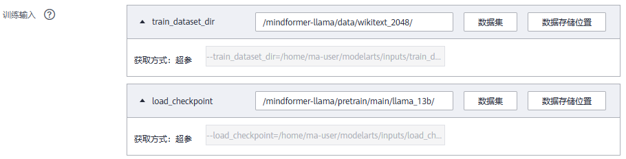

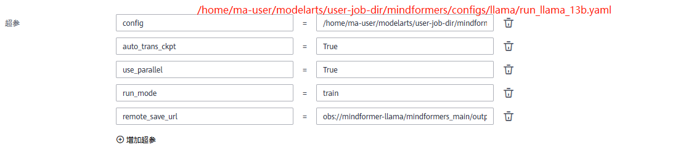

③ 提交训练作业，查看训练日志


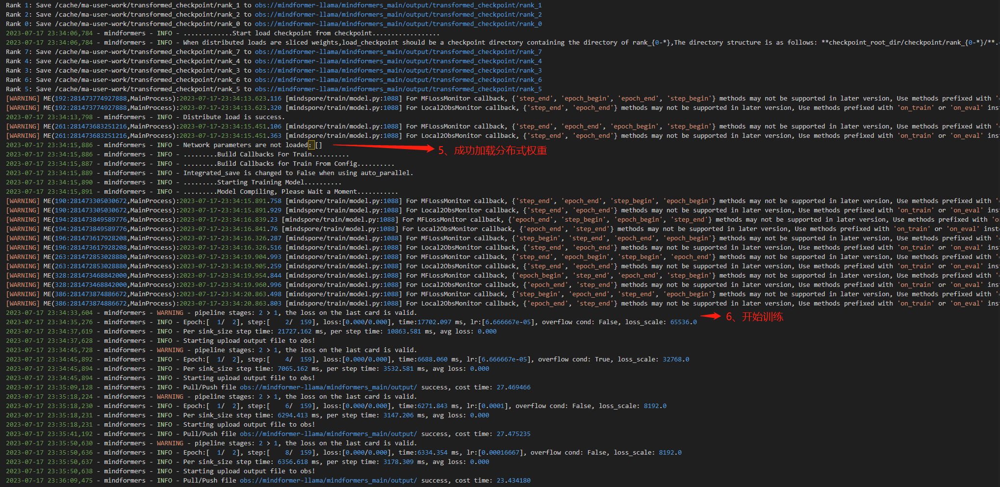

④ 查看转换生成的文件

**分布式策略文件**：保存在`remote_save_url/strategy`文件夹下，由于开启了**流水线并行**，会对所有`ckpt_strategy_rank_x.ckpt`进行合并，得到`merged_ckpt_strategy.ckpt`。若不开启流水线并行，则不会合并。

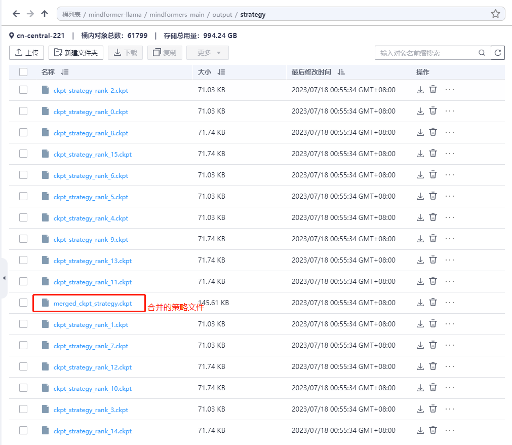

**分布式权重**：保存在`output/transformed_checkpoint`文件夹下

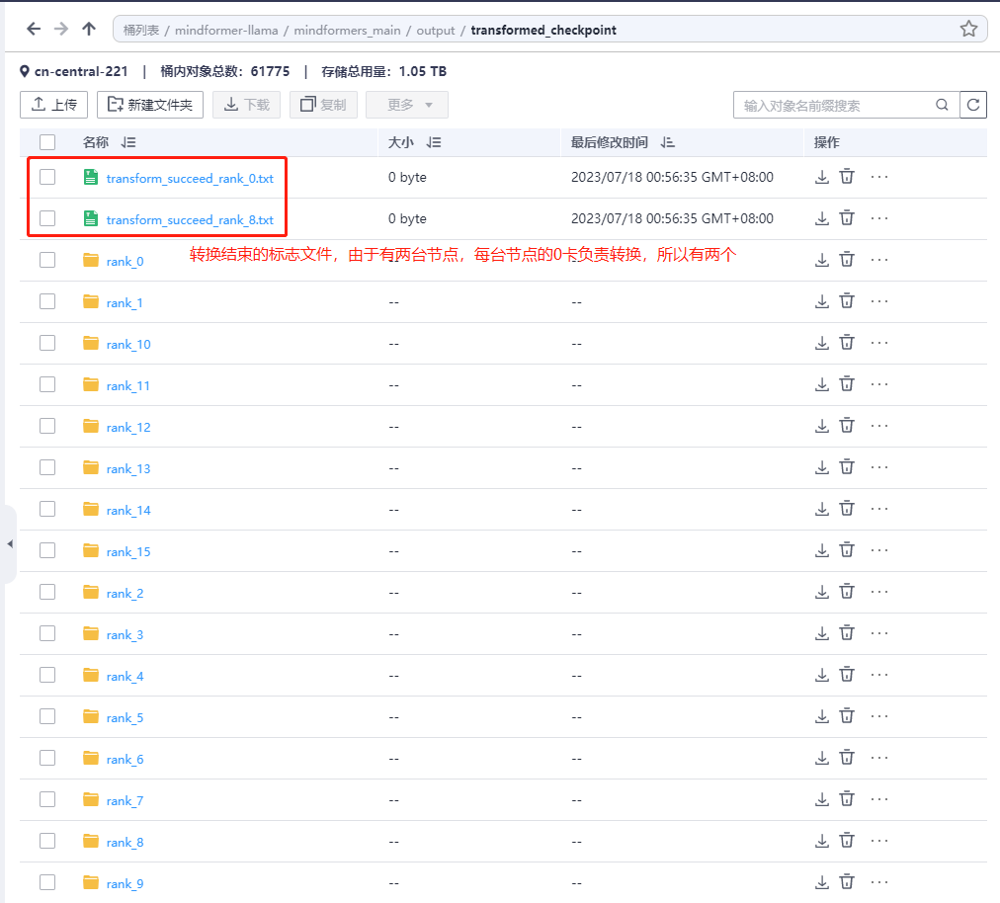

注：**strategy**和**transformed_checkpoint**两个文件夹请及时保存到**自定义文件夹**中，以免被后续转换任务清空。