# 离线权重转换

## 概述

目前分布式训练/推理，当预训练权重与分布式策略不匹配时，需要**将预训练权重转换为对应分布式策略的权重**，主要适用场景如下：

- 基于完整权重的分布式训练/推理：需要将完整权重转换为多卡分布式权重。
- 修改分布式策略进行训练/推理：需要将权重转换为对应分布式策略的权重。

**离线权重转换**需要以下3个步骤：

1、获取当前任务的分布式策略文件；

2、运行离线转换脚本获得目标权重；

3、配置load_checkpoint参数，启动分布式训练/推理。

主要参考：[mindspore分布式弹性训练与推理](https://www.mindspore.cn/tutorials/experts/zh-CN/r2.1/parallel/resilience_train_and_predict.html)

## 方案1：源码执行

### step1：获取当前任务的分布式策略文件

在yaml文件中配置only_save_strategy=True，正常启动分布式任务，生成对应的分布式策略文件后，任务将会主动退出。

分布式策略文件保存为`output/strategy/ckpt_strategy_rank_x.ckpt`，**ckpt_strategy_rank_x.ckpt**数量和卡数相同。

```yaml
only_save_strategy: True
```

### step2：运行离线转换脚本获得目标权重

```shell
python mindformers/tools/transform_ckpt.py \
--src_ckpt_strategy src_strategy_path_or_dir \
--dst_ckpt_strategy dst_strategy_path_or_dir \
--src_ckpt_dir src_ckpt_dir \
--dst_ckpt_dir dst_ckpt_dir \
--prefix "checkpoint_"
```

参数说明:

- src_ckpt_strategy：源权重对应的分布式策略文件路径。**源权重为完整权重则不填写**；若为分布式权重，视以下情况填写：

  1. 源权重开启了流水线并行：权重转换基于**合并的策略文件**，填写**分布式策略文件夹路径**，脚本会自动将文件夹内所有**ckpt_strategy_rank_x.ckpt**合并，并在文件夹下生成**merged_ckpt_strategy.ckpt**；如果已有**merged_ckpt_strategy.ckpt**，可以直接填写该文件路径。

  2. 源权重未开启流水线并行：权重转换基于**任一策略文件**，填写任一**ckpt_strategy_rank_x.ckpt**路径即可。

  **注**：如果策略文件夹下存在**merged_ckpt_strategy.ckpt**，仍传入文件夹路径，脚本首先会将旧的**merged_ckpt_strategy.ckpt**删除，再合并一个新的**merged_ckpt_strategy.ckpt**用于权重转换，因此需要确保文件夹有足够的写入权限，否则将会报错。

- dst_ckpt_strategy：目标权重的分布式策略文件路径。**目标权重为完整权重则不填写**；若为分布式权重，请参考src_ckpt_strategy；

- src_ckpt_dir：源权重所在的文件夹路径，源权重须按照`model_dir/rank_x/xxx.ckpt`格式存放，文件夹路径填写为**model_dir**。

- dst_ckpt_dir：目标权重保存路径，为自定义空文件夹路径，目标权重的保存格式为`model_dir/rank_x/xxx.ckpt`。

- prefix：目标权重保存名前缀，默认为"checkpoint_"，即权重按照`model_dir/rank_x/checkpoint_x.ckpt`保存。

### step3：配置load_checkpoint参数

将yaml配置文件中`load_checkpoint`关键字指定为目标权重路径，视以下情况填写：

- 目标权重为分布式切分权重：填写权重文件夹路径，即model_dir；
- 目标权重为完整权重：填写权重文件路径，即model_dir/rank_0/xxx.ckpt；

```yaml
load_checkpoint: model_dir_or_path
```

## 方案2：高阶API 执行

参考Trainer API使用

使用`TrainingArguments`类打开`only_save_strategy`字段，获取当前任务的分布式策略文件，其余步骤可参考**方案1**。

# 自动权重转换（推荐）

## 概述

Mindformer支持**自动权重转换**，当预训练权重与分布式策略不匹配时，将**auto_trans_ckpt**开关置为True，并配置权重转换相关参数，由Mindformer自动完成权重转换，相比**权重离线切分转换**提升了任务启动效率。

**自动权重转换**只需要配置以下参数：

- **load_checkpoint**：源权重所在的文件夹路径，源权重须按照`model_dir/rank_x/xxx.ckpt`格式存放，文件夹路径填写为**model_dir**。

- **src_strategy_path_or_dir**：源权重对应的分布式策略文件路径。**源权重为完整权重则不填写**；若为分布式权重，视以下情况填写：

  1. 源权重开启了流水线并行：权重转换基于**合并的策略文件**，填写**分布式策略文件夹路径**，Mindformer会自动将文件夹内所有**ckpt_strategy_rank_x.ckpt**合并，并在文件夹下生成**merged_ckpt_strategy.ckpt**；如果已有**merged_ckpt_strategy.ckpt**，可以直接填写该文件路径。

  2. 源权重未开启流水线并行：权重转换基于**任一策略文件**，填写任一**ckpt_strategy_rank_x.ckpt**路径即可。

  **注**：如果策略文件夹下存在**merged_ckpt_strategy.ckpt**，仍传入文件夹路径，Mindformer首先会将旧的**merged_ckpt_strategy.ckpt**删除，再合并一个新的**merged_ckpt_strategy.ckpt**用于权重转换，因此需要确保文件夹有足够的写入权限，否则将会报错。

- **auto_trans_ckpt**：权重自动转换开关，为True开启，默认False。

**自动权重转换**会在`output`文件夹下输出两个结果文件夹，分别是**strategy**和 **transformed_checkpoint**：

- **strategy**：保存当前任务的**分布式策略文件**，文件夹内主要有以下两种文件：

  ① **ckpt_strategy_rank_x.ckpt**：rank_x的分布式策略文件；

  ② **merged_ckpt_strategy.ckpt**: 所有**ckpt_strategy_rank_x.ckpt**合并成的分布式策略文件；

  ​     只有开启流水线并行，才会有 **merged_ckpt_strategy.ckpt**。

- **transformed_checkpoint**：保存**转换后的目标权重**，目标权重的保存格式为`transformed_checkpoint/rank_x/checkpoint_x.ckpt`

## 适用场景

Mindformer的**自动权重转换**特性适用于以下三大任务场景，基本可以满足各种权重转换需求：

- **基于完整权重，启动分布式任务**
- **修改分布式策略，启动分布式任务**
- **基于分布式权重，启动单卡任务**

针对以上适用场景，本文档列举了七种使用**权重自动转换**特性的训练/推理案例，供用户参考：

- 训练案例一：基于完整权重，启动8卡分布式训练；
- 训练案例二：基于8卡分布式权重，启动4卡分布式训练；
- 推理案例一：基于8卡分布式权重，启动单卡推理；
- 推理案例二：基于8卡分布式权重，启动2卡分布式推理；
- 推理案例三：基于完整权重，启动2卡分布式推理；

- ModelArts多机多卡训练案例：基于完整权重，启动2节点16卡分布式训练；

- 物理机多机多卡训练案例：基于完整权重，启动2节点16卡分布式训练；(暂时仅提供操作步骤)

## 注意事项

**注1**：传入权重需要按照`model_dir/rank_x/xxx.ckpt`格式存放，确保每个`rank_x`文件夹下**仅存放一个ckpt文件**。

**注2**：开启**自动权重转换**后，任务首先会删除`output`下旧的strategy和transformed_checkpoint，然后保存当前任务的输出结果。因此上一次转换任务结束后，如有必要**请将strategy和transformed_checkpoint保存到自定义文件夹，避免误删**。

**注3**：分布式推理暂时不支持**流水线并行**，pipeline_stage固定设置为1。

**注4**：**物理机多机多卡任务**可以参考**物理机多机多卡训练案例**。

## 自动转换案例

### 前期准备

- 权重

[llama7B完整权重](https://ascend-repo-modelzoo.obs.cn-east-2.myhuaweicloud.com/XFormer_for_mindspore/llama/open_llama_7b.ckpt)

- 词表

llama7B的[tokenizer.model](https://ascend-repo-modelzoo.obs.cn-east-2.myhuaweicloud.com/XFormer_for_mindspore/llama/tokenizer.model)

- 数据集

[WikiText2数据集](https://ascend-repo-modelzoo.obs.cn-east-2.myhuaweicloud.com/MindFormers/dataset/wikitext-2/wikitext-2-v1.zip)

使用以下预处理脚本生成mindrecord训练数据

```bash
# 使用tools/dataset_preprocess/llama/llama_preprocess.py进行数据预处理+Mindrecord数据生成
python llama_preprocess.py \
--dataset_type wiki \
--input_glob  /{path}/wiki.train.tokens \
--model_file /{path}/tokenizer.model \
--seq_length 2048 \
--output_file /{path}/wiki2048.mindrecord
```

- rank_table_file

案例中分别会用到8卡、4卡、2卡对应的rank_table_file

```shell
# 8卡的rank_table_file：自行重命名为rank_table_8.json，原文件为hccl_xxx.json
python mindformers/tools/hccl_tools.py --device_num [0,8]
mv hccl*.json rank_table_8.json

# 4卡的rank_table_file：自行重命名为rank_table_4_id04.json，原文件为hccl_xxx.json
python mindformers/tools/hccl_tools.py --device_num [0,4]
mv hccl*.json rank_table_4_id04.json

# 2卡的rank_table_file：自行重命名为rank_table_2_id02.json，原文件为hccl_xxx.json
python mindformers/tools/hccl_tools.py --device_num [0,2]
mv hccl*.json rank_table_2_id02.json
```

### 训练案例一：基于完整权重，启动8卡分布式训练

**案例描述**：基于一份完整的llama-7B预训练权重，使用8卡进行分布式训练。

完整权重：

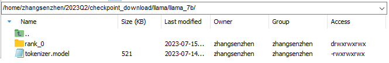

预训练数据集：

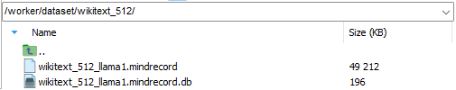

**步骤**：

① 配置参数

```yaml
# 配置预训练权重路径，预训练权重需要按照model_dir/rank_x/xxx.ckpt格式存放，填写model_dir
load_checkpoint: "/worker/checkpoint/llama-7b/single/"

# 设置auto_trans_ckpt为True
auto_trans_ckpt: True

# 配置数据集
train_dataset: &train_dataset
  data_loader:
    type: MindDataset
    dataset_dir: "/worker/dataset/wikitext_2048/"
    shuffle: True

# 配置8卡分布式策略，仅供参考
parallel_config:
  data_parallel: 2
  model_parallel: 1
  pipeline_stage: 4
  micro_batch_num: 4
  vocab_emb_dp: True
  gradient_aggregation_group: 4
# when model parallel is greater than 1, we can set micro_batch_interleave_num=2, that may accelerate the train process.
micro_batch_interleave_num: 1
```

② 启动训练

```shell
cd script
bash run_distribute.sh ../rank_table_8.json ../configs/llama/run_llama_7b.yaml [0,8] train
```

③ 查看权重转换相关日志

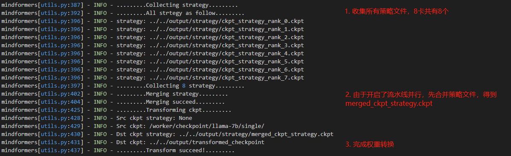

训练正常：

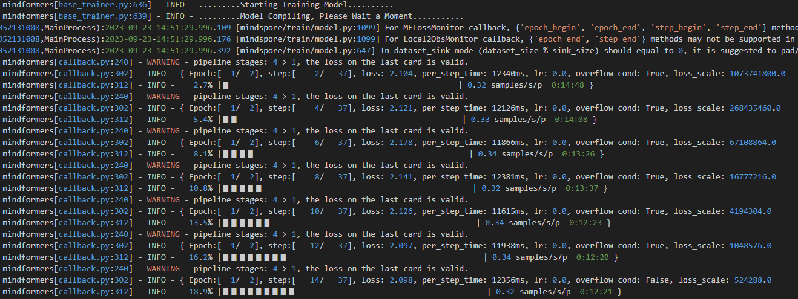

④ 查看转换生成的文件

**分布式策略文件**：保存在`output/strategy`文件夹下，由于开启了**流水线并行**，会对所有`ckpt_strategy_rank_x.ckpt`进行合并，得到`merged_ckpt_strategy.ckpt`。若不开启流水线并行，则不会合并。

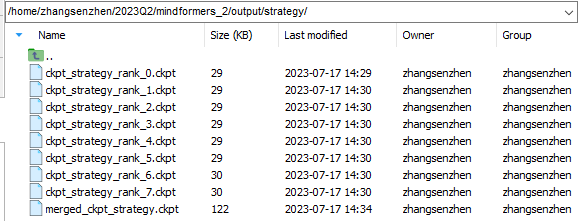

**分布式权重**：保存在`output/transformed_checkpoint`文件夹下

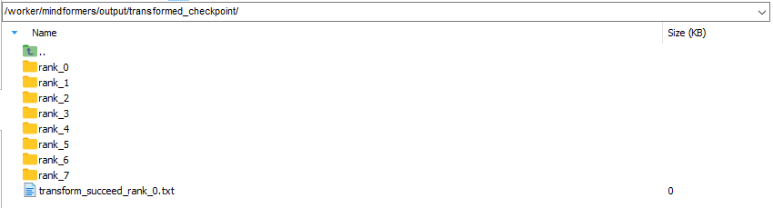

⑤ 保存生成的**分布式策略文件**和**分布式权重**到自定义文件夹下，以供后续使用

```shell
mv ../output/transformed_checkpoint/ /worker/checkpoint/llama-7b/multi_dp2mp1pp4
mv ../output/strategy/ /worker/checkpoint/llama-7b/multi_dp2mp1pp4/
```

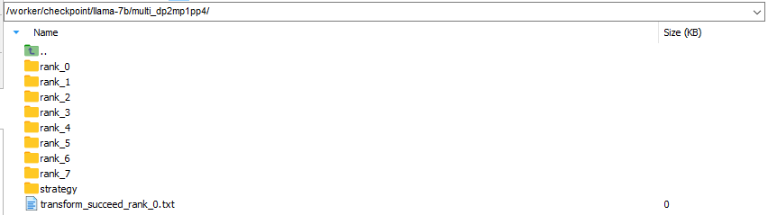

### 训练案例二：8卡分布式权重自动切分为4卡分布式权重

**案例描述**：基于8卡的分布式权重，转换到4卡进行分布式训练。

8卡分布式权重和策略文件：

- 用**训练案例一**保存好的


**步骤**：

① 配置参数

```yaml
# 配置预训练权重路径，预训练权重需要按照model_dir/rank_x/xxx.ckpt格式存放，填写model_dir
load_checkpoint: "/worker/checkpoint/llama-7b/multi_dp2mp1pp4/"

# 配置分布式策略文件路径
src_strategy_path_or_dir: "/worker/checkpoint/llama-7b/multi_dp2mp1pp4/strategy/merged_ckpt_strategy.ckpt"

# 设置auto_trans_ckpt为True
auto_trans_ckpt: True

# 设置数据集
train_dataset: &train_dataset
  data_loader:
    type: MindDataset
    dataset_dir: "/worker/dataset/wikitext_2048/"
    shuffle: True

# 4卡分布式配置参考
# default parallel of device num = 8 for Atlas 800
parallel_config:
  data_parallel: 1
  model_parallel: 2
  pipeline_stage: 2
  micro_batch_num: 2
  vocab_emb_dp: True
  gradient_aggregation_group: 4
# when model parallel is greater than 1, we can set micro_batch_interleave_num=2, that may accelerate the train process.
micro_batch_interleave_num: 1
```

② 启动训练

```shell
cd script
bash run_distribute.sh ../rank_table_4_id04.json ../configs/llama/run_llama_7b.yaml [0,4] train
```

③ 查看权重转换相关日志

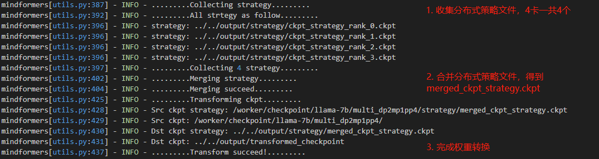

训练正常：

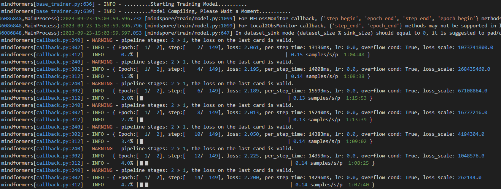

④ 查看转换生成的文件

**分布式策略文件**：保存在`output/strategy`文件夹下，由于开启了**流水线并行**，会对所有`ckpt_strategy_rank_x.ckpt`进行合并，得到`merged_ckpt_strategy.ckpt`。若不开启流水线并行，则不会合并。

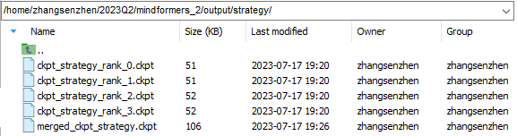

**分布式权重**：保存在`output/transformed_checkpoint`文件夹下

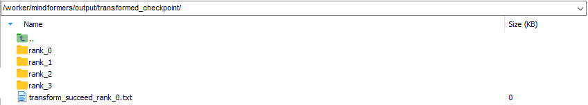

注：**strategy**和**transformed_checkpoint**两个文件夹请及时保存到**自定义文件夹**中，以免被后续转换任务清空。

### 推理案例一：8卡分布式权重自动合并为完整权重

**案例描述**：基于8卡的分布式权重，合并为完整权重进行单卡推理。

8卡分布式权重和策略文件：

- 用**训练案例一**保存好的


**步骤**：

① 配置参数

```yaml
# 配置预训练权重路径，预训练权重需要按照model_dir/rank_x/xxx.ckpt格式存放，填写model_dir
load_checkpoint: "/worker/checkpoint/llama-7b/multi_dp2mp1pp4/"

# 配置分布式策略文件路径
src_strategy_path_or_dir: "/worker/checkpoint/llama-7b/multi_dp2mp1pp4/strategy/merged_ckpt_strategy.ckpt"

# 设置auto_trans_ckpt为True
auto_trans_ckpt: True

# 设置use_paralle为False
use_parallel: False

# 设置run_mode为predict
run_mode: 'predict'

# 打开增量推理
use_past: True

# 配置词表路径（如果配置文件没有vocab_file关键字请自行补上）
processor:
  tokenizer:
    vocab_file: "/worker/checkpoint/llama-7b/tokenizer.model"
```

③ 启动推理

```shell
python run_mindformer.py --config configs/llama/run_llama_7b.yaml --predict_data "I love beijing, because"
```

③ 查看权重转换相关日志

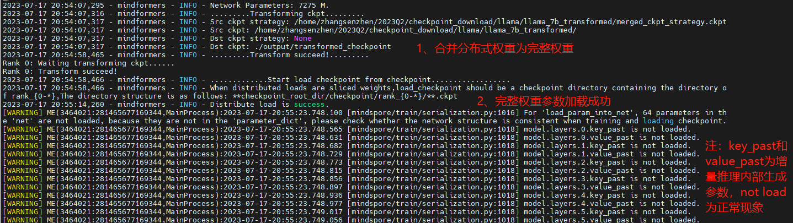

推理正常：

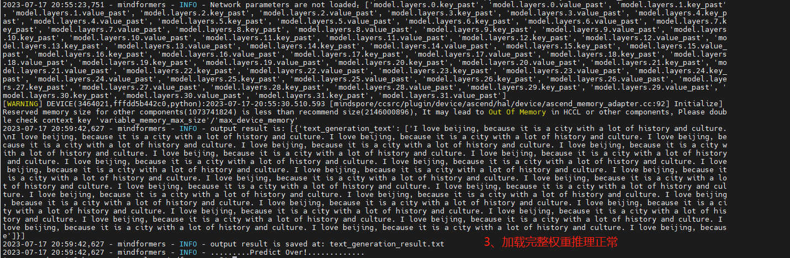

④ 查看合并后的权重

**完整权重**：保存在`output/transformed_checkpoint`文件夹下

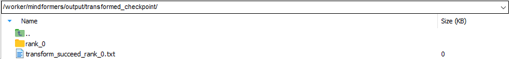

注：**transformed_checkpoint**请及时保存到**自定义文件夹**中，以免被后续转换任务清空。

### 推理案例二：8卡分布式权重自动切分为2卡分布式权重

**案例描述**：基于8卡的分布式权重，自动切分为2卡分布式权重进行分布式推理。

8卡分布式权重和策略文件：

- 用**训练案例一**保存好的


**步骤**：

① 配置参数

```yaml
# 配置预训练权重路径，预训练权重需要按照model_dir/rank_x/xxx.ckpt格式存放，填写model_dir
load_checkpoint: "/worker/checkpoint/llama-7b/multi_dp2mp1pp4/"

# 配置分布式策略文件路径
src_strategy_path_or_dir: "/worker/checkpoint/llama-7b/multi_dp2mp1pp4/strategy/merged_ckpt_strategy.ckpt"

# 设置auto_trans_ckpt为True
auto_trans_ckpt: True

# 设置use_paralle为True
use_parallel: True

# 设置run_mode为predict
run_mode: 'predict'

# 打开增量推理
use_past: True

# 2卡分布式配置参考
# default parallel of device num = 8 for Atlas 800
# 由于通过run_distribute.sh拉起推理，内部走的是pipeline推理流程，暂时不支持多batch推理，因此data_parallel设置为1
parallel_config:
  data_parallel: 1
  model_parallel: 2
  pipeline_stage: 1
  micro_batch_num: 1
  vocab_emb_dp: True
  gradient_aggregation_group: 4
# when model parallel is greater than 1, we can set micro_batch_interleave_num=2, that may accelerate the train process.
micro_batch_interleave_num: 1

# 配置词表路径（如果配置文件没有vocab_file关键字请自行补上）
processor:
  tokenizer:
    vocab_file: "/worker/checkpoint/llama-7b/tokenizer.model"
```

② 启动推理

```shell
cd script
bash run_distribute.sh rank_table_2_id02.json configs/llama/run_llama_7b.yaml [0,2] predict "I love beijing, because"
```

④ 查看权重转换相关日志

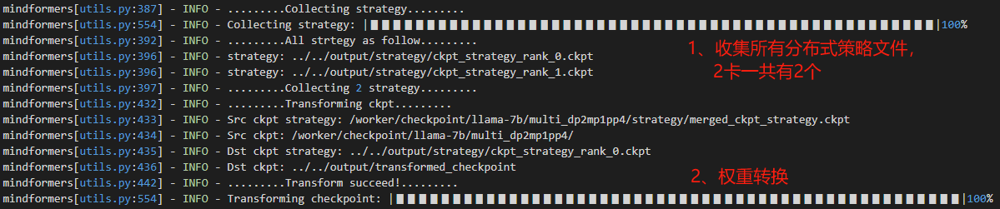

推理正常：

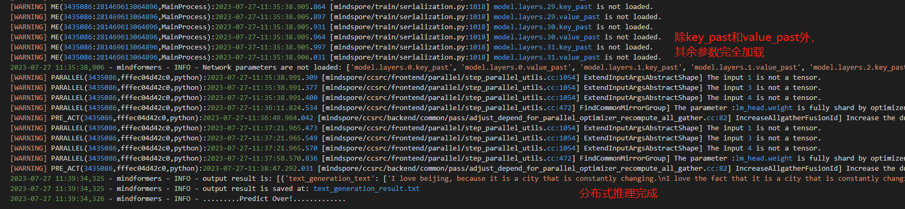

⑤ 查看转换生成的文件

**分布式策略文件**：保存在`output/strategy`文件夹下

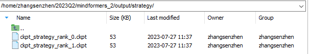

**分布式权重**：保存在`output/transformed_checkpoint`文件夹下

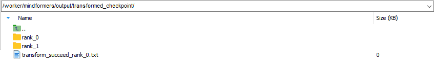

注：**strategy**和**transformed_checkpoint**两个文件夹请及时保存到**自定义文件夹**中，以免被后续转换任务清空。

### 推理案例三：完整权重自动切分为2卡分布式权重

**案例描述**：基于一份完整的llama-7B预训练权重，使用2卡进行分布式推理。

完整权重：


**步骤**：

① 配置参数

```yaml
# 配置预训练权重路径，预训练权重需要按照model_dir/rank_x/xxx.ckpt格式存放，填写model_dir
load_checkpoint: "/worker/checkpoint/llama-7b/single/"

# 设置auto_trans_ckpt为True
auto_trans_ckpt: True

# 设置use_paralle为True
use_parallel: True

# 设置run_mode为predict
run_mode: 'predict'

# 打开增量推理
use_past: True

# 2卡分布式配置参考
# default parallel of device num = 8 for Atlas 800
# 由于通过run_distribute.sh拉起推理，内部走的是pipeline推理流程，暂时不支持多batch推理，因此data_parallel设置为1
parallel_config:
  data_parallel: 1
  model_parallel: 2
  pipeline_stage: 1
  micro_batch_num: 1
  vocab_emb_dp: True
  gradient_aggregation_group: 4
# when model parallel is greater than 1, we can set micro_batch_interleave_num=2, that may accelerate the train process.
micro_batch_interleave_num: 1

# 配置词表路径（如果配置文件没有vocab_file关键字请自行补上）
processor:
  tokenizer:
    vocab_file: "/worker/checkpoint/llama-7b/tokenizer.model"
```

② 启动推理

```shell
cd script
bash run_distribute.sh rank_table_2_id02.json configs/llama/run_llama_7b.yaml [0,2] predict "I love beijing, because"
```

③ 查看权重转换相关日志

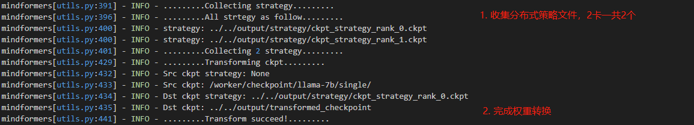

推理正常：

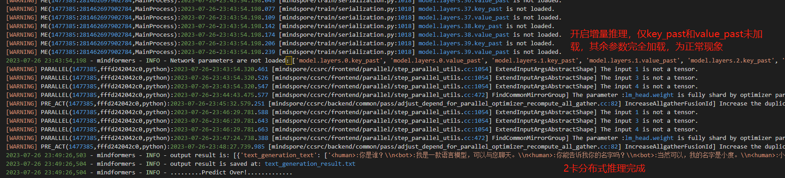

④ 查看转换生成的文件

**分布式策略文件**：保存在`output/strategy`文件夹下

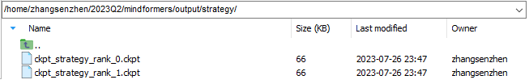

**分布式权重**：保存在`output/transformed_checkpoint`文件夹下

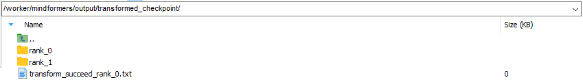

注：**strategy**和**transformed_checkpoint**两个文件夹请及时保存到**自定义文件夹**中，以免被后续转换任务清空。

### ModelArts多机多卡训练案例

**案例描述**：基于一份完整的llama-7B预训练权重，在Modelarts上使用16卡进行分布式训练。

**步骤**：

① 配置参数

```yaml
# 16卡分布式配置参考
# default parallel of device num = 8 for Atlas 800
parallel_config:
  data_parallel: 2
  model_parallel: 4
  pipeline_stage: 2
  micro_batch_num: 2
  vocab_emb_dp: True
  gradient_aggregation_group: 4
# when model parallel is greater than 1, we can set micro_batch_interleave_num=2, that may accelerate the train process.
micro_batch_interleave_num: 1
```

② 训练作业配置

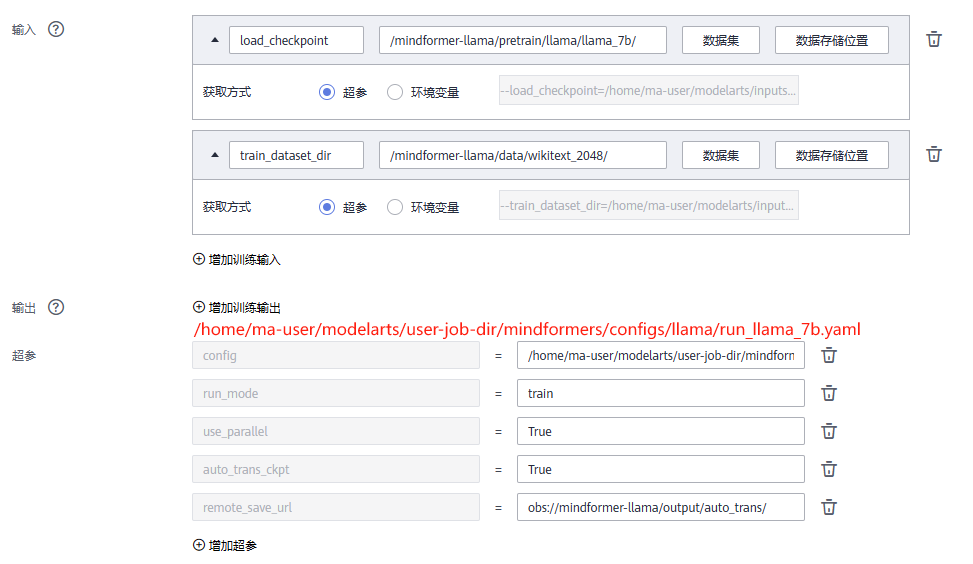

③ 提交训练作业，查看训练日志

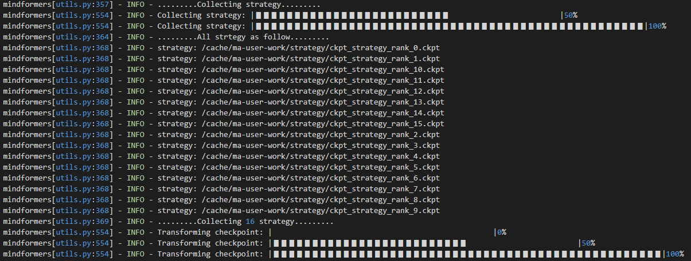


④ 查看转换生成的文件

**分布式策略文件**：保存在`remote_save_url/strategy`文件夹下，由于开启了**流水线并行**，会对所有`ckpt_strategy_rank_x.ckpt`进行合并，得到`merged_ckpt_strategy.ckpt`。若不开启流水线并行，则不会合并。

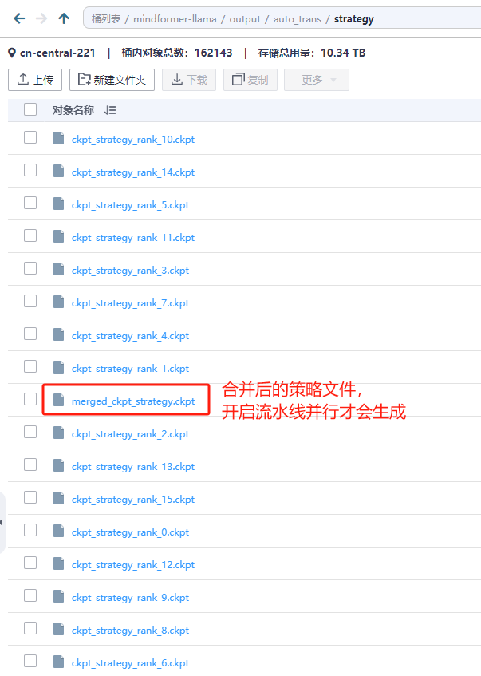

**分布式权重**：保存在`output/transformed_checkpoint`文件夹下

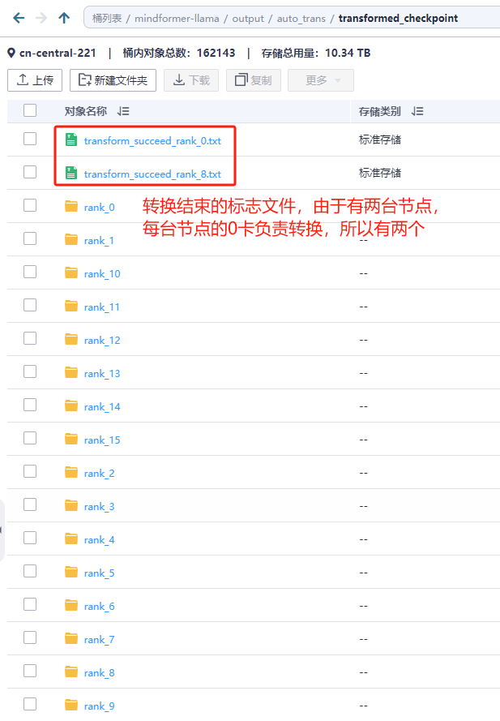

注：**strategy**和**transformed_checkpoint**两个文件夹请及时保存到**自定义文件夹**中，以免被后续转换任务清空。

### 物理机多机多卡训练案例

**案例描述**：基于一份完整的llama-7B预训练权重，在2台Atlas服务器上使用16卡进行分布式训练。

**前提**：请确保服务器之间已经组网。

根据是否有共享盘，分为以下两种情况：

**1. 服务器之间有共享盘：支持自动权重转换**

假设`/public`为服务器共享盘。

**步骤**：

① 准备rank_table_file

```shell
# step1：每台机器生成各自的rank_table_file
python mindformers/tools/hccl_tools.py --device_num [0,8]

# step2：将所有机器的rank_table_file保存到一台机器，进行合并
python mindformers/tools/merge_hccl.py hccl*.json

# step3：将合并后的rank_table_file复制到所有机器
```

② 配置参数

```yaml
# 修改输出保存路径到共享盘目录
output_dir: "/public/output"

# 配置预训练权重路径，预训练权重需要按照model_dir/rank_x/xxx.ckpt格式存放，填写model_dir
load_checkpoint: "/worker/checkpoint/llama-7b/single/"

# 设置auto_trans_ckpt为True
auto_trans_ckpt: True

# 配置数据集
train_dataset: &train_dataset
  data_loader:
    type: MindDataset
    dataset_dir: "/worker/dataset/wikitext_2048/"
    shuffle: True

# 配置16卡分布式策略，仅供参考
parallel_config:
  data_parallel: 2
  model_parallel: 4
  pipeline_stage: 2
  micro_batch_num: 2
  vocab_emb_dp: True
  gradient_aggregation_group: 4
# when model parallel is greater than 1, we can set micro_batch_interleave_num=2, that may accelerate the train process.
micro_batch_interleave_num: 1
```

③ 启动训练

```shell
cd script
# 第一台机器（0节点）
bash run_distribute.sh RANK_TABLE_FILE ../configs/llama/run_llama_7b.yaml [0,8] train 16
# 第二台机器（0节点）
bash run_distribute.sh RANK_TABLE_FILE ../configs/llama/run_llama_7b.yaml [8,16] train 16
```

**2. 服务器之间无共享盘：不支持自动权重转换，使用离线权重转换**

**步骤**：

① 准备rank_table_file

```shell
# step1：每台机器生成各自的rank_table_file
python mindformers/tools/hccl_tools.py --device_num [0,8]

# step2：将所有机器的rank_table_file保存到一台机器，进行合并
python mindformers/tools/merge_hccl.py hccl*.json

# step3：将合并后的rank_table_file复制到所有机器
```

② 配置参数

```yaml
# 配置only_save_strategy=True，拉起分布式任务以获取所有节点的分布式策略文件
only_save_strategy: True

# 配置数据集
train_dataset: &train_dataset
  data_loader:
    type: MindDataset
    dataset_dir: "/worker/dataset/wikitext_2048/"
    shuffle: True

# 配置16卡分布式策略，仅供参考
parallel_config:
  data_parallel: 2
  model_parallel: 4
  pipeline_stage: 2
  micro_batch_num: 2
  vocab_emb_dp: True
  gradient_aggregation_group: 4
# when model parallel is greater than 1, we can set micro_batch_interleave_num=2, that may accelerate the train process.
micro_batch_interleave_num: 1
```

③ 启动训练任务，目的是获取所有分布式策略文件

```shell
cd script
# 第一台机器（0节点）
bash run_distribute.sh RANK_TABLE_FILE ../configs/llama/run_llama_7b.yaml [0,8] train 16
# 第二台机器（1节点）
bash run_distribute.sh RANK_TABLE_FILE ../configs/llama/run_llama_7b.yaml [8,16] train 16
```

各节点的策略文件保存在各自的`output/strategy`目录下，其中0节点保存`ckpt_strategy_rank_0-7.ckpt`，1节点保存`ckpt_strategy_rank_8-15.ckpt`。

④ 离线权重切分

**将1节点的ckpt_strategy_rank_8-15.ckpt拷贝到0节点目录下**，0节点收集到所有16个策略文件后，对**完整权重进行离线切分**，运行离线切分脚本

```shell
# 具体参数说明见离线权重转换章节
python mindformers/tools/transform_ckpt.py \
--src_ckpt_strategy None \ # 填None或不填，表示原始权重是完整权重
--dst_ckpt_strategy output/strategy \ # 保存16个策略文件的文件夹路径
--src_ckpt_dir “/worker/checkpoint/llama-7b/single/” \
--dst_ckpt_dir “/worker/checkpoint/llama-7b/multi_dp2mp4pp2/”
```

⑤ 1节点获取其对应的分布式权重，以下两种方式均可：

- 拷贝分布式权重到1节点，可以拷贝完整分布式权重，也可以只拷贝**rank_8到rank_15**，建议使用scp命令传输。(推荐)
- 1节点同样按照步骤**④ 离线权重切分**获取完整分布式权重。

⑥  配置参数

```yaml
# 配置预训练权重路径，预训练权重需要按照model_dir/rank_x/xxx.ckpt格式存放，填写model_dir
load_checkpoint: "/worker/checkpoint/llama-7b/multi_dp2mp4pp2/"

# 设置auto_trans_ckpt为False
auto_trans_ckpt: False

# 配置数据集
train_dataset: &train_dataset
  data_loader:
    type: MindDataset
    dataset_dir: "/worker/dataset/wikitext_2048/"
    shuffle: True

# 配置16卡分布式策略，仅供参考
parallel_config:
  data_parallel: 2
  model_parallel: 4
  pipeline_stage: 2
  micro_batch_num: 2
  vocab_emb_dp: True
  gradient_aggregation_group: 4
# when model parallel is greater than 1, we can set micro_batch_interleave_num=2, that may accelerate the train process.
micro_batch_interleave_num: 1
```

③ 启动训练

```shell
cd script
# 第一台机器（0节点）
bash run_distribute.sh RANK_TABLE_FILE ../configs/llama/run_llama_7b.yaml [0,8] train 16
# 第二台机器（1节点）
bash run_distribute.sh RANK_TABLE_FILE ../configs/llama/run_llama_7b.yaml [8,16] train 16
```
