# 权重转换

## 概述

目前分布式训练/推理，当预训练权重与分布式策略不匹配时，需要**将预训练权重转换为对应分布式策略的权重**，主要适用场景如下：

- 基于完整权重的分布式训练/推理：需要将完整权重转换为多卡分布式权重。
- 修改分布式策略进行训练/推理：需要将权重转换为对应分布式策略的权重。
- 基于训练完的分布式权重进行单卡推理：需要将分布式权重合并为完整权重。

主要参考：[mindspore分布式弹性训练与推理](https://www.mindspore.cn/tutorials/experts/zh-CN/master/parallel/model_transformation.html)

## 自动权重转换

Mindformer支持**自动权重转换**，当预训练权重与分布式策略不匹配时，将`auto_trans_ckpt`开关置为True，并配置权重转换相关参数，由Mindformer自动完成权重转换，相比[离线权重转换](#离线权重转换)提升了任务启动效率。

**自动权重转换**相关参数说明如下：

| 参数名称              | 描述                                                         |
| --------------------- | ------------------------------------------------------------ |
| load_checkpoint       | 预加载权重的绝对路径或文件夹路径。<br />- 如果是完整权重，则填写绝对路径；<br />- 如果是分布式权重，则填写文件夹路径，分布式权重须按照`model_dir/rank_x/xxx.ckpt`格式存放，文件夹路径填写为`model_dir`。**如果rank_x文件夹下存在多个ckpt，将会使用文件名默认排序最后的ckpt文件用于转换。** |
| src_strategy          | 预加载权重对应的分布式策略文件路径。<br />- 如果预加载权重是完整权重，则**不填写**；<br />- 如果预加载权重是分布式权重，且预加载权重保存时使用了流水线并行，则填写**合并的策略文件路径**或**分布式策略文件夹路径**；<br />- 如果预加载权重是分布式权重，且预加载权重保存时未使用流水线并行，则填写任一**ckpt_strategy_rank_x.ckpt**路径； |
| auto_trans_ckpt       | 权重自动转换开关，为True开启，默认False。                    |
| transform_process_num | 权重自动转换使用的进程数，默认为1。<br />- 如果transform_process_num = 1，使用**单进程转换**，转换时只有rank_0负责权重转换，其它进程等待rank_0转换结束；<br />- 如果transform_process_num > 1，使用**多进程转换**，比如8卡任务，transform_process_num=2时，转换时rank_0负责rank_0/1/2/3切片权重的转换，rank_4负责rank_4/5/6/7切片权重的转换，其它进程等待rank_0/4转换结束；<br />**注意**：<br />① transform_process_num越大，转换时间越短，**转换所占用的host内存越大**；当出现host侧内存不足时，需要减少transform_process_num。<br />② transform_process_num必须能够整除NPU卡数，且最大不得超过NPU卡数。 |
| transform_by_rank     | 是否使用mindspore.transform_checkpoint_by_rank接口做权重转换。<br />transform_process_num > 1时，自动设置为`True`；<br />transform_process_num = 1时，如果目标权重为分布式权重，则循环调用mindspore.transform_checkpoint_by_rank串行转换每一个rank切片权重。<br />transform_process_num = 1时，如果目标权重为完整权重，则自动设置为`False`，使用mindspore.transform_checkpoints接口做权重转换； |

### 适用场景

Mindformer的**自动权重转换**特性适用于以下三大任务场景，基本可以满足各种权重转换需求：

- **完整权重转换为分布式权重，启动分布式任务**
- **修改分布式策略，分布式权重转换为其他分布式权重，启动分布式任务**
- **分布式权重合并为完整权重，启动单卡任务**

具体操作可以参考[自动转换案例](#自动转换案例)章节。

### 注意事项

开启**自动权重转换**后，任务首先会删除`output`下旧的`strategy`和`transformed_checkpoint`文件夹，然后保存当前任务的输出结果。因此转换任务结束后，建议**将strategy和transformed_checkpoint保存到自定义文件夹，避免误删**。

### 自动转换案例

案例主要为演示如何使用权重自动转换，基于2层的llama-7b权重进行转换演示，同时提供了已转为mindrecord格式的WikiText2数据集。

#### 前期准备

- 权重：下载使用2层的[llama-7b权重](https://ascend-repo-modelzoo.obs.cn-east-2.myhuaweicloud.com/MindFormers/features/transform_checkpoint/llama_7b_2layer/llama_7b.ckpt)。

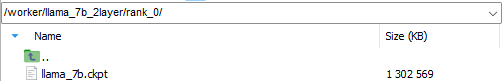

- 数据集：下载使用已转为mindrecord格式的[WikiText2数据集](https://ascend-repo-modelzoo.obs.cn-east-2.myhuaweicloud.com/MindFormers/features/transform_checkpoint/wikitext_512.zip)并解压。


- 词表：下载llama-7b的[tokenizer.model](https://ascend-repo-modelzoo.obs.cn-east-2.myhuaweicloud.com/XFormer_for_mindspore/llama/tokenizer.model)。

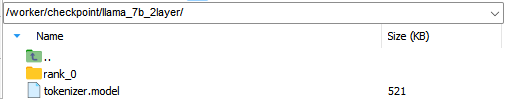

- rank_table_file：运行以下命令获取8卡、4卡、2卡对应的rank_table_file。

  ```bash
  # 生成8卡的rank_table_file：自行重命名为rank_table_8.json，原文件为hccl_xxx.json
  python mindformers/tools/hccl_tools.py --device_num [0,8]
  mv hccl*.json rank_table_8.json

  # 生成4卡的rank_table_file：自行重命名为rank_table_4_id04.json，原文件为hccl_xxx.json
  python mindformers/tools/hccl_tools.py --device_num [0,4]
  mv hccl*.json rank_table_4_id04.json

  # 生成2卡的rank_table_file：自行重命名为rank_table_2_id02.json，原文件为hccl_xxx.json
  python mindformers/tools/hccl_tools.py --device_num [0,2]
  mv hccl*.json rank_table_2_id02.json
  ```

#### 自动转换案例一：完整权重转换为分布式权重

**案例描述**：使用[前期准备](#自动转换案例)下载的完整权重，转换为8卡分布式权重进行训练。

- **单进程转换**

① 配置参数

```yaml
# configs/llama/run_llama_7b.yaml
# 配置预训练权重路径，填写权重文件路径
load_checkpoint: "/worker/llama_7b_2layer/rank_0/llama_7b.ckpt"

# 打开权重自动转换开关
auto_trans_ckpt: True

# 配置数据集
train_dataset: &train_dataset
  data_loader:
    type: MindDataset
    dataset_dir: "/worker/dataset/wikitext_512/"
    shuffle: True

# 配置8卡分布式策略，以dp=2,mp=2,pp=2为例
parallel_config:
  data_parallel: 2
  model_parallel: 2
  pipeline_stage: 2
  micro_batch_num: 2

# 修改模型配置
model:
  model_config:
    seq_length: 512
    num_layers: 2
```

② 启动训练

```shell
cd scripts
bash run_distribute.sh ../rank_table_8.json ../configs/llama/run_llama_7b.yaml [0,8] train
```

③ 查看权重转换相关日志

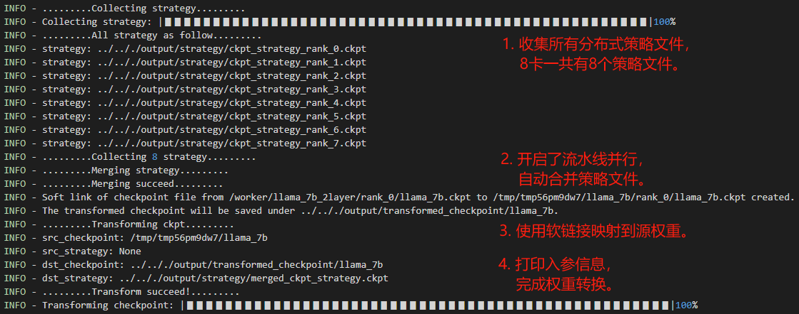

④ 查看转换生成的文件

**分布式权重**：保存在`output/transformed_checkpoint`文件夹下。

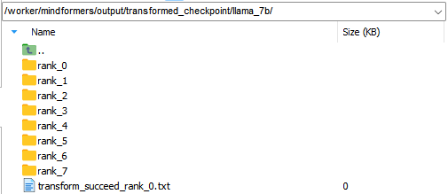

**分布式策略文件**：保存在`output/strategy`文件夹下，由于开启了**流水线并行**，权重自动转换过程中会对所有`ckpt_strategy_rank_x.ckpt`进行合并，得到`merged_ckpt_strategy.ckpt`。若不开启流水线并行，则不会合并。

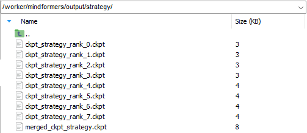

- **多进程转换**（可选）

① 配置参数：基于**单进程转换**的配置，额外配置`transform_process_num`参数。

```bash
# 设置参与权重转换的进程数量为2：由rank_0负责rank_0/1/2/3切片权重转换，rank_4负责rank_4/5/6/7切片权重转换
transform_process_num: 2
```

② 启动训练：

```bash
cd scripts
bash run_distribute.sh ../rank_table_8.json ../configs/llama/run_llama_7b.yaml [0,8] train
```

③ 查看权重转换相关日志

- rank_0

  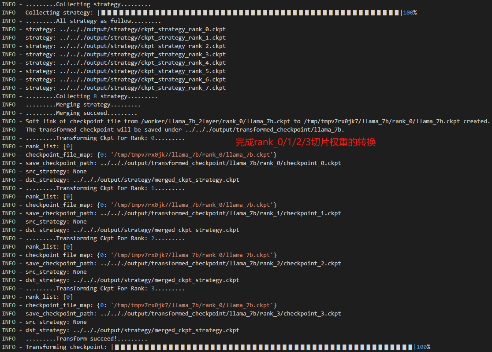

- rank_4

  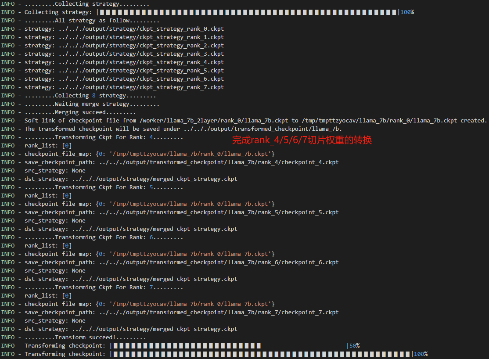

④ 查看转换生成的文件

**分布式权重**：保存在`output/transformed_checkpoint`文件夹下。

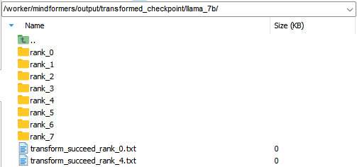

**分布式策略文件**：保存在`output/strategy`文件夹下，由于开启了**流水线并行**，权重自动转换过程中会对所有`ckpt_strategy_rank_x.ckpt`进行合并，得到`merged_ckpt_strategy.ckpt`。若不开启流水线并行，则不会合并。

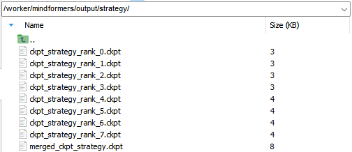

- **重新保存权重和策略文件**

转换完成后，建议**重新保存转换得到的权重和策略文件到自定义文件夹**下，后续任务中若分布式策略不变，可以直接加载该权重，也可以基于该权重以及策略文件转换为其他分布式策略的权重。本案例重新保存了权重和策略文件，并在[自动转换案例二](#自动转换案例二：分布式权重转换为其他分布式权重)和[离线转换案例二](#离线转换案例二：分布式权重转换为其他分布式权重)中使用。

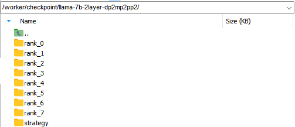

#### 自动转换案例二：分布式权重转换为其他分布式权重

**案例描述**：使用[自动转换案例一](#自动转换案例一完整权重转换为分布式权重)中保存的8卡分布式权重，转换为4卡分布式权重进行训练。

- **单进程转换**

① 配置参数

```yaml
# configs/llama/run_llama_7b.yaml
# 配置预训练权重路径，填写分布式权重文件夹路径model_dir，权重按照model_dir/rank_x/xxx.ckpt格式存放
load_checkpoint: "/worker/checkpoint/llama-7b-2layer-dp2mp2pp2"

# 配置分布式策略文件路径
src_strategy_path_or_dir: "/worker/checkpoint/llama-7b-2layer-dp2mp2pp2/strategy/merged_ckpt_strategy.ckpt"

# 设置auto_trans_ckpt为True
auto_trans_ckpt: True

# 设置数据集
train_dataset: &train_dataset
  data_loader:
    type: MindDataset
    dataset_dir: "/worker/dataset/wikitext_2048/"
    shuffle: True

# 4卡分布式配置参考
# default parallel of device num = 8 for Atlas 800
parallel_config:
  data_parallel: 1
  model_parallel: 2
  pipeline_stage: 2
  micro_batch_num: 2
  vocab_emb_dp: True
  gradient_aggregation_group: 4
# when model parallel is greater than 1, we can set micro_batch_interleave_num=2, that may accelerate the train process.
micro_batch_interleave_num: 1
```

② 启动训练

```shell
cd scripts
bash run_distribute.sh ../rank_table_4_id04.json ../configs/llama/run_llama_7b.yaml [0,4] train
```

③ 查看权重转换相关日志

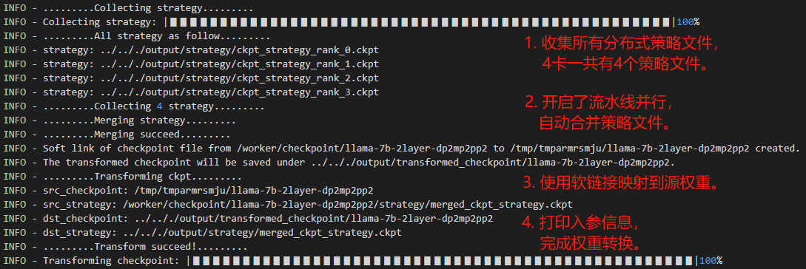

④ 查看转换生成的文件

**分布式权重**：保存在`output/transformed_checkpoint`文件夹下。

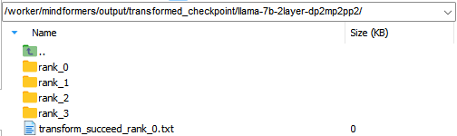

**分布式策略文件**：保存在`output/strategy`文件夹下，由于开启了**流水线并行**，会对所有`ckpt_strategy_rank_x.ckpt`进行合并，得到`merged_ckpt_strategy.ckpt`。若不开启流水线并行，则不会合并。

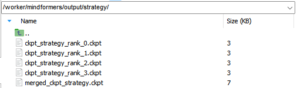

- **多进程转换**（可选）

① 配置参数：基于**单进程转换**的配置，额外配置`transform_process_num`参数。

```bash
# 设置参与权重转换的进程数量为2：由rank_0负责rank_0/1/2/3切片权重转换，rank_4负责rank_4/5/6/7切片权重转换
transform_process_num: 2
```

② 启动训练：

```bash
cd scripts
bash run_distribute.sh ../rank_table_4_id04.json ../configs/llama/run_llama_7b.yaml [0,4] train
```

③ 查看权重转换相关日志

- rank_0

  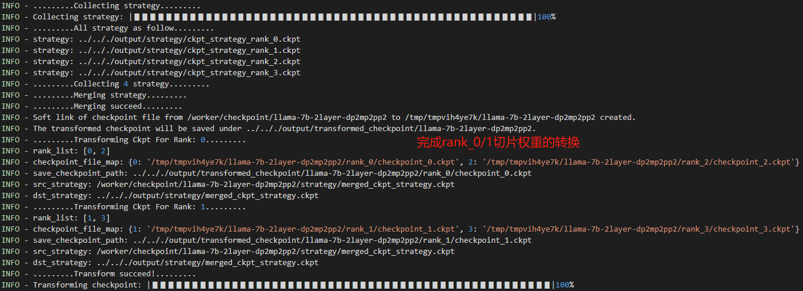

- rank_2

  

④ 查看转换生成的文件

**分布式权重**：保存在`output/transformed_checkpoint`文件夹下。

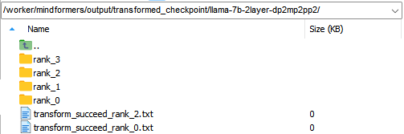

**分布式策略文件**：保存在`output/strategy`文件夹下，由于开启了**流水线并行**，会对所有`ckpt_strategy_rank_x.ckpt`进行合并，得到`merged_ckpt_strategy.ckpt`。若不开启流水线并行，则不会合并。

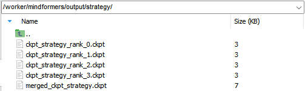

- **重新保存权重和策略文件**

转换完成后，建议**重新保存转换得到的权重和策略文件到自定义文件夹**下，后续任务中若分布式策略不变，可以直接加载该权重，也可以基于该权重以及策略文件转换为其他分布式策略的权重。该权重和策略文件在[自动转换案例三](#自动转换案例三：分布式权重转换为其他分布式权重)和[离线转换案例三](#离线转换案例三：分布式权重转换为其他分布式权重)中均有用到。

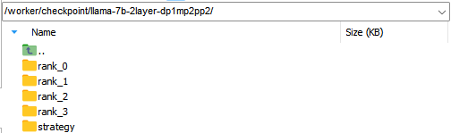

#### 自动转换案例三：分布式权重合并为完整权重

**案例描述**：使用[自动转换案例二](#自动转换案例二分布式权重转换为其他分布式权重)中保存的4卡分布式权重，合并为完整权重进行单卡推理，**该场景仅支持单进程转换**。

① 配置参数

```yaml
# configs/llama/run_llama_7b.yaml
# 配置权重路径，填写分布式权重文件夹路径model_dir，权重按照model_dir/rank_x/xxx.ckpt格式存放
load_checkpoint: "/worker/checkpoint/llama-7b-2layer-dp1mp2pp2"

# 配置分布式策略文件路径
src_strategy_path_or_dir: "/worker/checkpoint/llama-7b-2layer-dp1mp2pp2/strategy/merged_ckpt_strategy.ckpt"

# 设置auto_trans_ckpt为True
auto_trans_ckpt: True

# 设置use_paralle为False
use_parallel: False

# 设置run_mode为predict
run_mode: 'predict'

# 配置词表路径（如果配置文件没有vocab_file关键字请自行补上）
processor:
  tokenizer:
    vocab_file: "/worker/checkpoint/llama-7b-2layer/tokenizer.model"
```

③ 启动推理

```shell
python run_mindformer.py --config configs/llama/run_llama_7b.yaml --predict_data "I love beijing, because"
```

③ 查看权重转换相关日志

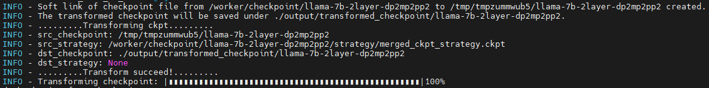

④ 查看合并后的权重

**单卡权重**：保存在`output/transformed_checkpoint`文件夹下

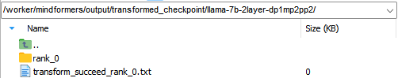

⑤ 重新保存权重

转换完成后，建议**重新保存转换得到的权重到自定义文件夹**下，后续可直接用于单卡推理。

## 离线权重转换

Mindformers提供了权重转换工具，支持**离线权重转换**。

- 若目标权重是**完整权重**，可直接运行权重转换脚本获得目标权重。

- 若目标权重是**分布式权重**，首先获取目标权重的分布式策略文件，然后运行权重转换脚本获得目标权重。

  **获取分布式策略文件**：在yaml文件中配置`only_save_strategy=True`，正常启动分布式任务，生成对应的分布式策略文件后，任务将会主动退出。

  分布式策略文件保存为`output/strategy/ckpt_strategy_rank_x.ckpt`。

  ```bash
  only_save_strategy: True
  ```

权重转换工具支持**单进程转换**和**多进程转换**，权重转换脚本启动方式参考如下。

- 单进程转换

  ```bash
  cd mindformers/tools/ckpt_transform
  python transform_checkpoint.py \
  --src_checkpoint=src_checkpoint \
  --src_strategy=src_strategy \
  --dst_checkpoint=dst_checkpoint \
  --dst_strategy=dst_strategy \
  --prefix=prefix
  ```

- 多进程转换

  ```bash
  cd mindformers/tools/ckpt_transform
  bash transform_checkpoint.sh src_checkpoint src_strategy dst_checkpoint dst_strategy world_size process_num [prefix]
  ```

**离线权重转换**相关参数说明如下：

| 参数名称       | 描述                                                         |
| -------------- | ------------------------------------------------------------ |
| src_checkpoint | 源权重的绝对路径或文件夹路径。<br />- 如果是**完整权重**，则填写**绝对路径**；<br />- 如果是**分布式权重**，则填写**文件夹路径**，分布式权重须按照`model_dir/rank_x/xxx.ckpt`格式存放，文件夹路径填写为`model_dir`。**如果rank_x文件夹下存在多个ckpt，将会使用文件名默认排序最后的ckpt文件用于转换。** |
| src_strategy   | 源权重对应的分布式策略文件路径。<br />- 如果是完整权重，则**不填写**；<br />- 如果是分布式权重，且使用了流水线并行，则填写**合并的策略文件路径**或**分布式策略文件夹路径**；<br />- 如果是分布式权重，且未使用流水线并行，则填写任一**ckpt_strategy_rank_x.ckpt**路径； |
| dst_checkpoint | 保存目标权重的文件夹路径。                                   |
| dst_strategy   | 目标权重对应的分布式策略文件路径，分布式权重的策略文件参考[获取分布式策略文件](#获取分布式策略文件)小节获取。<br />- 如果是完整权重，则**不填写**；<br />- 如果是分布式权重，且使用了流水线并行，则填写**合并的策略文件路径**或**分布式策略文件夹路径**；<br />- 如果是分布式权重，且未使用流水线并行，则填写任一**ckpt_strategy_rank_x.ckpt**路径； |
| prefix         | 目标权重保存的前缀名，权重保存为"{prefix}rank_x.ckpt"，默认"checkpoint_"。 |
| world_size     | 目标权重的切片总数，一般等于dp * mp * pp。                   |
| process_num    | 离线权重转换使用的进程数，默认为1。<br />- 如果process_num = 1，使用**单进程转换**；<br />- 如果process_num > 1，使用**多进程转换**，比如转换的目标权重为8卡分布式权重，process_num=2时，会启动两个进程分别负责rank_0/1/2/3和rank_4/5/6/7切片权重的转换； |

### 离线转换案例

案例演示如何使用权重转换工具做离线权重转换，基于2层的llama-7b权重进行转换演示。

#### 前期准备

参考[自动转换案例-前期准备](#自动转换案例)章节，准备权重，数据集以及rank_table_file。

#### 离线转换案例一：完整权重转换为分布式权重

**案例描述**：使用[前期准备](#离线转换案例)下载的完整权重，转换为8卡分布式权重。

- **获取分布式策略文件**

① 配置参数

```yaml
# 打开策略文件保存开关
only_save_strategy: True

# 配置数据集
train_dataset: &train_dataset
  data_loader:
    type: MindDataset
    dataset_dir: "/worker/dataset/wikitext_512/"
    shuffle: True

# 配置8卡分布式策略，以dp=2,mp=2,pp=2为例
parallel_config:
  data_parallel: 2
  model_parallel: 2
  pipeline_stage: 2
  micro_batch_num: 2

# 修改模型配置
model:
  model_config:
    seq_length: 512
    num_layers: 2
```

② 启动训练

```shell
cd scripts
bash run_distribute.sh ../rank_table_8.json ../configs/llama/run_llama_7b.yaml [0,8] train
```

③ 查看生成的策略文件


- **单进程转换**

① 运行命令

开启了流水线并行，`dst_strategy`使用文件夹路径。

```bash
python transform_checkpoint.py \
--src_checkpoint=/worker/checkpoint/llama-7b-2layer/rank_0/llama_7b.ckpt \
--dst_checkpoint=/worker/transform_ckpt/llama_7b_1to8/ \
--dst_strategy=/worker/mindformers/output/strategy/
```

② 查看权重转换相关日志

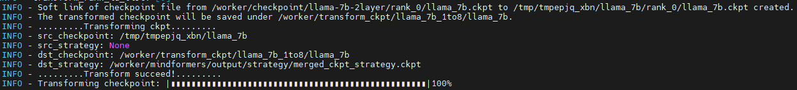

③ 查看转换生成的文件

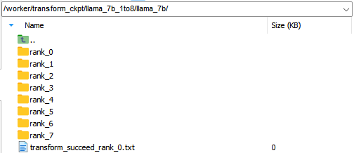

- **多进程转换**（可选）

① 运行命令

```bash
# 使用2个进程转换
bash transform_checkpoint.sh \
/worker/checkpoint/llama-7b-2layer/rank_0/llama_7b.ckpt \
None \
/worker/transform_ckpt/llama_7b_1to8/ \
/worker/mindformers/output/strategy/ \
8 2
```

② 查看权重转换相关日志

转换日志保存为`mindformers/tools/ckpt_transform/log/transform_x.log`。

- transform_0

  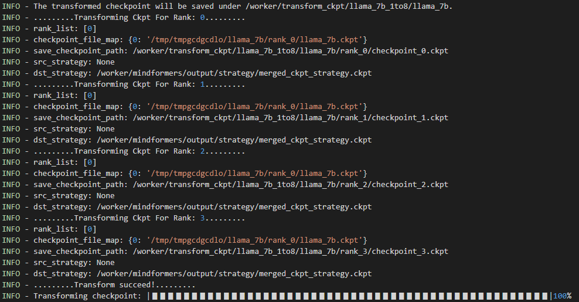

- transform_1

  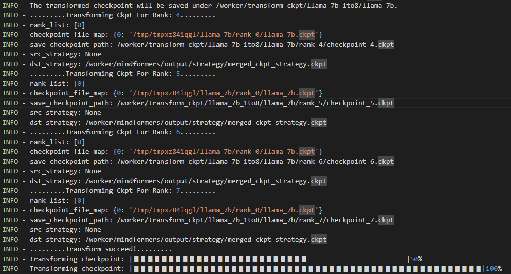

③ 查看转换生成的文件

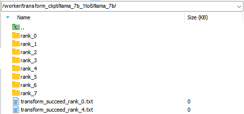

#### 离线转换案例二：分布式权重转换为其他分布式权重

**案例描述**：使用[自动转换案例一](#自动转换案例一完整权重转换为分布式权重)得到的8卡分布式权重，转换为4卡分布式权重。

- **获取分布式策略文件**

① 配置参数

```yaml
# 打开策略文件保存开关
only_save_strategy: True

# 配置数据集
train_dataset: &train_dataset
  data_loader:
    type: MindDataset
    dataset_dir: "/worker/dataset/wikitext_512/"
    shuffle: True

# 配置8卡分布式策略，以dp=2,mp=2,pp=2为例
parallel_config:
  data_parallel: 1
  model_parallel: 2
  pipeline_stage: 2
  micro_batch_num: 2

# 修改模型配置
model:
  model_config:
    seq_length: 512
    num_layers: 2
```

② 启动训练

```shell
cd scripts
bash run_distribute.sh ../rank_table_4_id04.json ../configs/llama/run_llama_7b.yaml [0,4] train
```

③ 查看生成的策略文件

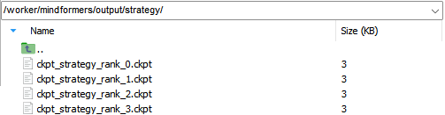

- **单进程转换**

① 运行命令

开启了流水线并行，`dst_strategy`使用文件夹路径。

```bash
python transform_checkpoint.py \
--src_checkpoint=/worker/checkpoint/llama-7b-2layer-dp2mp2pp2/ \
--src_strategy=/worker/checkpoint/llama-7b-2layer-dp2mp2pp2/strategy/merged_ckpt_strategy.ckpt \
--dst_checkpoint=/worker/transform_ckpt/llama_7b_8to4/ \
--dst_strategy=/worker/mindformers/output/strategy/
```

② 查看权重转换相关日志

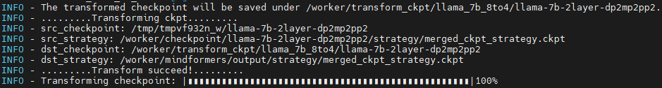

③ 查看转换生成的文件

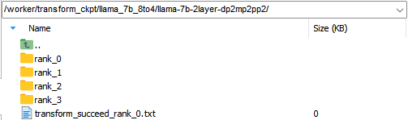

- **多进程转换**（可选）

① 运行命令

```bash
# 使用2个进程转换
bash transform_checkpoint.sh \
/worker/checkpoint/llama-7b-2layer-dp2mp2pp2/ \
/worker/checkpoint/llama-7b-2layer-dp2mp2pp2/strategy/merged_ckpt_strategy.ckpt \
/worker/transform_ckpt/llama_7b_8to4/ \
/worker/mindformers/output/strategy/ \
4 2
```

② 查看权重转换相关日志

转换日志保存为`mindformers/tools/ckpt_transform/log/transform_x.log`。

- transform_0

  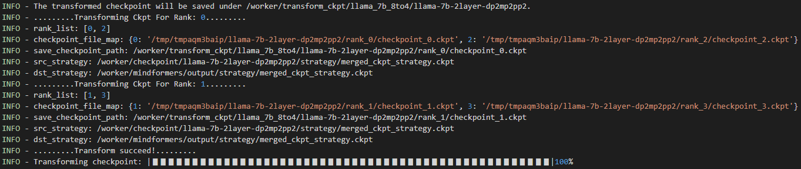

- transform_1

  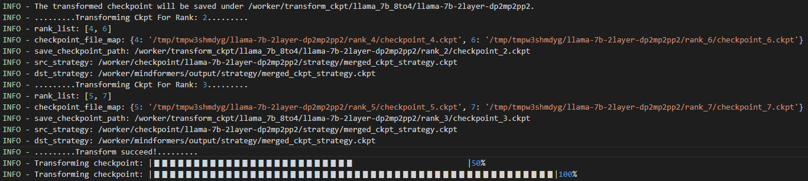

③ 查看转换生成的文件

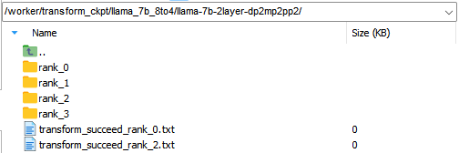

#### 离线转换案例三：分布式权重合并为完整权重

**案例描述**：使用[自动转换案例二](#自动转换案例二分布式权重转换为其他分布式权重)得到的4卡分布式权重，合并为完整权重。

① 运行命令

```python
python transform_checkpoint.py \
--src_checkpoint=/worker/checkpoint/llama-7b-2layer-dp1mp2pp2/ \
--src_strategy=/worker/checkpoint/llama-7b-2layer-dp1mp2pp2/strategy/merged_ckpt_strategy.ckpt \
--dst_checkpoint=/worker/transform_ckpt/llama_7b_4to1/
```

② 查看权重转换相关日志

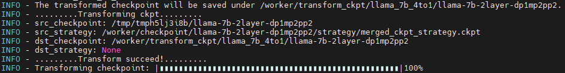

③ 查看转换生成的文件

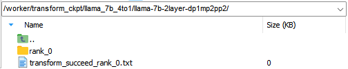

## 物理机多机多卡训练

大模型通常使用多台服务器组成的集群进行训练，同样涉及到权重加载和转换的问题。本小节根据服务器之间**有共享盘**和**无共享盘**两种使用场景，描述加载预训练权重的多机多卡训练流程，以2机16卡训练llama-13b模型为例。

### 前期准备

- 获取多机的rank_table_file

```bash
# step1：每台机器生成各自的rank_table_file
python mindformers/tools/hccl_tools.py --device_num [0,8]

# step2：将所有机器的rank_table_file保存到一台机器，进行合并
python mindformers/tools/merge_hccl.py hccl*.json

# step3：将合并后的rank_table_file复制到所有机器
```

### 一、服务器之间有共享盘：使用自动权重转换

假设`/data`为服务器共享盘，mindformer工程代码为`/data/mindformers`。

- **单进程转换**

参数配置

```yaml
# 配置预训练权重路径，填写权重文件路径
load_checkpoint: "/worker/checkpoint/llama-7b/rank_0/llama_7b.ckpt"

# 设置auto_trans_ckpt为True
auto_trans_ckpt: True

# 配置数据集
train_dataset: &train_dataset
  data_loader:
    type: MindDataset
    dataset_dir: "/worker/dataset/wikitext_2048/"
    shuffle: True

# 配置16卡分布式策略，仅供参考
parallel_config:
  data_parallel: 2
  model_parallel: 4
  pipeline_stage: 2
  micro_batch_num: 2
  vocab_emb_dp: True
  gradient_aggregation_group: 4
# when model parallel is greater than 1, we can set micro_batch_interleave_num=2, that may accelerate the train process.
micro_batch_interleave_num: 1
```

- **多进程转换**（可选）

若需要使用多进程转换，可配置`transform_process_num`参数

```yaml
# 如：使用2进程转换，第1台节点的0卡负责rank_0~7切片的转换，第2台节点的0卡负责rank_8~15切片的转换
transform_process_num: 2
```

- **启动任务**

```shell
cd scripts
# 第一台机器（0节点）
bash run_distribute.sh RANK_TABLE_FILE ../configs/llama/run_llama_7b.yaml [0,8] train 16
# 第二台机器（0节点）
bash run_distribute.sh RANK_TABLE_FILE ../configs/llama/run_llama_7b.yaml [8,16] train 16
```

### 二、 服务器之间无共享盘：使用离线权重转换

#### 1. 获取分布式策略文件

① 配置参数

```yaml
# 配置only_save_strategy=True，拉起分布式任务以获取所有节点的分布式策略文件
only_save_strategy: True

# 配置数据集
train_dataset: &train_dataset
  data_loader:
    type: MindDataset
    dataset_dir: "/worker/dataset/wikitext_2048/"
    shuffle: True

# 配置16卡分布式策略，仅供参考
parallel_config:
  data_parallel: 2
  model_parallel: 4
  pipeline_stage: 2
  micro_batch_num: 2
  vocab_emb_dp: True
  gradient_aggregation_group: 4
# when model parallel is greater than 1, we can set micro_batch_interleave_num=2, that may accelerate the train process.
micro_batch_interleave_num: 1
```

② 启动训练任务

```shell
cd scripts
# 第一台机器（0节点）
bash run_distribute.sh RANK_TABLE_FILE ../configs/llama/run_llama_7b.yaml [0,8] train 16
# 第二台机器（1节点）
bash run_distribute.sh RANK_TABLE_FILE ../configs/llama/run_llama_7b.yaml [8,16] train 16
```

各节点的策略文件保存在各自的`output/strategy`目录下，其中0节点保存`ckpt_strategy_rank_0-7.ckpt`，1节点保存`ckpt_strategy_rank_8-15.ckpt`。

③ 将所有策略文件收集到同一台机器上。

#### 2. 离线权重转换

在保存有所有策略文件的机器上完成对**权重离线转换**。

- **单进程转换**

```bash
python mindformers/tools/ckpt_transorm/transform_checkpoint.py \
--src_checkpoint=/worker/checkpoint/llama-7b/rank_0/llama_7b.ckpt \
--dst_checkpoint=./output/llama_7b_dp2mp4pp2 \
--dst_strategy=./output/strategy
```

- **多进程转换**（可选）

```bash
# 使用2个进程转换
bash mindformers/tools/ckpt_transorm/transform_checkpoint.sh \
/worker/checkpoint/llama-7b/rank_0/llama_7b.ckpt \
None \
./output/llama_7b_dp2mp4pp2 \
./output/strategy \
16 2
```

#### 3. 复制权重到其他节点

将分片权重分别复制到对应的节点上，0节点只需要**rank_0到rank_7**切片权重，1节点只需要**rank_8到rank_15**切片权重。

#### 4. 启动任务

①  基于[获取分布式策略文件](#1. 获取分布式策略文件)小节配置的参数基础上，作如下修改

```yaml
# 配置预训练权重路径，填写分布式权重文件夹路径model_dir，权重按照model_dir/rank_x/xxx.ckpt格式存放
load_checkpoint: "/worker/checkpoint/llama_7b_dp2mp4pp2"

# only_save_strategy改为False
only_save_strategy: False
```

③ 启动训练

```shell
cd scripts
# 第一台机器（0节点）
bash run_distribute.sh RANK_TABLE_FILE ../configs/llama/run_llama_7b.yaml [0,8] train 16
# 第二台机器（1节点）
bash run_distribute.sh RANK_TABLE_FILE ../configs/llama/run_llama_7b.yaml [8,16] train 16
```

## ModelArts训练

ModelArts训练和物理机类似，**多机多卡训练支持开启权重自动转换**。

在**训练作业-->超参**中配置`auto_trans_ckpt=True`开启自动权重转换，配置`transform_process_num > 1`可开启多进程转换。

**注意**：若ModelArts资源池的服务器节点的卡数不为8，需要额外配置`npu_num_per_node=节点NPU卡数`，比如每台节点有16个NPU，则`npu_num_per_node=16`。

## AutoModel加载分布式模型

AutoModel接口已适配权重自动转换，支持分布式训练场景下输出分布式模型，使用方式如下：

```python
from mindformers import AutoModelForCausalLM, build_context

# 配置分布式策略
train_args = TrainingArguments(
    use_parallel=True,
    data_parallel=1,
    model_parallel=2,
    pipeline_stage=2,
    micro_batch_num=2,
    recompute=True,
    enable_parallel_optimizer=True,
    ...
)

# 初始化分布式权重
build_context(train_args)

# 初始化分布式模型
model = AutoModelForCausalLM.from_pretrained(
    "repo_id",
    auto_trans_ckpt=True,
    parallel_config=train_args.get_parallel_config()
)
```

**注**：AutoModel的权重自动转换特性仅支持传入"repo_id"的形式，即从openMind或本地仓库加载权重，不支持模型名及其他方式。
