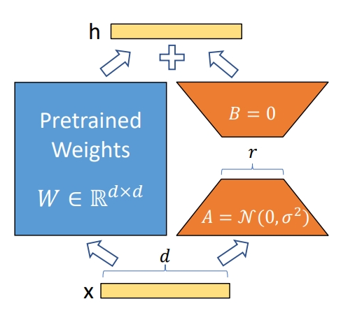

# Lora权重合并

## 概述

LoRA的基本原理是冻结预训练的模型参数，然后在Transfomer的每一层中加入一个可训练的旁路矩阵（低秩可分离矩阵），接着将旁路输出与初始路径输出相加输入到网络当中，并只训练这些新增的旁路矩阵参数。其中，低秩可分离矩阵由两个矩阵组成，第一个矩阵负责降维，第二个矩阵负责升维，中间层维度为r，从而来模拟本征秩（intrinsic rank），这两个低秩矩阵能够大幅度减小参数量。示意图如下:

<div align=center></div>

由于Lora的原理就是对原模型的参数做重参数化，所以合并基本原理就是把lora分支的权重计算后，加到对应的模型权重中去，不会对推理结果产生任何影响。  
Paper: [LoRA: Low-Rank Adaptation of Large Language Models](https://arxiv.org/abs/2106.09685)  
Github: https://github.com/microsoft/LoRA

## 使用说明

如果要用模型lora微调后的权重直接拿去在原模型上进行推理，这个教程会教您怎么用脚本把lora权重合并进原始权重（分布式权重或者完整权重都可以），最终输出合并后的完整原始权重，具体使用只要按照下面的说明填写下面这个脚本的参数。当然如果想对lora权重有什么其他操作，或者你只有lora权重等情况，可以依据上述原理，根据现有脚本代码进行修改。

```shell
python mindformers/tools/transform_ckpt_lora.py \
--src_ckpt_strategy src_strategy_path_or_dir \
--src_ckpt_path_or_dir src_ckpt_path_or_dir \
--dst_ckpt_dir dst_ckpt_dir \
--prefix "checkpoint_" \
--lora_scaling lora_alpha/lora_rank
```

参数说明:

- src_ckpt_strategy：源权重对应的分布式策略文件路径，启动训练任务后默认保存在`output/strategy/`路径下。**源权重为完整权重则不填写**；若为分布式权重，视以下情况填写：

  1. 源权重开启了流水线并行：权重转换基于**合并的策略文件**，填写**分布式策略文件夹路径**，脚本会自动将文件夹内所有**ckpt_strategy_rank_x.ckpt**合并，并在文件夹下生成**merged_ckpt_strategy.ckpt**；如果已有**merged_ckpt_strategy.ckpt**，可以直接填写该文件路径。

  2. 源权重未开启流水线并行：权重转换基于**任一策略文件**，填写任一**ckpt_strategy_rank_x.ckpt**路径即可。

  **注**：如果策略文件夹下存在**merged_ckpt_strategy.ckpt**，仍传入文件夹路径，脚本首先会将旧的**merged_ckpt_strategy.ckpt**删除，再合并一个新的**merged_ckpt_strategy.ckpt**用于权重转换，因此需要确保文件夹有足够的写入权限，否则将会报错。

- src_ckpt_path_or_dir：如果是分布式权重则是源权重所在的文件夹路径，源权重须按照`model_dir/rank_x/xxx.ckpt`格式存放，文件夹路径填写为**model_dir**，如果源权重为完整权重则填写完整权重的绝对路径。
- dst_ckpt_dir：目标权重保存路径，为自定义空文件夹路径，目标权重的保存格式为`model_dir/rank_x/xxx.ckpt`。
- prefix：目标权重保存名前缀，默认为"checkpoint_"，即权重按照`model_dir/rank_x/checkpoint_x.ckpt`保存。
- lora_scaling：Lora权重合并系数，默认要等于**lora_alpha/lora_rank**，这个两个参数就是lora模型配置时的参数，需要自己计算。

## 示例

### 场景1：完整的带lora的权重

如果你有一个完整的带lora的权重，然后转换为完整的原始权重，可以按照如下填写参数(直接输入完整权重路径)：

```shell
python mindformers/tools/transform_ckpt_lora.py \
--src_ckpt_path_or_dir .../xxx/xxx.ckpt \
--dst_ckpt_dir dst_ckpt_dir \
--prefix "checkpoint_" \
--lora_scaling lora_alpha/lora_rank
```

### 场景2：带lora的分布式权重

如果你有一个分布式切分的带Lora权重的权重，然后转换为完整原始权重，可以按照如下填写参数(需输入权重文件夹路径和分配策略文件夹路径)：

```shell
python mindformers/tools/transform_ckpt_lora.py \
--src_ckpt_strategy .../xxx/mindformers/output/strategy/ \
--src_ckpt_path_or_dir .../xxx/model_dir \
--dst_ckpt_dir dst_ckpt_dir \
--prefix "checkpoint_" \
--lora_scaling lora_alpha/lora_rank
```
