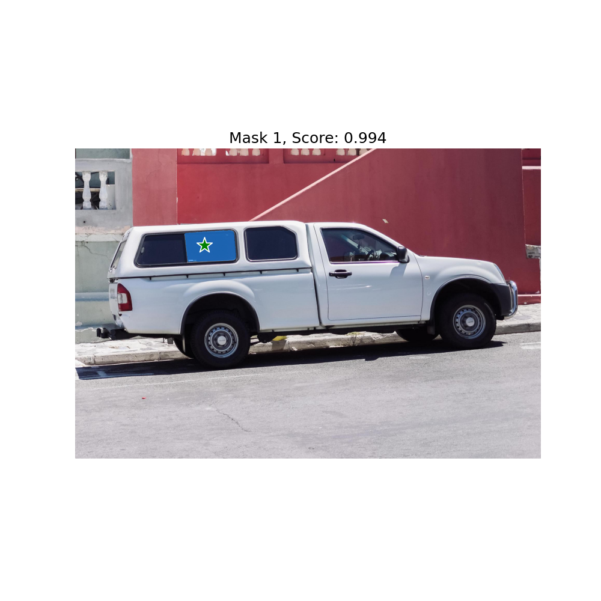
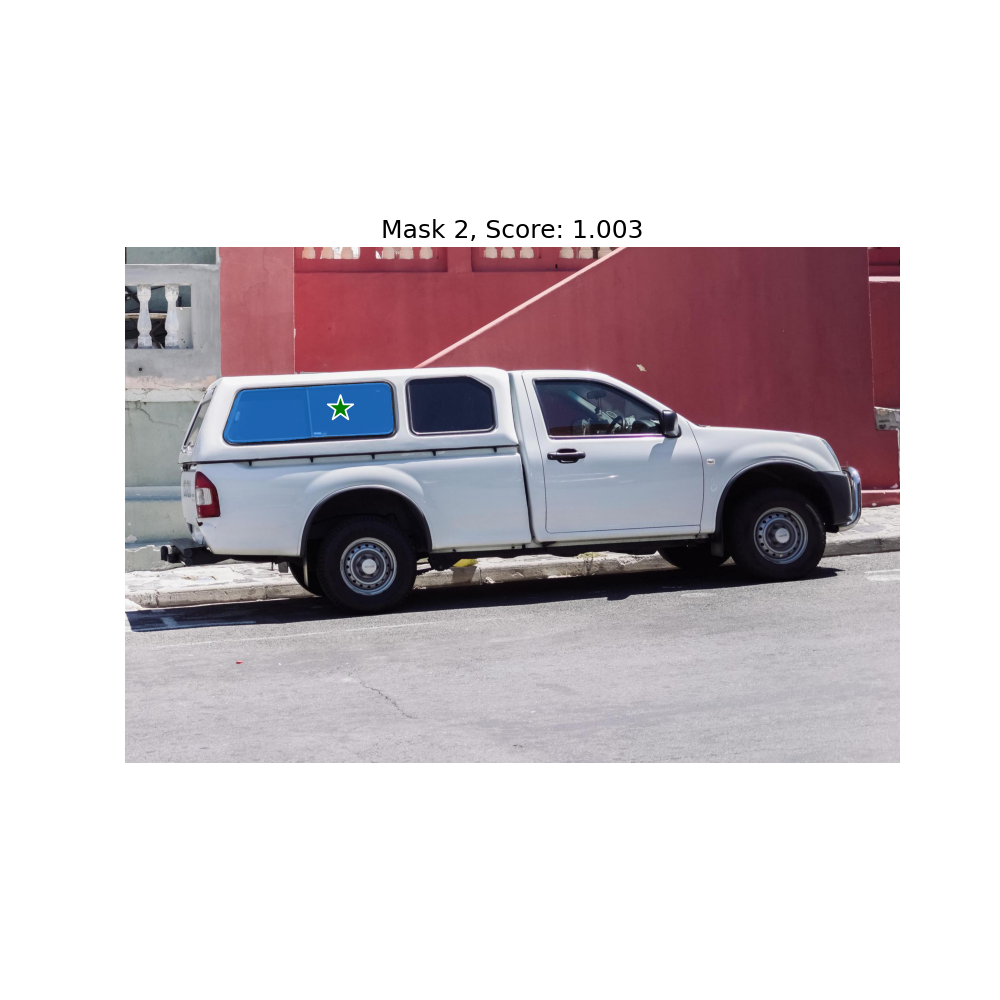
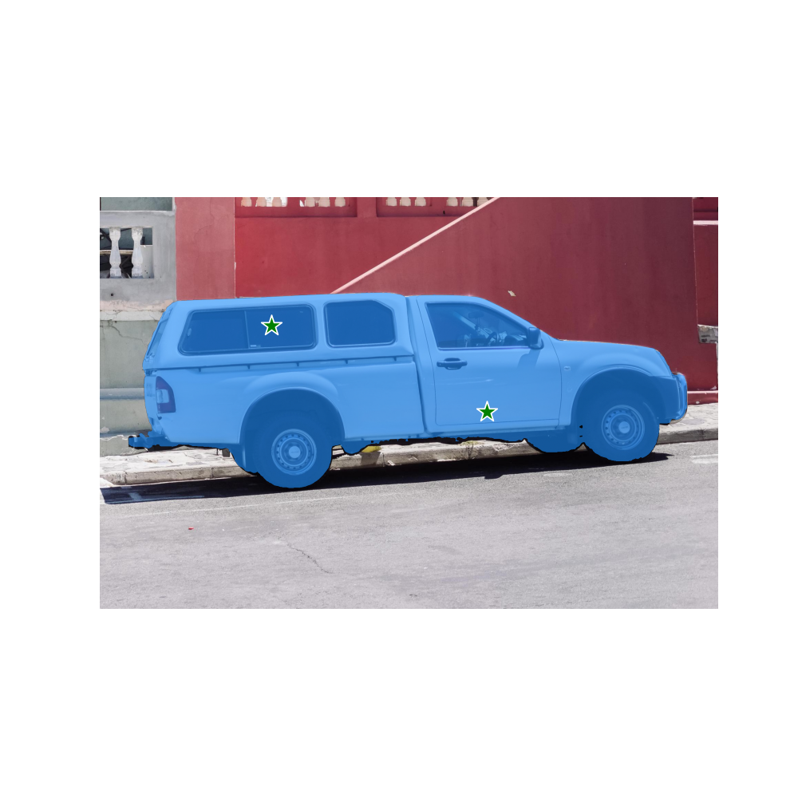
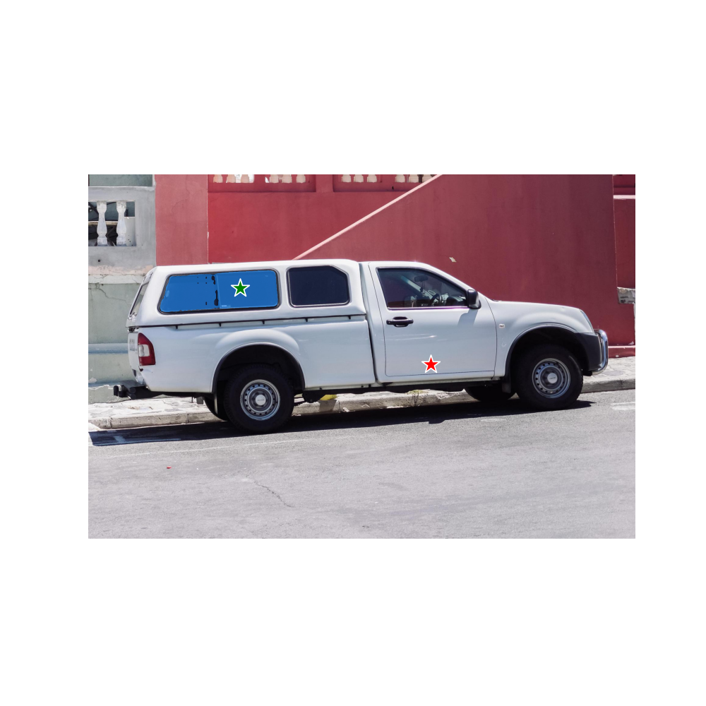
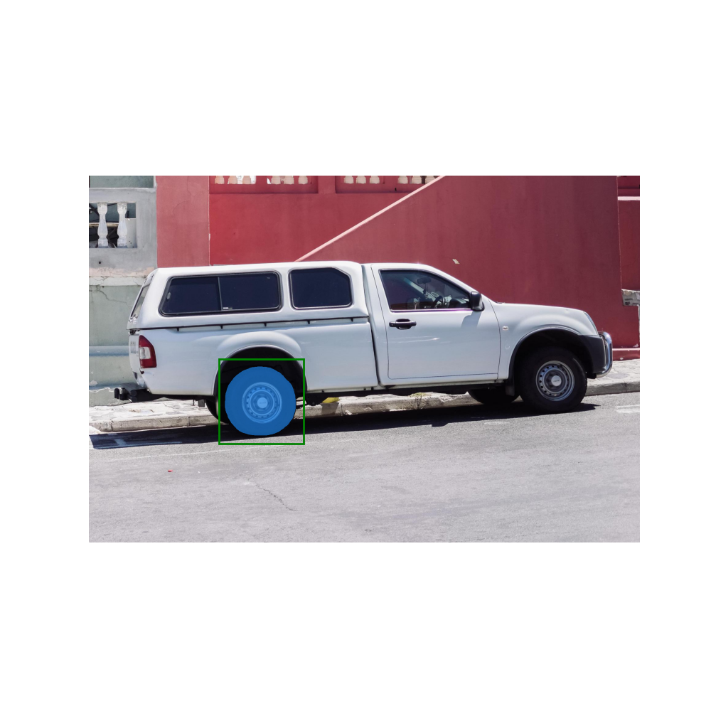
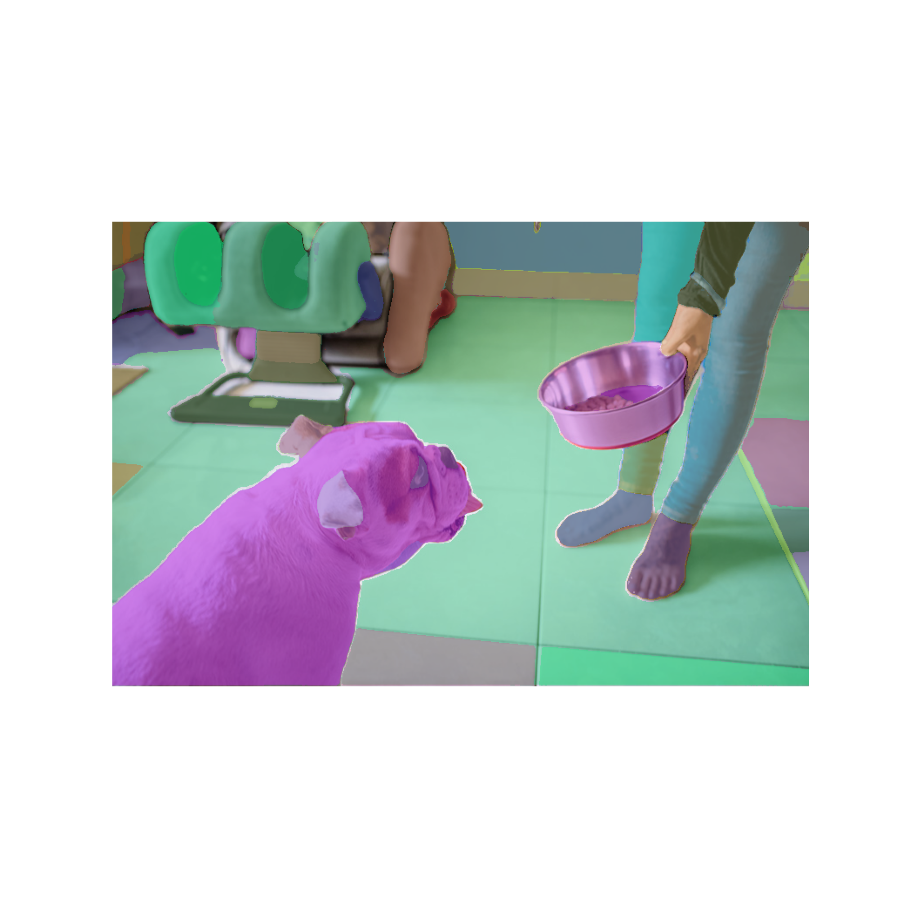

# Segment Anything Model

## 模型描述

SAM（Segment Anything Model）是Meta的FAIR实验室发布的图像分割模型，基于SA-1B数据集训练，SA-1B数据集包含了1100万图片，拥有11亿分割掩码，专注于可提示的分割任务，使用提示工程来适应不同的下游分割任务。

论文：https://arxiv.org/abs/2304.02643

SA-1B数据集：https://segment-anything.com/dataset/index.html

## 模型准备

SAM开源了[base](https://dl.fbaipublicfiles.com/segment_anything/sam_vit_h_4b8939.pth)(358M)、[large](https://dl.fbaipublicfiles.com/segment_anything/sam_vit_l_0b3195.pth)(1.2G)、[huge](https://dl.fbaipublicfiles.com/segment_anything/sam_vit_b_01ec64.pth)(2.4G)三个不同规格大小的模型，用户下载原生模型后，使用提供的`convert_weight.py`脚本将pth模型转为mindspore支持的ckpt模型。

```shell
# 以sam_vit_b_01ec64.pth模型为例，转换后权重保存为同目录下的sam_vit_b_01ec64.ckpt
python mindformers/models/sam/convert_weight.py --torch_path path/sam_vit_b_01ec64.pth
```

转好模型后，在配置文件中配置模型路径。

```shell
checkpoint_name_or_path: "path/sam_vit_b_01ec64.ckpt"
```

## 快速使用

Mindformer提供了SAM推理的pipeline，用户通过创建和调用pipeline来做推理。

- 创建pipeline

```python
import cv2
import numpy as np
import matplotlib.pyplot as plt

import mindspore as ms

from mindformers.pipeline import pipeline

ms.set_context(device_target="Ascend", device_id=0, mode=0)

pipeline_task = pipeline("segment_anything", model='sam_vit_h')
```

- 定义画图函数

```python
def show_mask(mask, ax, random_color=False):
    if random_color:
        color = np.concatenate([np.random.random(3), np.array([0.6])], axis=0)
    else:
        color = np.array([30/255, 144/255, 255/255, 0.6])
    h, w = mask.shape[-2:]
    mask_image = mask.reshape(h, w, 1) * color.reshape(1, 1, -1)
    ax.imshow(mask_image)

def show_points(coords, labels, ax, marker_size=375):
    pos_points = coords[labels==1]
    neg_points = coords[labels==0]
    ax.scatter(pos_points[:, 0], pos_points[:, 1], color='green', marker='*', s=marker_size, edgecolor='white', linewidth=1.25)
    ax.scatter(neg_points[:, 0], neg_points[:, 1], color='red', marker='*', s=marker_size, edgecolor='white', linewidth=1.25)

def show_box(box, ax):
    x0, y0 = box[0], box[1]
    w, h = box[2] - box[0], box[3] - box[1]
    ax.add_patch(plt.Rectangle((x0, y0), w, h, edgecolor='green', facecolor=(0,0,0,0), lw=2))

def show_anns(anns):
    if len(anns) == 0:
        return
    sorted_anns = sorted(anns, key=(lambda x: x['area']), reverse=True)
    ax = plt.gca()
    ax.set_autoscale_on(False)

    for ann in sorted_anns:
        m = ann['segmentation']
        img = np.ones((m.shape[0], m.shape[1], 3))
        color_mask = np.random.random((1, 3)).tolist()[0]
        for i in range(3):
            img[:,:,i] = color_mask[i]
        ax.imshow(np.dstack((img, m*0.35)))
```

- 使用pipeline提前抽取图像特征：性能耗时约为300ms。

```python
# 方式1：传入cv2图像
image = cv2.imread("scripts/examples/segment_anything/images/truck.jpg")
image = cv2.cvtColor(image, cv2.COLOR_BGR2RGB)
pipeline_task.set_image(image)

# 方式2：传入图像路径
pipeline_task.set_image("scripts/examples/segment_anything/images/truck.jpg")
```

**基于Prompt分割**：可以传入坐标点或坐标框作为prompt，模型自动对点所在位置或框内物体进行分割，性能耗时约为50ms。

以下为几种Prompt的使用方式：

- 1、单点确定一个物体

```python
input_point = np.array([[500, 375]]) # 单坐标点，2维
input_label = np.array([1]) # 单坐标点的label，1：前景点，需要分割；2：背景点，不需要分割。

outputs = pipeline_task({"points": input_point, # prompt以字典的方式传入
                        "labels": input_label},
                        multimask_output=True) # multimask_output=True输出3个掩码图
masks = outputs["masks"]
scores = outputs["iou_predictions"]
logits_single = outputs["low_res_masks"]

for i, (mask, score) in enumerate(zip(masks, scores)):
    plt.figure(figsize=(10,10))
    plt.imshow(image)
    show_mask(mask, plt.gca())
    show_points(input_point, input_label, plt.gca())
    plt.title(f"Mask {i+1}, Score: {score:.3f}", fontsize=18)
    plt.axis('off')
    plt.show()
```






- 2、多点确定相同物体（以两点为例）

```python
input_point = np.array([[500, 375], [1125, 625]]) # 多坐标点，2维，代表分割的是同一物体
input_label = np.array([1, 1]) # 多坐标点的label，1维，代表分割的是同一物体

outputs = pipeline_task({"points": input_point,
                        "labels": input_label},
                        multimask_output=False)

masks = outputs["masks"]
scores = outputs["iou_predictions"]
logits = outputs["low_res_masks"]

plt.figure(figsize=(10,10))
plt.imshow(image)
show_mask(masks, plt.gca())
show_points(input_point, input_label, plt.gca())
plt.axis('off')
plt.show()
```



- 3、多点确定不同物体（以两点为例）

```python
input_point = np.array([
        [[500, 375]],
        [[1125, 625]],
    ]) # 多坐标点，3维，代表分割的是不同物体
input_label = np.array([[1], [1]]) # 多坐标点的label，2维，代表分割的是不同物体

outputs = pipeline_task({"points": input_point,
                        "labels": input_label},
                        multimask_output=False)
masks = outputs["masks"]
scores = outputs["iou_predictions"]
logits = outputs["low_res_masks"]

plt.figure(figsize=(10, 10))
plt.imshow(image)
for mask in masks:
    show_mask(mask, plt.gca(), random_color=True)
show_points(input_point.reshape(-1, 2), input_label.reshape(-1), plt.gca())
plt.axis('off')
plt.show()
```


- 4、前景点和背景点

```python
input_point = np.array([[500, 375], [1125, 625]])
input_label = np.array([1, 0]) # label=1为前景点、label=0为背景点，背景点则不分割

outputs = pipeline_task({"points": input_point,
                        "labels": input_label},
                        multimask_output=False)
masks = outputs["masks"]
scores = outputs["iou_predictions"]
logits = outputs["low_res_masks"]

plt.figure(figsize=(10, 10))
plt.imshow(image)
show_mask(masks, plt.gca())
show_points(input_point, input_label, plt.gca())
plt.axis('off')
plt.show()
```



- 5、单框确定一个物体

```python
input_box = np.array([425, 600, 700, 875]) # 单坐标框，1维

outputs = pipeline_task({"boxes": input_box},
                        multimask_output=False)
masks = outputs["masks"]
scores = outputs["iou_predictions"]
logits = outputs["low_res_masks"]

plt.figure(figsize=(10, 10))
plt.imshow(image)
show_mask(masks[0], plt.gca())
show_box(input_box, plt.gca())
plt.axis('off')
plt.show()
```



- 6、框和背景点确定物体

```python
# 可同时传入坐标框和坐标点的组合
input_box = np.array([425, 600, 700, 875])
input_point = np.array([[575, 750]])
input_label = np.array([0])

outputs = pipeline_task({"points": input_point,
                        "labels": input_label,
                        "boxes": input_box},
                        multimask_output=False)
masks = outputs["masks"]
scores = outputs["iou_predictions"]
logits = outputs["low_res_masks"]

plt.figure(figsize=(10, 10))
plt.imshow(image)
show_mask(masks[0], plt.gca())
show_box(input_box, plt.gca())
show_points(input_point, input_label, plt.gca())
plt.axis('off')
plt.show()
```


- 7、多组框和点确定不同物体

```python
input_boxes = np.array([[425, 600, 700, 875],
                        [1360, 525, 1680, 780]])
input_points = np.array([[[575, 750]],
                        [[1525, 670]]])
input_labels = np.array([[1], [1]])

outputs = pipeline_task({"points": input_points,
                        "labels": input_labels,
                        "boxes": input_boxes},
                        multimask_output=False)
masks = outputs["masks"]
scores = outputs["iou_predictions"]
logits = outputs["low_res_masks"]

plt.figure(figsize=(10, 10))
plt.imshow(image)
for mask in masks:
    show_mask(mask, plt.gca(), random_color=True)
for box in input_boxes:
    show_box(box, plt.gca())
for point, label in zip(input_points, input_labels):
    show_points(point, label, plt.gca())
plt.axis('off')
plt.show()
```


- 8、多个框确定不同物体

```python
input_boxes = np.array([
        [75, 275, 1725, 850],
        [425, 600, 700, 875],
        [1375, 550, 1650, 800],
        [1240, 675, 1400, 750],
    ]) # 多坐标框，2维，分割不同物体

outputs = pipeline_task({"boxes": input_boxes},
                        multimask_output=False)
masks = outputs["masks"]
scores = outputs["iou_predictions"]
logits = outputs["low_res_masks"]

plt.figure(figsize=(10, 10))
plt.imshow(image)
for mask in masks:
    show_mask(mask, plt.gca(), random_color=True)
for box in input_boxes:
    show_box(box, plt.gca())
plt.axis('off')
plt.show()
```


**基于整图分割**：整图分割本质上是在图上构造网格坐标点矩阵作为Prompt，默认坐标点数量为32*32，模型内部采用批处理的方式，即每次传入N个坐标点作为Prompt，直到处理完32*32个坐标点，默认N=64。每批次处理完后会做一系列后处理，收集完所有mask后统一做非极大值抑制(NMS)处理，以过滤掉重复的mask。

用户可直接传入图像，并设置`seg_image=True`，模型自动对整张图像进行分割，默认参数下性能耗时约为30s。

- 9、全图分割：默认参数

```python
# 方式1：传入cv2图像
image = cv2.imread("scripts/examples/segment_anything/images/dog.jpg")
image = cv2.cvtColor(image, cv2.COLOR_BGR2RGB)
masks = pipeline_task({"image": image}, seg_image=True)

# 方式2：传入图像路径
masks = pipeline_task({"image": "scripts/examples/segment_anything/images/dog.jpg"}, seg_image=True)

plt.figure(figsize=(20,20))
plt.imshow(image)
show_anns(masks)
plt.axis('off')
plt.show()
```



- 10、全图分割：根据图像适当调整参数。

```python
masks = pipeline_task({"image": image}, seg_image=True,
                      points_per_side = 32,
                      pred_iou_thresh = 0.86,
                      stability_score_thresh = 0.92,
                      crop_n_layers = 1,
                      crop_n_points_downscale_factor = 2,
                      min_mask_region_area = 100)
plt.figure(figsize=(20,20))
plt.imshow(image)
show_anns(masks)
plt.axis('off')
plt.show()

# 参数说明：
# points_per_side: 控制默认坐标点数量，传入N，表示构造N*N网格点，默认32。
# pred_iou_thresh: 控制iou阈值，越大mask精度越高，默认0.88。
# stability_score_thresh: mask稳定性得分阈值，越大mask精度越高，默认0.95。
# crop_n_layers: 额外裁剪图像层数，大于0，表示对图像做额外裁剪，并基于原图+裁剪图像做分割，提高分割精度，但会增加额外耗时；默认0，表示只基于原图做分割。
# crop_n_points_downscale_factor: 额外裁剪图像对应的坐标点数量下采样比例，比如原图坐标点数量是32*32，第i层裁剪图像对应的坐标点数量为(32/crop_n_points_downscale_factor^i)*(32/crop_n_points_downscale_factor^i)；默认为1，表示裁剪图像和原图使用相同数量的网格点。
# min_mask_region_area: mask最小面积，面积小于min_mask_region_area的mask都会被过滤，默认为0，表示不对面积做过滤。
```


## 注意事项

- `mindformers/scripts/examples/segment_anything/`目录下提供了`sam_by_prompt.py`和`sam_by_image.py`两个参考推理脚本，运行前需要在环境中提前安装`mindformers`。