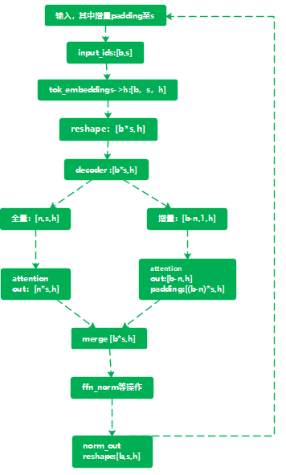
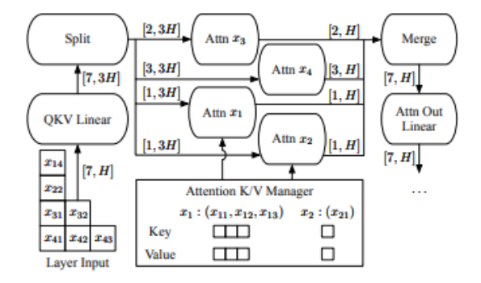

## 一、特性概述

### 1.1 需求来源及价值概述

*描述该特性需求来源或背景，比如：XXX竞品分析，XXX用户需求，XXX内部优化等。描述该特性对用户带来什么价值，如果没有该特性，对用户或者框架竞争力带来什么损失。*

*为实现该需求整体的特性规划。*

**背景：**

**当前推理存在的问题：**

1. LLM推理采用batch级迭代，空闲时间未得到利用

**Orca算法原理：**

https://www.usenix.org/system/files/osdi22-yu.pdf

Orca 采用了迭代级调度，其中批大小根据每次迭代确定。结果是，一旦批中的一个序列完成生成，就可以在其位置插入一个新的序列，从而实现比静态批处理更高的GPU利用率。

**Orca的一个 Decoding Step 中大概包含如下几个步骤：**

1. padding：增量padding至与全量seq_length相同，并共组batch

2. split：split全量与增量，分别进行attention计算

3. merge：merge attention计算输出，混合计算非线性层操作


**硬件：**Ascend，单机单卡

**模型：llama2 13B 模型**，动态shape，静态shape，静态图\动态图

**代码：**

MindSpore代码是合入：https://gitee.com/mindspore/mindspore/tree/br_base/

### 1.2 场景分析

_描述该特性的业务使用场景_
_内容包括：_
_1）场景触发条件及对象：什么角色/工具/接口等在什么具体情况下使用该特性？_
_2）描述该特性主要有哪些场景、子场景及关键任务操作。_


### 1.3特性影响分析

*描述该特性在整个系统中的位置及周边接口。其涉及的组件或服务，及其依赖关系。描述该特性有哪些关键约束或特性冲突。*


特性开关：chunk_prefill： True

启动脚本：

```shell
python predict_custom.py --yaml_file path/to/predict_llama2_13b.yaml --checkpoint_path path/to/checkpoint.ckpt --model_type llama2_13b

```


*与其他需求及特性的交互分析：*

* *平台差异性分析：*
* *兼容性分析（API兼容）：*
* *约束及限制：*

表 1-1 表X：约束说明

| *支持后端* | *支持模式*              | 支持平台 |
| ---------- | ----------------------- | -------- |
| *ASCEND*   | *动态图模式* | LINUX    |


|      |      |      |
| ---- | ---- | ---- |
|      |      |      |

## 二、详细设计

### 2.1总体方案描述

_主要阐述该特性的详细设计，包括选择使用什么算法，架构如何布局，希望获取什么用户信息支撑后续设计等。_
_从整体处理流程上来看，XX特性包含多个关键场景，根据场景分析和系统分解，XXX特性涉及以下X个子系。_
_定义设计原则、对接原则_
_系统架构描述(模块间交互关系)_
_方案整体架构图_



1、输入时，输入全量数量与增量数量，增量padding至与全量seq_length一致。

2、计算mask、freqs_cis时，全量与增量分别计算

3、按照全量与增量对请求进行切分，并相应获取全量、增量对应的mask、freqs_cis、slot_mapping、block_table、valid_batch_length

4、全量与增量分别进行attention计算，merge计算结果，后续非attention计算，全量与增量混合计算

5、按照全量与增量分别进行output后处理


### 2.2 基本功能设计

_可以包含流程图，用户使用接口伪代码等_

待补充。。。





测试点：

1）推理流程跑通，精度误差范围内：对比全量增量分开的推理

2）一次step时间消耗


### 2.3 可靠性/可用性

内存

性能

启动可靠性

*系统对于可靠性指标的假设和约束，例如在预设的条件下要支持x 个9 的目标等。设计需考虑如下可靠可用场景的设计：*

*1）涉及用户并且用户可解决的异常，设计需考虑提供清晰的报错提示和处理建议可支持用户快速解决问题。参考：中央软件院/中软海思解决方案TDT/Docs/02.D项目/02.技术例会/架构设计/MindSpore可信架构设计/DFx/规范&原则&基线/MindSpore 日志与错误信息规范V1.3.docx*

*2）设计需考虑人为因素可能引入的故障，例如：人为配置的配置文件、环境变量设置的校验，避免因为人为配置错误导致执行异常不易定位。*

*3）方案设计遵循尽早发现问题原则，问题检查应该尽可能设计到较前端执行流程，例如：在编译器可检查的故障，应在编译期完成检查，不应到执行期再检查。*

*4）对于功能部分支持的场景需要设计不支持场景的校验，报错应该明确给出提示，例如：特性只支持pynative，用图模式执行，应该在执行前即校验并给出明确的不支持报错。*

*5）设计需要包含异常场景的故障检测机制，不能出现故障不能检测或者挂死问题，例如：使用多线程场景，线程无检查机制，出现挂死导致程序无响应。*

*6）维测类等非关键功能特性需考虑故障放通机制设计，故障不影响训练/推理主流程，例如：写磁盘失败仅告警，不中断训练/推理执行。*

*7）设计需考虑故障定界定位能力，基于日志或者其他可记录的故障信息可自证清白，例如：调用CANN层接口后出现故障，可通过日志、故障信息判断故障是由MindSpore引起还是CANN引起，可快速完成多组件问题的定界。*

*8）涉及与外部系统对接的特性，设计需要考虑外部系统的请求是否存在过载场景，例如：MindSpore Serving提供服务给外部访问，需要考虑是否会存在服务量过大，导致服务异常。*

*9）在线服务的特性(例如：MindSpore Serving)，需考虑设计冗余机制，避免服务中断，例如：考虑通过主备、负载均衡等方案实现服务的冗余，不产生单点故障。*

### 2.4 安全/隐私/韧性设计

*系统对于安全性指标的假设和约束，例如在预设的条件下要支持xx* *攻击防护量的目标等。*

*对于通信加密（含算法安全）、认证、端口绑定、文件权限、软件包完整性、模型植入、用户隐私数据等场景考虑安全、隐私、韧性设计*

### 2.5 易用性设计

*本节描述系统对于易用性设计要素的考虑和约束，主要目的在于：*

- *描述本特性所涉及的目标用户群、关键体验路径，明确用户在本特性上所关注的痛点问题*
- *描述本特性所涉及的关键体验指标，并将指标的具体改进目标作为特性验收标准*
- *通过竞品对比分析，描述本特性相比竞品的差异点（优势或不足）*
- *阐述本特性的易用性设计思路*

#### 2.5.1 目标用户群

*对照MindSpore用户画像，描述本特性面向的用户群体。MindSpore用户画像简表如下，详细信息参见[《MindSpore用户关键体验路径（KEP）》文档](https://gitee.com/mind_spore/dashboard/attach_files/970250/download)。*

| 用户类型       | KEP序号 | 使用场景                                                     |
| -------------- | ------- | ------------------------------------------------------------ |
| 学习型用户     | A-KEP1  | 个人开发者初学AI，期望通过快速上手文档了解框架               |
| 学习型用户     | A-KEP2  | 个人开发者初学AI，期望通过框架持续学习AI领域的知识           |
| 学习型用户     | A-KEP3  | 个人开发者通过MindSpore了解AI框架特性，帮助手头工作          |
| 科研型用户     | B-KEP1  | 高校学生，基于MindSpore以及文档、教程，完成老师布置的作业/众智任务，通过自动微分等理解深度学习的原理 |
| 科研型用户     | B-KEP2  | 高校研究生/老师，基于MindSpore以及文档、教程，完成算法研究和论文发表 |
| 科研型用户     | B-KEP3  | 高校学生，基于MindSpore完成老师承接的众智任务，完成模型/算子的开发 |
| 生产应用型用户 | C-KEP1  | 企业开发者基于MindSpore完成AI算法开发                        |
| 生产应用型用户 | C-KEP2  | 算子开发场景                                                 |

#### 2.5.2 关键体验路径

*对照[MindSpore用户关键体验路径文档](https://gitee.com/mind_spore/dashboard/attach_files/970250/download)，描述本特性主要与哪条关键体验路径关联，以及路径上的触点。*

#### 2.5.3 关键体验指标

*对照[MindSpore用户关键体验指标文档](https://gitee.com/mind_spore/dashboard/attach_files/970251/download)，描述本特性主要与哪些关键体验指标相关联。*

*注意：三类用户指标均需有关联（系统表现、用户行为、用户感受）*.

*如不存在已有的指标，可新增指标，新增指标时需要说明本指标的类别和测试方法*

#### 2.5.4 竞品对比分析

*对比业界其他主流AI计算框架（TensorFlow、PyTorch等），本特性与其相比的差异点（优势或不足），具体到数据或指标上进行说明。*

#### 2.5.5 易用性设计思路

*1. 明确易用性设计的规格约束：比如静态图的语法是面向用户哪些场景进行设计的（具体到支持哪些语法），是否能覆盖目标用户的需求。*
*2. 对于不同用户的设计差异点：从用户场景和需求出发进行设计，以API接口设计为例，如A类用户在何种场景下需要细粒度接口，B类用户在何种场景下需要简单化接口，C类用户需要自定义性能优化的接口等。*
*3. 列出本特性资料文档的纲要，以及应包含进去的重要信息、图表等。*

### 2.6 验收规格

*明确特性的功能、性能、易用性等相关规格指标，保证特性可验收。如与易用性相关，易用性验收标准中应包含相关的关键体验指标（KEI）改进目标。*

## 三、对外接口

*接口包含直接的对外接口、环境变量、配置文件等。*

_1、接口说明（函数输入输出参数/属性/返回值）_

| 序号 | 基本项        | 内容 |
| ---- | ------------- | ---- |
| 1    | 函数定义      |      |
| 2    | 输入/输出参数 |      |
| 3    | 属性          |      |
| 4    | 返回值        |      |

## 四、教程及资料说明

