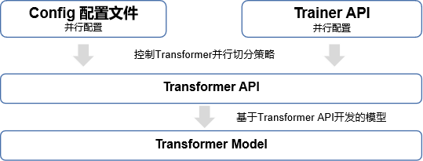

# Parallel

## 前言

在深度学习中，当数据集和参数量的规模越来越大，训练所需的时间和硬件资源会随之增加，最后会变成制约训练的瓶颈。分布式并行训练，可以降低对内存、计算性能等硬件的需求，是进行训练的重要优化手段。此外，分布式并行对大模型训练和推理有着重要的意义，它为处理大规模数据和复杂模型提供了强大的计算能力和性能优势。

业界常见的并行方式有以下两种：

- **数据并行**：为应对数据集过大的问题，利用多个设备的计算资源，同时处理更多的训练数据，加快模型训练速度。
- **模型并行**：数据过大或模型过大导致无法在单个计算节点上加载训练时，每个计算节点只加载部分模型和数据，这样可以减少内存占用，提高训练效率。

传统的分布式并行编程范式需要用户基于通信原语通过编码，手动把模型切分到多个节点上并行，用户需要感知图切分、算子切分、集群拓扑，才能实现最优性能。此种编程范式对于工程师存在一定的门槛要求。MindSpore通过集合通信的方式来实现并行训练过程中的数据通信和同步操作，在Ascend芯片上它依赖于华为集合通信库HCCL，在GPU上它依赖于英伟达集合通信库NCCL。MindSpore目前采用的是同步训练模式，同步模式能够保证所有设备上的参数保持一致，在每个训练迭代开始前所有设备上的参数都被同步。

Mindspore支持**数据并行**，**半自动并行**和**全自动并行**三种并行训练模式：

- **数据并行**：在数据并行模式下，训练数据被划分成多份，然后将每份数据分配到不同的计算节点上，每个节点独立地处理自己的数据子集，并使用相同的模型进行前向传播和反向传播，最终对所有节点的梯度进行同步后，进行模型参数更新。

- **半自动并行**：在半自动并行模式下，并行逻辑和算法逻辑解耦，用户只需要按单卡串行的方式写算法代码，并配置并行策略来实现自动并行切分；用户无需感知模型切片的调度及集群拓扑。
- **全自动并行**：用户只需要写单卡串行算法，通过搜索算法来自动生成较优的切分策略。

Mindspore分布式并行介绍请参考：[Mindspore分布式并行原生](https://www.mindspore.cn/docs/zh-CN/master/design/distributed_training_design.html)

Mijndspore分布式并行教程请参考：[MindSpore分布式并行总览](https://www.mindspore.cn/tutorials/experts/zh-CN/master/parallel/overview.html)

## 分布式并行总览

### 数据并行

[数据并行](https://www.mindspore.cn/tutorials/experts/zh-CN/master/parallel/data_parallel.html)是最常用的并行训练方式，用于加速模型训练和处理大规模数据集。在数据并行模式下，训练数据被划分成多份，然后将每份数据分配到不同的计算节点上，例如多卡或者多台设备。每个节点独立地处理自己的数据子集，并使用相同的模型进行前向传播和反向传播，最终对所有节点的梯度进行同步后，进行模型参数更新。

### 半自动并行

半自动并行支持多种并行模式的自动混合使用，包括：

- [算子级并行](https://www.mindspore.cn/tutorials/experts/zh-CN/master/parallel/operator_parallel.html)：算子级并行是指以算子为单位，把输入张量和模型参数切分到多台设备上进行计算，提升整体速度。
- [优化器并行](https://www.mindspore.cn/tutorials/experts/zh-CN/master/parallel/optimizer_parallel.html)：优化器并行可以减少多台设备对于相同权重更新的冗余计算，将计算量分散到多个设备上。
- [流水线并行](https://www.mindspore.cn/tutorials/experts/zh-CN/master/parallel/pipeline_parallel.html)：流水线并行是指将模型按层切分，每个设备只处理模型中某一部分。

### 自动并行

[自动并行](https://www.mindspore.cn/tutorials/experts/zh-CN/master/parallel/auto_parallel.html)模式让用户无需关心策略配置，自动地建立代价模型，找到训练时间较短的并行策略。

### 优化方法

如果对性能、吞吐量或规模有要求，或者不知道如何选择并行策略，可以考虑以下优化技术：

- **并行策略优化**：
    - **策略选择**：根据您的模型规模和数据量大小，您可以参考[策略选择](https://www.mindspore.cn/tutorials/experts/zh-CN/master/parallel/strategy_select.html)教程来选择不同的并行策略，以提高训练效率和资源利用率。
    - **切分技巧**：切分技巧也是实现高效并行计算的关键，在[切分技巧](https://www.mindspore.cn/tutorials/experts/zh-CN/master/parallel/split_technique.html)教程中，您可以通过具体案例了解到如何应用各种切分技巧来提升效率。
    - **多副本并行**：在现有的单副本模式下，某些底层算子在进行通信的时候，无法同时进行计算，从而导致资源浪费。多副本并行通过对数据按照Batch Size维度进行切分为多个副本，可以使一个副本在通信时，另一副本进行计算操作，提升了资源利用率，详细可参考[多副本并行](https://www.mindspore.cn/tutorials/experts/zh-CN/master/parallel/multiple_copy.html)教程。
    - **序列并行**：主要是将Transformer层中的LayerNorm以及Dropout的输入按输入长度Sequence Length维度进行了切分，减少了计算资源的浪费，降低了内存开销，可参考论文：[Reducing Activation Recomputation in Large Transformer Models](https://arxiv.org/pdf/2205.05198.pdf)。
- **内存优化**：
    - **梯度累加**：梯度累加通过在多个MicroBatch上计算梯度并将它们累加起来，然后一次性应用这个累积梯度来更新神经网络的参数。通过这种方法少量设备也能训练大Batch Size，有效减低内存峰值，详细可参考[梯度累加](https://www.mindspore.cn/tutorials/experts/zh-CN/master/parallel/distributed_gradient_accumulation.html)教程。
    - **重计算**：重计算通过不保存某些正向算子的计算结果，以节省内存空间，在计算反向算子时，需要用到正向结果再重新计算正向算子。详细可参考[重计算](https://www.mindspore.cn/tutorials/experts/zh-CN/master/parallel/recompute.html)教程。
    - **数据集切分**：数据集单个数据过大的时候，可以对数据进行切分，进行分布式训练。数据集切分配合模型并行是有效降低显存占用的方式。详细可参考[数据集切分](https://www.mindspore.cn/tutorials/experts/zh-CN/master/parallel/dataset_slice.html)教程。
    - **Host&Device异构**：在遇到参数量超过Device内存上限的时候，可以把一些内存占用量大且计算量少的算子放在Host端，这样能同时利用Host端内存大，Device端计算快的特性，提升了设备的利用率。详细可参考[Host&Device异构](https://www.mindspore.cn/tutorials/experts/zh-CN/master/parallel/host_device_training.html)教程。
    - **异构存储**：大模型目前受限显存大小，难以在单卡上训练。大规模分布式集群训练中，在通信代价越来越大的情况下，提升单机的显存，减少通信，也能提升训练性能。异构存储可以将暂时不需要用到的参数或中间结果拷贝到Host端内存或者硬盘，在需要时再恢复至Device端。详细可参考[异构存储](https://www.mindspore.cn/tutorials/experts/zh-CN/master/parallel/memory_offload.html)教程。
- **通信优化**：
    - **通信融合**：通信融合可以将相同源节点和目标节点的通信算子合并到一次通信过程，避免多次通信带来额外开销。详细可参考[通信融合](https://www.mindspore.cn/tutorials/experts/zh-CN/master/parallel/comm_fusion.html)。
    - **通信子图提取与复用**：通过对通信算子提取通信子图，替换原本的通信算子，可以减少通信耗时，同时减少模型编译时间。详细可参考[通信子图提取与复用](https://www.mindspore.cn/tutorials/experts/zh-CN/master/parallel/comm_subgraph.html)。

## MindFormers 并行手册

### MindFormers 并行设计

MindFormers集成了MindSpore原生的并行能力，在`transformer API`中利用配置化方式对Transformer网络做并行配置。



MindFormers支持基于`Transformer API`开发的大模型通过配置化接口进行并行配置，主要提供两种使用方式：1. config配置文件；  2. Trainer高阶接口；

### config 并行配置

配置文件介绍及使用请参见：[MindFormers Config 配置]()，主要用于`run_mindformer.py`脚本启动时使用。

用户可通过提供的并行模块和关键字，完成并行策略的设定：

- use_parallel: 是否开启并行
- parallel: 自动并行配置，相关入参支持可参考：[mindspore.set_auto_parallel_context](https://www.mindspore.cn/docs/zh-CN/r2.0/api_python/mindspore/mindspore.set_auto_parallel_context.html)
    - parallel_mode: 并行模式，0-dataset数据并行, 1-semi半自动并行, 2-auto自动并行, 3-hybrid手工实现并行
    - gradients_mean: 是否在梯度AllReduce后执行平均算子。通常半自动并行模式下为False，数据并行模式下为True
    - enable_alltoall: 允许在通信期间生成AllToAll通信算子的开关。通常仅在MOE场景下打开，默认False
    - full_batch: 在auto_parallel模式下加载整个batch数据集时为True。半自动并行模式通常设置为True，数据并行模式必须设置为False，否则会报错
    - search_mode: 策略搜索模式，有三种，分别是recursive_programming，dynamic_programming和sharding_propagation。仅在全自动并行模式下生效，其他模式不生效，实验性接口，谨慎使用
    - enable_parallel_optimizer: 数据并行训练时对权重更新计算进行分片。优化器并行开关，在数据并行训练时默认会将模型权重参数切分成device_num份；半自动并行时默认将模型权重参数切分成data_parallel份
    - strategy_ckpt_save_file: 保存并行切分策略的路径。
- parallel_config: 并行策略配置，相关入参配置可参考[transformer.TransformerOpParallelConfig](https://gitee.com/mindspore/mindformers/blob/dev/mindformers/modules/transformer/transformer.py#L197)
    - data_parallel: 数据并行
    - model_parallel: 模型并行
    - pipeline_stage: 流水线并行
    - use_seq_parallel: 序列并行
    - micro_batch_num: 流水线并行的微批次大小。pipeline_satge大于1时，开启流水并行时使用，此处需满足micro_batch_num >= pipeline_satge
    - gradient_aggregation_group: 梯度通信算子融合组的大小
- micro_batch_interleave_num: 多副本并行配置，默认为1。当采用模型并行时，设置多副本并行为2，可提升模型训练性能。

### Trainer 并行配置

MindFormers Trainer接口介绍请见：[MindFormers Trainer API]()

利用 `Trainer.set_parallel_config(**kwargs)`来为模型设定切分策略：[set_parallel_config](https://gitee.com/mindspore/mindformers/blob/dev/mindformers/trainer/trainer.py#L690)

使用样例：

```python
import argparse

from mindformers import Trainer, TrainingArguments
from mindformers import init_context, ContextConfig, ParallelContextConfig

############################################# 并行环境初始化 ##################################################
def context_init(use_parallel=False, optimizer_parallel=False):
    """init context for mindspore."""
    context_config = ContextConfig(mode=0, device_target="Ascend", device_id=0)
    parallel_config = None
    if use_parallel:
        parallel_config = ParallelContextConfig(parallel_mode='SEMI_AUTO_PARALLEL',
                                                gradients_mean=False,
                                                enable_parallel_optimizer=optimizer_parallel,
                                                full_batch=True)
    rank_id, device_num = init_context(use_parallel=use_parallel,
                                       context_config=context_config,
                                       parallel_config=parallel_config)
############################################# 并行环境初始化 ##################################################


def main(use_parallel=False,
         run_mode='train',
         task='text_generation',
         model_type='gpt2',
         pet_method='',
         train_dataset='./train',
         eval_dataset='./eval',
         predict_data='hello!',
         dp=1, mp=1, pp=1, micro_size=1, op=False):
    # 环境初始化
    context_init(use_parallel, op)
    # 训练超参数定义
    training_args = TrainingArguments(num_train_epochs=1, batch_size=2, learning_rate=0.001, warmup_steps=100,
                                      sink_mode=True, sink_size=2)
    # 定义任务，预先准备好相应数据集
    task = Trainer(task=task,
                   model=model_type,
                   pet_method=pet_method,
                   args=training_args,
                   train_dataset=train_dataset,
                   eval_dataset=eval_dataset)
    ############################################# 设定并行策略 ##################################################
    task.set_parallel_config(data_parallel=dp,
                             model_parallel=mp,
                             pipeline_stage=pp,
                             micro_batch_num=micro_size)
    ############################################# 设定并行策略 ##################################################
    if run_mode == 'train':
        task.train()
    elif run_mode == 'finetune':
        task.finetune()
    elif run_mode == 'eval':
        task.evaluate()
    elif run_mode == 'predict':
        result = task.predict(input_data=predict_data)
        print(result)
```

### 并行注意事项

- `data_parallel` * `model_parallel` * `pipeline_stage` <= `total_device_num`;

- `micro_batch_num` >= `pipeline_satge`，`micro_batch_num`的大小通常越高，流水并行的效率就越好，但是往往会导致**编译时间过长和Task Stream超限2016的问题**，请根据实际情况调整该数值；

- `model_parallel`的大小通常和`Transformer`中`hidden_size或vocab_size`的大小相关，需要满足`model_parallel` % `hidden_size` == 0,不然会导致相应参数无法切分，从而引入**额外的算子重排，引起性能劣化**；

- `pipeline_satge`的大小通常和`Transformer`中`num_layers`的大小相关，建议配比满足`num_layers` % `pipeline_satge` == 0,使得`Transformer`的`Layer`层可以被均匀切分到不同的卡上，如果无法被均匀切分，容易导致**编译时间过长**或者**编译失败**。
