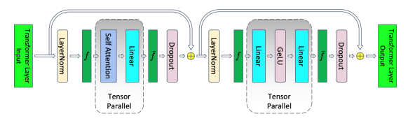
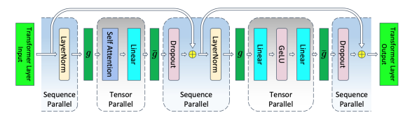

# 高阶接口使用样例

## AutoClass

MindFormers大模型套件提供了AutoClass类，包含AutoConfig、AutoModel、AutoTokenizer、AutoProcessor4个便捷高阶接口，方便用户调用套件中已封装的API接口。上述4类提供了相应领域模型的ModelConfig、Model、Tokenzier、Processor的实例化功能。

### AutoConfig&&AutoModel

使用AutoConfig和AutoModel自动实例化MindFormers中支持的模型配置或模型架构：

```python
from mindformers import AutoConfig, AutoModel

gpt_config = AutoConfig.from_pretrained("gpt2")
gpt_model = AutoModel.from_pretrained("gpt2")  # 自动加载预置权重到网络中
```

使用已有模型配置或网络架构实例化相应的模型配置或网络架构实例：

```python
from mindformers import GPT2LMHeadModel, GPT2Config

gpt_13b_config = GPT2Config.from_pretrained("gpt2_13b")
gpt_13b_model = GPT2LMHeadModel.from_pretrained("gpt2_13b")  # 自动加载预置权重到网络中
```

使用已有模型配置或模型架构进行二次开发：

```python
from mindformers import GPT2LMHeadModel, GPT2Config

gpt_config = GPT2Config(hidden_size=768, num_layers=12)
gpt_model = GPT2LMHeadModel(gpt_config)
```

### AutoTokenizer

使用AutoTokenizer自动获取文本分词器：

```python
from mindformers import AutoTokenizer

gpt_tokenizer = AutoTokenizer.from_pretrained("gpt2")
print(gpt_tokenizer("hello!"))
```

```text
{'input_ids': [31373, 0], 'token_type_ids': [0, 0], 'attention_mask': [1, 1]}
```

使用已有Tokenizer函数对文本进行分词：

```python
from mindformers import GPT2Tokenizer

gpt_tokenizer = GPT2Tokenizer.from_pretrained("gpt2")
print(gpt_tokenizer("hello!"))
```

```text
{'input_ids': [31373, 0], 'token_type_ids': [0, 0], 'attention_mask': [1, 1]}
```

### AutoProcessor

使用AutoProcessor自动获取模型数据预处理过程：

```python
from mindformers import AutoProcessor

gpt_processor = AutoProcessor.from_pretrained("gpt2")
print(gpt_processor("hello!"))
```

```text
{'text': Tensor(shape=[1, 128], dtype=Int32, value=
[[31373,     0, 50256 ... 50256, 50256, 50256]])}
```

使用已有模型数据预处理过程对相应数据做模型输入前的预处理：

```python
from mindformers import GPT2Processor

gpt_processor = GPT2Processor.from_pretrained('gpt2')
print(gpt_processor("hello!"))
```

```text
{'text': Tensor(shape=[1, 128], dtype=Int32, value=
[[31373,     0, 50256 ... 50256, 50256, 50256]])}
```

使用已有数据预处理过程进行二次开发：

```python
from mindformers import GPT2Processor, GPT2Tokenizer

# 自定义 tokenizer
tok = GPT2Tokenizer.from_pretrained("gpt2")
gpt_processor = GPT2Processor(tokenizer=tok, max_length=256, return_tensors='ms')
print(gpt_processor("hello!"))
```

```text
{'text': Tensor(shape=[1, 256], dtype=Int32, value=
[[31373,     0, 50256 ... 50256, 50256, 50256]])}
```

## pipeline

MindFormers大模型套件面向任务设计pipeline推理接口，旨在让用户可以便捷地体验不同AI领域的大模型在线推理服务，当前已集成10+任务的推理流程。

### pipeline使用样例

使用MindFormers预置任务和模型开发一个推理流：

```python
import mindspore; mindspore.set_context(mode=0, device_id=0)
from mindformers import pipeline

text_generation = pipeline(task='text_generation', model='gpt2', max_length=10)
print(text_generation("I love Beijing, because", do_sample=False))
```

```text
[{'text_generation_text': ["I love Beijing, because it's a beautiful city"]}]
```

使用自定义的模型、tokenizer等进行任务推理：

```python
import mindspore; mindspore.set_context(mode=0, device_id=0)
from mindformers import pipeline
from mindformers import GPT2LMHeadModel, GPT2Tokenizer

tok = GPT2Tokenizer.from_pretrained("gpt2")
gpt_model = GPT2LMHeadModel.from_pretrained("gpt2")

text_generation = pipeline(task='text_generation', model=gpt_model, tokenizer=tok, max_length=10)
print(text_generation("I love Beijing, because", do_sample=False))
```

```text
[{'text_generation_text': ["I love Beijing, because it's a beautiful city"]}]
```

## Trainer

MindFormers大模型套件面向任务设计Trainer接口，旨在让用户可以快速使用我们预置任务和模型的训练、微调、评估、推理能力，当前已集成10+任务和10+模型的全流程开发能力。

### init_context

mindspore相关环境的初始化，MindFormers中提供了init_context标准接口帮助用户完成单卡或多卡并行环境的初始化：

[init_context](https://gitee.com/mindspore/mindformers/blob/dev/mindformers/core/context/build_context.py#L53)  [ContextConfig](https://gitee.com/mindspore/mindformers/blob/dev/mindformers/trainer/config_args.py#L26) [ParallelContextConfig](https://gitee.com/mindspore/mindformers/blob/dev/mindformers/trainer/config_args.py#L26)

单卡初始化：

```python
from mindformers import init_context, ContextConfig


def context_init():
    """init context for mindspore."""
    context_config = ContextConfig(mode=0, device_target="Ascend", device_id=0)
    rank_id, device_num = init_context(use_parallel=False, context_config=context_config)
```

多卡数据并行模式初始化：

```python
from mindformers import init_context, ContextConfig, ParallelContextConfig


def context_init():
    """init context for mindspore."""
    context_config = ContextConfig(mode=0, device_target="Ascend", device_id=0)
    parallel_config = ParallelContextConfig(parallel_mode='DATA_PARALLEL', gradients_mean=True,
                                            enable_parallel_optimizer=False)
    rank_id, device_num = init_context(use_parallel=True, context_config=context_config,
                                       parallel_config=parallel_config)
```

多卡半自动并行模式初始化：

```python
from mindformers import init_context, ContextConfig, ParallelContextConfig


def context_init():
    """init context for mindspore."""
    context_config = ContextConfig(mode=0, device_target="Ascend", device_id=0)
    parallel_config = ParallelContextConfig(parallel_mode='SEMI_AUTO_PARALLEL', gradients_mean=False,
                                            enable_parallel_optimizer=False, full_batch=True)
    rank_id, device_num = init_context(use_parallel=True, context_config=context_config,
                                       parallel_config=parallel_config)
```

### TrainingArguments&&Trainer

MindFormers套件对用户提供了`TrainingArguments`类，用于自定义大模型训练过程中的各类参数，支持参数详见：[TrainingArguments](https://gitee.com/mindspore/mindformers/blob/dev/mindformers/trainer/training_args.py)。

同时，MindFormers也提供了`Trainer`高阶接口，用于大模型任务的开发、训练、微调、评估、推理等流程。

使用TrainingArguments自定义大模型训练过程参数：

```python
from mindformers import TrainingArguments

# 环境初始化，参考上述`init_context`章节实现
context_init()
# 训练超参数定义
training_args = TrainingArguments(num_train_epochs=3, batch_size=2, learning_rate=0.001, warmup_steps=1000,
                                  sink_mode=True)
```

使用Trainer接口创建内部预置任务：数据集按照官方教程准备[GPT预训练数据集](../model_cards/gpt2.md)，自定义训练参数：

```python
from mindformers import Trainer, TrainingArguments

# 环境初始化，参考上述`init_context`章节实现
context_init()
# 训练超参数定义
training_args = TrainingArguments(num_train_epochs=3, batch_size=2, learning_rate=0.001, warmup_steps=1000,
                                  sink_mode=True)

text_generation = Trainer(task='text_generation', model='gpt2', args=training_args, train_dataset='./train',
                          eval_dataset='./eval')
```

使用Trainer接口创建内部预置任务：自定义数据集，模型，训练参数：

```python
from mindspore.dataset import GeneratorDataset

from mindformers import Trainer, TrainingArguments, AutoModel


def generator():
    """text dataset generator."""
    seq_len = 1025
    input_ids = np.random.randint(low=0, high=15, size=(seq_len,)).astype(np.int32)
    for _ in range(512):
        yield input_ids


# 环境初始化，参考上述`init_context`章节实现
context_init()
# 自定义训练超参数
training_args = TrainingArguments(num_train_epochs=3, batch_size=2, learning_rate=0.001, warmup_steps=1000,
                                  sink_mode=True)
# 自定义模型
pangu_model = AutoModel.from_pretrained("pangualpha_2_6b")
# 自定义数据集
dataset = GeneratorDataset(generator, column_names=["input_ids"])
train_dataset = dataset.batch(batch_size=4)
eval_dataset = dataset.batch(batch_size=4)
# 定义文本生成任务，传入自定义模型、数据集、超参数
text_generation = Trainer(task='text_generation', model=pangu_model, args=training_args, train_dataset=train_dataset,
                          eval_dataset=eval_dataset)
```

### 并行配置

MindFormers的Trainer接口提供了并行的配置接口`set_parallel_config`，接口仅在**半自动并行**
或**全自动并行模式**下生效，同时需要模型本身已支持或已配置[并行策略](https://www.mindspore.cn/tutorials/experts/zh-CN/r2.0/parallel/introduction.html)：

[set_parallel_config](https://gitee.com/mindspore/mindformers/blob/dev/mindformers/trainer/trainer.py#L690)

使用Trainer高阶接口，自定义并行配置：

```python
import numpy as np
from mindspore.dataset import GeneratorDataset

from mindformers import Trainer, TrainingArguments
from mindformers import PanguAlphaHeadModel, PanguAlphaConfig


def generator():
    """text dataset generator."""
    seq_len = 1025
    input_ids = np.random.randint(low=0, high=15, size=(seq_len,)).astype(np.int32)
    for _ in range(512):
        yield input_ids


# 环境初始化，参考上述`init_context`章节实现
context_init()
# 自定义训练超参数
training_args = TrainingArguments(num_train_epochs=3, batch_size=2, learning_rate=0.001, warmup_steps=1000,
                                  sink_mode=True)
# 自定义模型
pangu_config = PanguAlphaConfig(hidden_size=768, ffn_hidden_size=768 * 4, num_layers=12, num_heads=12,
                                checkpoint_name_or_path='')
pangu_model = PanguAlphaHeadModel(pangu_config)
# 自定义数据集
dataset = GeneratorDataset(generator, column_names=["input_ids"])
train_dataset = dataset.batch(batch_size=4)
eval_dataset = dataset.batch(batch_size=4)
# 定义文本生成任务，传入自定义模型、数据集、超参数
text_generation = Trainer(task='text_generation', model=pangu_model, args=training_args, train_dataset=train_dataset,
                          eval_dataset=eval_dataset)

# 设定并行策略，比如2机16卡,设定数据并行4 模型并行2 流水并行2 微批次大小为2 打开优化器并行
text_generation.set_parallel_config(data_parallel=4, model_parallel=2, pipeline_stage=2, micro_batch_num=2)
```

### 重计算配置

MindFormers的Trainer接口提供了重计算配置接口`set_recompute_config`，接口入参如下：

[set_recompute_config](https://gitee.com/mindspore/mindformers/blob/dev/mindformers/trainer/trainer.py#L731)

```text
recompute(bool):是否开启全局重计算，默认值False。默认值：False。
select_recompute(bool):是否开启选择重计算，仅当模型本身已支持选择重计算时适用，开启后仅对模型的attention层进行重计算。默认值：False。
parallel_optimizer_comm_recompute (bool): 表示在自动并行或半自动并行模式下，指定Cell内部由优化器并行引入的AllGather通信是否重计算。默认值：False。
mp_comm_recompute (bool):表示在自动并行或半自动并行模式下，指定Cell内部由模型并行引入的通信操作是否重计算。默认值：True。
recompute_slice_activation (bool):是否对将保留在内存中的Cell输出进行切片。默认值：False。
```

使用Trainer高阶接口，自定义并行配置：

```python
import numpy as np
import mindspore
from mindspore.dataset import GeneratorDataset

from mindformers import Trainer
from mindformers import LlamaForCausalLM, LlamaConfig

def generator():
    """text dataset generator."""
    seq_len = 2049
    input_ids = np.random.randint(low=0, high=15, size=(seq_len,)).astype(np.int32)
    for _ in range(512):
        yield input_ids

# 指定图模式，指定使用训练卡id
mindspore.set_context(mode=0, device_id=0)
# 自定义模型
llama_config = LlamaConfig(batch_size=1)
llama_model = LlamaForCausalLM(llama_config)
# 自定义数据集
dataset = GeneratorDataset(generator, column_names=["input_ids"])
train_dataset = dataset.batch(batch_size=1)
# 定义文本生成任务，传入自定义模型、数据集
text_generation = Trainer(task='text_generation',
                          model=llama_model,
                          train_dataset=train_dataset)
# 全局重计算：设置重计算配置，打开重计算
text_generation.set_recompute_config(recompute=True,select_recompute=False)
# 选择重计算：设置重计算配置，关闭全局重计算，打开选择重计算
text_generation.set_recompute_config(recompute=False,select_recompute=True)
```

### 多副本并行配置

#### 概述

多**副本**并行指把输入数据切分为多份，通过模型并行的方法，隐藏通信时延，提高训练速度、系统的吞吐量以及模型的性能。

使用场景：当在半自动模式以及网络中存在模型并行时，第1份的切片数据的前向计算同时，第2份的数据将会进行模型并行的通信，以此来达到通信计算并发的性能加速。

相关接口：

1. `nn.WithLossCell(backbone, loss_fn)`：多**副本**并行需要首先通过此接口定义网络和损失函数的Cell，即LossCell，用于封装骨干网络和损失函数。
2. `mindspore.nn.MicroBatchInterleaved(cell_network, interleave_num=2)`：这个函数的作用是将输入在第零维度拆成 `interleave_num`份，然后执行包裹的cell的计算。

参考资料：[MindSpore多副本并行](https://www.mindspore.cn/tutorials/experts/zh-CN/r2.2/parallel/multiple_copy.html?highlight=副本)

#### 基本原理

将输入模型的数据按照batchsize维度进行切分，从而将现有的单**副本**形式修改成多副本的形式，使其底层在通信的时候，另一副本进行计算操作，无需等待，这样就能保证多副本的计算和通信的时间相互互补，提升模型性能，同时将数据拆成多副本的形式还能减少算子输入的参数量，从而减少单个算子的计算时间，对提升模型性能有很大帮助。


#### 使用方式

MindFormers的Trainer接口提供了并行的配置接口`set_parallel_config`，接口仅在**半自动并行** 或**全自动并行模式**下生效，同时需要模型本身已支持或已配置[并行策略](https://www.mindspore.cn/tutorials/experts/zh-CN/r2.0/parallel/introduction.html)：

[set_parallel_config](https://gitee.com/mindspore/mindformers/blob/dev/mindformers/trainer/trainer.py#L690)

使用Trainer高阶接口，自定义多副本并行配置：

```python
import numpy as np
from mindspore.dataset import GeneratorDataset

from mindformers import Trainer, TrainingArguments
from mindformers import PanguAlphaHeadModel, PanguAlphaConfig

def generator():
    """text dataset generator."""
    seq_len = 1025
    input_ids = np.random.randint(low=0, high=15, size=(seq_len,)).astype(np.int32)
    for _ in range(512):
        yield input_ids

# 环境初始化，参考上述`init_context`章节实现
context_init()
# 自定义训练超参数
training_args = TrainingArguments(num_train_epochs=3, batch_size=2, learning_rate=0.001, warmup_steps=1000, sink_mode=True)
# 自定义模型
pangu_config = PanguAlphaConfig(hidden_size=768, ffn_hidden_size=768 * 4, num_layers=12, num_heads=12,
                                checkpoint_name_or_path='')
pangu_model = PanguAlphaHeadModel(pangu_config)
# 自定义数据集
dataset = GeneratorDataset(generator, column_names=["input_ids"])
train_dataset = dataset.batch(batch_size=4)
eval_dataset = dataset.batch(batch_size=4)
# 定义文本生成任务，传入自定义模型、数据集、超参数
text_generation = Trainer(task='text_generation', model=pangu_model, model_name='pangualpha_2_6b',
                          args=training_args, train_dataset=train_dataset, eval_dataset=eval_dataset)

# 设定并行策略，比如2机16卡,设定数据并行4 模型并行2 流水并行2 微批次大小为2 多副本并行为2 打开优化器并行
text_generation.set_parallel_config(data_parallel=4, model_parallel=2, pipeline_stage=2, micro_batch_num=2, micro_batch_interleave_num=2)
```

### 序列并行

MindFormers支持通过并行配置参数`seq_parallel=True`开启序列并行，当模型适配此特性时生效。序列并行通常与模型并行同时使用。

序列并行的原理参考论文：

[Reducing Activation Recomputation in Large Transformer Models](https://arxiv.org/pdf/2205.05198.pdf)

主要是将`Transformer`层中的`LayerNorm`以及`Dropout`的输入按输入长度`Sequence Length`维度进行了切分，使得各个设备上面只需要做一部分的`Dropout`和`LayerNorm`即可。`LayerNorm`和`Dropout`的计算及其所产生的激活值被平摊到了各个设备上，减少了计算资源的浪费，降低了内存开销。

在开启模型并行时，未开启序列并行的`Transformer`层结构如图所示，`LayerNorm`和`Dropout`模块需要依赖`AllReduce`得到的完整中间结果。



开启模型并行和序列并行后，将`LayerNorm`和`Dropout`层的`Tensor`在`seq_length`维度进行`mp`大小的切分，计算所需动态内存降低；`AllReduce`被拆解成`ReduceScatter`和`AllGather`，通信量不变。



使用样例：

```python
import argparse
import numpy as np
import mindspore
from mindspore.dataset import GeneratorDataset

from mindformers import Trainer, TrainingArguments
from mindformers import init_context, ContextConfig, ParallelContextConfig
from mindformers import LlamaForCausalLM, LlamaConfig

# 并行环境初始化
def context_init(use_parallel=False, optimizer_parallel=False):
    """init context for mindspore."""
    context_config = ContextConfig(mode=0, device_target="Ascend", device_id=0)
    parallel_config = None
    if use_parallel:
        parallel_config = ParallelContextConfig(parallel_mode='SEMI_AUTO_PARALLEL',
                                                gradients_mean=False,
                                                enable_parallel_optimizer=optimizer_parallel,
                                                full_batch=True)
    rank_id, device_num = init_context(use_parallel=use_parallel,
                                       context_config=context_config,
                                       parallel_config=parallel_config)
# 样例数据集生成
def generator():
    """text dataset generator."""
    seq_len = 2049
    input_ids = np.random.randint(low=0, high=15, size=(seq_len,)).astype(np.int32)
    for _ in range(512):
        yield input_ids

# 环境初始化
context_init(use_parallel=False, optimizer_parallel=False)
# 训练超参数定义
training_args = TrainingArguments(num_train_epochs=1, batch_size=1, learning_rate=0.001, warmup_steps=100,
                                  sink_mode=True, sink_size=2)
# 生成数据集
dataset = GeneratorDataset(generator, column_names=["input_ids"])
train_dataset = dataset.batch(batch_size=1)
# 自定义模型
llama_config = LlamaConfig(batch_size=1, seq_length=2048, num_layers=2)
llama_model = LlamaForCausalLM(llama_config)
# 定义任务，预先准备好相应数据集
task = Trainer(task='text_generation',
               model=llama_model,
               args=training_args,
               train_dataset=train_dataset)
# 设定并行策略
task.set_parallel_config(data_parallel=1,
                         model_parallel=1,
                         pipeline_stage=1,
                         use_seq_parallel=True,    # 开启序列并行
                         micro_batch_num=1)
# 开启训练
task.train()
```
