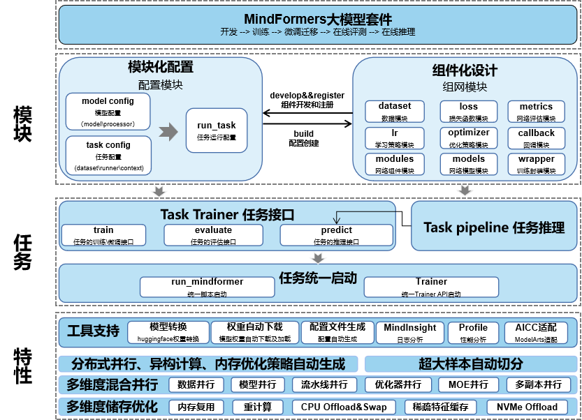

MindSpore Transformers 文档
==========================

MindSpore Transformers的目标是构建一个大模型训练、推理、部署的全流程套件：提供业内主流的Transformer类预训练模型，涵盖丰富的并行特性。期望帮助用户轻松地实现大模型训练。

MindSpore Transformers基于MindSpore内置的并行技术，具备如下特点：

- 提供典型SOTA网络的预训练、微调和部署能力。支持GPT、BERT等网络。
- 一行代码实现从单卡到大规模集群训练的无缝切换。
- 提供灵活易用的个性化并行配置。
- 能够自动进行拓扑感知，高效地融合数据并行和模型并行策略；实现单卡到大规模集群的无缝切换。

如果您对MindSpore Transformers有任何建议，请通过 `Gitee <https://gitee.com/mindspore/transformer>`_ 或MindSpore与我们联系，我们将及时处理。

使用MindSpore Transformers的典型场景
-----------------------------------

- 需要使用BERT、GPT等Transformer类网络进行微调和部署
- 需要进行Transformer类网络大规模训练

基本结构
--------

MindSpore Transformers是一个基于MindSpore的Python软件包。

提供的高级功能包括：

- 提供典型SOTA网络例如BERT的预训练、微调和部署能力。
- 支持混合并行训练大模型能力。

目录
==========================

.. toctree::
   :glob:
   :maxdepth: 1
   :caption: 欢迎使用MindFormers

   README

.. toctree::
   :glob:
   :maxdepth: 1
   :caption: 特性

   feature/Trainer
   feature/Pipeline
   feature/AutoClass

.. toctree::
   :glob:
   :maxdepth: 1
   :caption: 开发实践

   practice/bert
   practice/gpt2
   practice/mindspore

.. toctree::
   :glob:
   :maxdepth: 1
   :caption: 模型

   model_cards/bert
   model_cards/clip
   model_cards/gpt2
   model_cards/mae
   model_cards/pangualpha
   model_cards/swin
   model_cards/t5
   model_cards/vit

.. toctree::
   :glob:
   :maxdepth: 1
   :caption: 任务

   task_cards/contrastive_language_image_pretrain
   task_cards/image_classification
   task_cards/question_answering
   task_cards/text_classification
   task_cards/token_classification
   task_cards/zero_shot_image_classification

.. toctree::
   :glob:
   :maxdepth: 1
   :caption: API

   api_python/mindformers.core
   api_python/mindformers.dataset
   api_python/mindformers.models
   api_python/mindformers.modules
   api_python/mindformers.pipeline
   api_python/mindformers
   api_python/mindformers.trainer
   api_python/mindformers.wrapper

.. toctree::
   :glob:
   :maxdepth: 1
   :caption: FAQ

   FAQ
