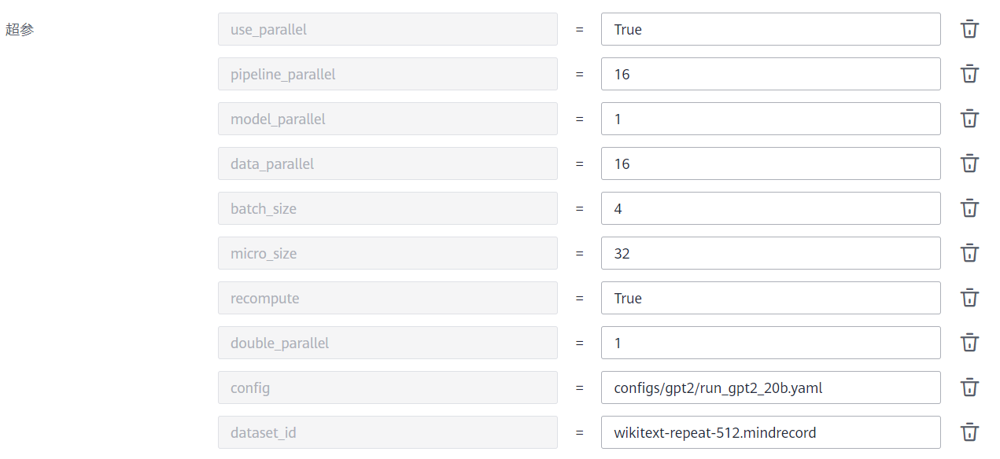

### MindSpore 学习

* 请参考MindSpore官方文档学习MindSpore相关[编程规范]()、[文档](https://www.mindspore.cn/docs/zh-CN/r1.8/index.html)、[教程](https://www.mindspore.cn/tutorials/zh-CN/r1.8/index.html)、[工具]()等

* 请参考MindSpore官方文档了解MindSpore大规模分布式并行能力 [数据并行](https://www.mindspore.cn/docs/zh-CN/r1.8/design/distributed_training_design.html#%E6%95%B0%E6%8D%AE%E5%B9%B6%E8%A1%8C) [模型并行](https://www.mindspore.cn/tutorials/experts/zh-CN/r1.8/parallel/operator_parallel.html) [流水线并行](https://www.mindspore.cn/tutorials/experts/zh-CN/r1.8/parallel/pipeline_parallel.html) [优化器并行](https://www.mindspore.cn/tutorials/experts/zh-CN/r1.8/parallel/optimizer_parallel.html) [双副本并行]()
* 请参考MindSpore官方文档了解MindSpore内存优化能力 [内存复用]() [重计算](https://www.mindspore.cn/tutorials/experts/zh-CN/r1.8/parallel/recompute.html) [CPU Off-Load]() [图算融合](https://www.mindspore.cn/docs/zh-CN/r2.0.0-alpha/design/graph_fusion_engine.html)

### GPT2-13B 分布式训练

#### GPT2 模型介绍

GPT-2由OpenAI于2019年发布。GPT-2模型是继承于GPT模型，GPT-2是一个非常庞大的语言模型，它主要是用于预测下一个单词。按照参数量的大小，GPT-2模型可分为small（124M）、medium（355M）、large（774M）、xlarge（1.5B）。

[论文](https://arxiv.org/abs/1810.04805)J Devlin，et al., Pre-training of Deep Bidirectional Transformers for Language Understanding, 2019

GPT2套件代码更多细节请参考[文档](https://gitee.com/mindspore/mindformers/blob/r0.3/docs/model_cards/gpt2.md)。


#### GPT2 模型开发

GPT2模型代码路径： `mindformers/models/gpt2`

```bash
└── gpt2
    ├── __init__.py
    ├── convert_weight.py
    ├── gpt2.py
    ├── gpt2_config.py
    ├── gpt2_processor.py
    └── gpt2_tokenizer.py
```

- [convert_weight.py](https://gitee.com/mindspore/mindformers/blob/r0.3/mindformers/models/gpt2/convert_weight.py)：权重转化脚本，将pytorch权重转化为mindspore权重；
- [gpt2.py](https://gitee.com/mindspore/mindformers/blob/r0.3/mindformers/models/gpt2/gpt2.py)：gpt2模型架构代码，由词嵌入层、自注意力层等组成；
- [gpt2_config.py](https://gitee.com/mindspore/mindformers/blob/r0.3/mindformers/models/gpt2/gpt2_config.py)：gpt2模型结构配置，如层数、自注意头数等；
- [gpt2_processor.py](https://gitee.com/mindspore/mindformers/blob/r0.3/mindformers/models/gpt2/gpt2_processor.py)：pipeline时文本切词预处理脚本；
- [gpt2_tokenizer.py](https://gitee.com/mindspore/mindformers/blob/r0.3/mindformers/models/gpt2/gpt2_tokenizer.py)：gpt2切词脚本。

GPT2配置文件路径: `configs/gpt2`

```bash
# 套件提供三种不同参数量的gpt配置
└── gpt2
    ├── run_gpt2.yaml
    ├── run_gpt2_13b.yaml
    └── run_gpt2_52b.yaml
```

[run_gpt2_13b.yaml等](https://gitee.com/mindspore/mindformers/blob/r0.3/configs/gpt2/run_gpt2.yaml)：主配置文件，其中的配置如与以上相同，则以该文件中的配置为准。需要修改配置时，推荐采用在该文件中复写配置的方式。

```text
# 关键参数说明，以4机13B参数模型为例
context:
  mode: 0 # 0-静态图模式; 1-动态图模式
  device_target: "Ascend" # 运行的设备定义 支持 Ascend、CPU、GPU
  max_device_memory: "31GB" # 每张卡运行内存限制数量

parallel: # 并行环境配置
  parallel_mode: 1 # 0-数据并行, 1-半自动并行, 2-自动并行, 3-混合并行
  full_batch: True # 数据导入方式，打开即每设备获取的数据一致，关闭则每张卡采样数据不一致
  enable_parallel_optimizer: True # 开启优化器并行

recompute_config: # 重计算模块
  recompute: True # 打开重计算
  parallel_optimizer_comm_recompute: False # 是否开启优化器通信算子重计算
  mp_comm_recompute: True # 是否开启模型并行下通信算子的重计算
  recompute_slice_activation: True # 是否开启激活权重切片重计算

# 4机32卡
parallel_config: # 模型的并行配置
  data_parallel: 4 # 数据切分数量，batch维度切分
  model_parallel: 2 # 模型权重切分数量，权重维度上切分
  pipeline_stage: 4 # 流水并行切分stage数量，切分transformer layer层 <= 节点数
  optimizer_shard: True # 优化器并行打开
  micro_batch_num: 24 # micro batch number
  vocab_emb_dp: True # 词表是否使用数据并行
  gradient_aggregation_group: 4 # 梯度聚合组数，在组内融合通信算子，提升通信效率
```

#### GPT2-13B 模型大规模分布式训练

##### 多机多卡启动

- 首先在每台机器上运行`mindformers/tools/hccl_tools.py`生成RANK_TABLE_FILE的json文件；
- 将不同机器上生成的RANK_TABLE_FILE文件中的server_list合并，server_count设为机器数，rank_id顺序增加，并保证不同机器上的RANK_TABLE_FILE相同；
- 在多机上同时拉起任务，拉起方式为

```shell
cd scripts
bash run_distribute.sh RANK_TABLE_FILE CONFIG_PATH DEVICE_RANGE RUN_MODE RANK_SIZE
```

```text
# 参数说明
RANK_TABLE_FILE: 由mindformers/tools/hccl_tools.py生成的分布式json文件
CONFIG_PATH: 为configs文件夹下面的gpt2/run_gpt2*.yaml配置文件
DEVICE_RANGE: 为单机分布式卡的范围, 如[0,8]为8卡分布式，不包含8本身
RUN_MODE: 为任务运行状态，支持关键字 train 预训练、predict（文本生成预测）
RANK_SIZE: 总运行卡数
```

```json
# 4机32卡参考RANK_TABLE_FILE样例
{
  "version": "1.0",
  "server_count": "4",
  "server_list": [
    {
      "server_id": "10.155.111.140",
      "device": [
        {"device_id": "0","device_ip": "192.1.27.6","rank_id": "0"},
        {"device_id": "1","device_ip": "192.2.27.6","rank_id": "1"},
        {"device_id": "2","device_ip": "192.3.27.6","rank_id": "2"},
        {"device_id": "3","device_ip": "192.4.27.6","rank_id": "3"},
        {"device_id": "4","device_ip": "192.1.27.7","rank_id": "4"},
        {"device_id": "5","device_ip": "192.2.27.7","rank_id": "5"},
        {"device_id": "6","device_ip": "192.3.27.7","rank_id": "6"},
        {"device_id": "7","device_ip": "192.4.27.7","rank_id": "7"}],
      "host_nic_ip": "reserve"
    },
    {
      "server_id": "10.155.111.141",
      "device": [
        {"device_id": "0","device_ip": "192.1.27.8","rank_id": "8"},
        {"device_id": "1","device_ip": "192.2.27.8","rank_id": "9"},
        {"device_id": "2","device_ip": "192.3.27.8","rank_id": "10"},
        {"device_id": "3","device_ip": "192.4.27.8","rank_id": "11"},
        {"device_id": "4","device_ip": "192.1.27.9","rank_id": "12"},
        {"device_id": "5","device_ip": "192.2.27.9","rank_id": "13"},
        {"device_id": "6","device_ip": "192.3.27.9","rank_id": "14"},
        {"device_id": "7","device_ip": "192.4.27.9","rank_id": "15"}],
      "host_nic_ip": "reserve"
    },
    {
      "server_id": "10.155.111.142",
      "device": [
        {"device_id": "0","device_ip": "192.1.27.10","rank_id": "16"},
        {"device_id": "1","device_ip": "192.2.27.10","rank_id": "17"},
        {"device_id": "2","device_ip": "192.3.27.10","rank_id": "18"},
        {"device_id": "3","device_ip": "192.4.27.10","rank_id": "19"},
        {"device_id": "4","device_ip": "192.1.27.11","rank_id": "20"},
        {"device_id": "5","device_ip": "192.2.27.11","rank_id": "21"},
        {"device_id": "6","device_ip": "192.3.27.11","rank_id": "22"},
        {"device_id": "7","device_ip": "192.4.27.11","rank_id": "23"}],
      "host_nic_ip": "reserve"
    },
    {
      "server_id": "10.155.111.143",
      "device": [
        {"device_id": "0","device_ip": "192.1.27.12","rank_id": "24"},
        {"device_id": "1","device_ip": "192.2.27.12","rank_id": "25"},
        {"device_id": "2","device_ip": "192.3.27.12","rank_id": "26"},
        {"device_id": "3","device_ip": "192.4.27.12","rank_id": "27"},
        {"device_id": "4","device_ip": "192.1.27.13","rank_id": "28"},
        {"device_id": "5","device_ip": "192.2.27.13","rank_id": "29"},
        {"device_id": "6","device_ip": "192.3.27.13","rank_id": "30"},
        {"device_id": "7","device_ip": "192.4.27.13","rank_id": "31"}],
      "host_nic_ip": "reserve"
    }
  ],
  "status": "completed"
}
```

```shell
# 任务拉起命令示例
# 第一台机器
bash run_distribute.sh {RANK_TABLE_FILE path of the first device} ../configs/gpt2/run_gpt2_13b.yaml [0,8] train 32
# 第二台机器
bash run_distribute.sh {RANK_TABLE_FILE path of the second device} ../configs/gpt2/run_gpt2_13b.yaml [8,16] train 32
# 第三台机器
bash run_distribute.sh {RANK_TABLE_FILE path of the third device} ../configs/gpt2/run_gpt2_13b.yaml [16,24] train 32
# 第四台机器
bash run_distribute.sh {RANK_TABLE_FILE path of the forth device} ../configs/gpt2/run_gpt2_13b.yaml [24,32] train 32
```

##### AICC计算中心

AICC，人工智能计算中心，提供[ModelArts](https://support.huaweicloud.com/bestpractice-modelarts/modelarts_10_0080.html)服务和Ascend 910算力。

- 进入`存储`标题下的`对象存储服务`，将训练代码和数据上传，以下提及路径均指`对象存储服务`中的路径；
  
  
- 进入`EI企业智能`标题下的`ModelArts`，打开`训练管理`标题下的`训练作业New`；
  
  
- 点击`创建训练作业`，根据提示填写相关实验信息：
  + `代码目录`填写代码文件夹的路径
  + `启动文件`填写`代码目录`中的`run_mindformer.py`路径
    
  + `训练输入`填写`run_mindformer.py`中的入参`dataset`，该操作保证mindrecord数据和对应db文件能够同时拉取到缓存中
    
    
  + `超参`填写`run_mindformer.py`中的入参，如和默认值相同，可不填写。其中，`dataset_id`是数据集名称
    
  + `环境变量`填写模型训练所需要设置的环境变量
    
  + `启动方式`下的`预置框架`中可以选择用于自己的镜像，前提是用户已将镜像上传到`对象存储服务`，并通过`ModelArts`->`镜像管理`->`注册镜像`将镜像注册

### Bert 下游任务微调

#### Bert 模型介绍

BERT:全名`Bidirectional Encoder Representations from Transformers`模型是谷歌在2018年基于Wiki数据集训练的Transformer模型。  

[论文](https://arxiv.org/abs/1810.04805): J Devlin，et al., Pre-training of Deep Bidirectional Transformers for Language Understanding, 2019

#### Bert 下游任务微调

下面以question_answering任务为例介绍Bert下游任务微调的流程。

- 数据集

  SQuAD v1.1数据集：该数据集包含 10 万个（问题，原文，答案）三元组，原文来自于 536 篇维基百科文章，而问题和答案的构建主要是通过众包的方式，让标注人员提出最多 5 个基于文章内容的问题并提供正确答案，且答案出现在原文中。

  下载地址：[SQuAD v1.1训练集](https://rajpurkar.github.io/SQuAD-explorer/dataset/train-v1.1.json)，[SQuAD v1.1验证集](https://rajpurkar.github.io/SQuAD-explorer/dataset/dev-v1.1.json)

  新建名为squad文件夹，将下载的json格式数据集文件放入文件夹中。

  ```bash
  └─squad  
   ├─train-v1.1.json
   └─dev-v1.1.json
  ```

- 初始化question_answering任务trainer

  使用mindformers.trainer.Trainer类，初始化question_answering任务的trainer。

  ```python
  from mindformers.trainer import Trainer
  
  # 初始化question_answering任务trainer
  trainer = Trainer(task='question_answering',
                    model='qa_bert_base_uncased',
                    train_dataset='./squad/',
                    eval_dataset='./squad/')
  ```

  参数含义如下：

  - task(str) - 任务名称，'question_answering'为问答任务。

  - model(str) - 模型名称， 'qa_bert_base_uncased'为Bert接question_answering下游任务模型。

  - train_dataset(str) - 训练数据集所在路径。

  - eval_dataset(str) - 评估数据集所在路径。

- 使用现有的预训练权重进行finetune微调

  从obs上下载bert_base_uncased预训练权重，加载预训练权重，并在下游任务qa_bert_base_uncased模型上进行微调。

  ```python
  # 使用现有的预训练权重进行finetune微调
  trainer.train(resume_or_finetune_from_checkpoint="qa_bert_base_uncased",
                do_finetune=True)
  ```

  参数含义如下：

  - resume_or_finetune_from_checkpoint(str) - 权重名称，'qa_bert_base_uncased'为问答任务对应的Bert预训练权重。

  - do_finetune(bool) - 是否进行微调，True表示以微调的方式加载权重。

  训练过程中会实时打印训练时长、Loss等信息。

- 使用finetune获得的权重进行eval评估

  从finetune保存的权重文件中，取最后一次保存的checkpoint文件的权重加载进网络中，并进行评估。

  ```python
  # 使用finetune获得的最新权重进行eval评估
  trainer.evaluate(eval_checkpoint=True)
  ```

  参数含义如下：

  - eval_checkpoint(bool) - 是否加载最后一次保存的权重进行评估，True表示加载最后一次保存的权重文件中的权重进网络中。

  obs上训练好的权重评估结果如下：

  ```text
  INFO - QA Metric = {'QA Metric': {'exact_match': 80.74739829706716, 'f1': 88.33552874684968}}
  ```

- 使用finetune获得的权重进行predict推理

  从finetune保存的权重文件中，取最后一次保存的checkpoint文件的权重加载进网络中，并进行推理。推理输入的文本包括context和question两部分，两者以短横线“-”为标志分隔开。

  ```python
  # 使用finetune获得的最新权重进行predict推理
  # 测试数据，测试数据分为context和question两部分，两者以 “-” 分隔
  input_data = ["My name is Wolfgang and I live in Berlin - Where do I live?"]
  trainer.predict(predict_checkpoint=True, input_data=input_data)
  ```

  参数含义如下：

  - predict_checkpoint(bool) - 是否加载最后一次保存的权重进行推理，True表示加载最后一次保存的权重文件中的权重进网络中。

  - input_data(str) - 输入文本，分为context和question两部分，两者以 “-” 分隔。

  得到的输出为：

  ```text
  [{'text': 'Berlin', 'score': 0.9941, 'start': 34, 'end': 40}]
  ```
