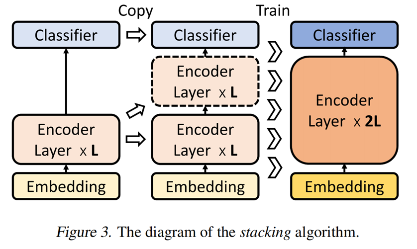
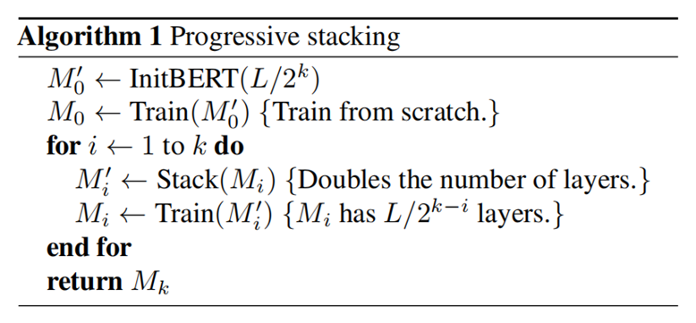

# Progressively Stacking Train

## 背景描述
训练Transformer模型的时间长，资源耗费多，因此减少Transformer模型的训练时间，加快其收敛速度非常重要。现有一些工作发现，在训练Transformer模型的过程中，不同层之间的参数
具有非常高的相似性，并且在训练过程中某些层的参数收敛较快。因此，可以通过共享不同层之间参数的方式，加快其模型的训练过程。

## 算法介绍

### Stacking过程：
如果我们有一个L层训练BERT，我们可以通过复制构建一个2L层BERT：对于i ≤ L，构造的BERT的第i层和(i+L)层与训练后的BERT的第i层具有相同的参数。

过程示意图如下：

<div align=center></div>

### Progressive Stacking算法：
由于浅层模型通常比深度模型训练得更快（对于相同的步数），如果我们从浅层模型叠加来训练深度模型，训练时间将大大减少。同样，我们可以通过从较浅的模型堆叠来更快地训练这个浅层模型。通过递归，我们设计了一种基于堆叠（Stacking）技术的迭代训练算法，以更快地训练深度BERT。我们称这种算法为渐进式叠加(Progressive Stacking)。

算法伪代码如下：

<div align=center></div>

## 接口代码的设计
Progressively Stacking Train为多阶段训练，每一个阶段训练过程中构建的模型（模型的层数）、优化器的状态、每个阶段的epoch数量的设定、学习率调度器等都不一样，
因此在每个阶段的训练过程中都要对这些进行单独的构建。

接口代码设计思路如下：
- 拷贝config文件：

    各个阶段在构建相应的模型、优化器等时，可能会pop一些配置文件里面的参数，为了防止其影响下一阶段模型、优化器等的构建，需要提前将配置文件进行深度拷贝
- 通过循环来进行Progressively Stacking Train：

    循环遍历来进行Progressively Stacking训练的各个阶段，每个阶段单独构建相应的模型、优化器、epoch size、学习率调度器等
- 阶段过渡时权重的加载：

    在各个阶段之间过度时，后一阶段的模型需要加载前一阶段的模型权重并进行stcking，例如第二阶段6层的模型需要加载第一阶段3层模型的权重并将此权重进行stacking，前一阶段的模型权重的路径可以通过前一阶段的ModelCheckpoint回调函数的latest_ckpt_file_name属性来获得。
- 不同的模型设置各自的stacking函数：

    对于GPT和Bert而言，其模型权重字典的key值都不一样，因此需要针对不同的大模型来构建不同的stacking函数


## 代码修改
与原仓库相比，代码的修改如下：
- mindtransformer/trainer/trainer.py： 类Trainer中添加函数stack_train
- mindtransformer/models/gpt/gpt_stack_trainer.py：添加了GPT Progressively Stacking Train的文件
- examples/pretrain/pretrain_stack_gpt.sh：添加了GPT Progressively Stacking Train的执行脚本文件

## 接口代码的使用
```shell
bash examples/pretrain/pretrain_stack_gpt.sh DEVICE_ID DATA_DIR
```
在脚本文件中新添加了如下两个参数：
- stages: 这个参数为Progressively Stacking Train时分为几个阶段进行模型的训练，例如[3,6,12]即先进行3层训练，然后3层权重叠加到6层进行训练，最后6层权重叠加到12层进行训练
- stage_epochs: 这个参数为Progressively Stacking Train时每个阶段训练的epochs数量，例如[1,1,3]即3层模型训练1个epoch，接着6层模型训练1个epoch，最后12层模型训练3个epoch

### 训练日志
此接口代码有一个示例日志，为训练日志.txt，为GPT模型在小数据集上进行训练的日志文件。

## 参考文献
1.Gong L, He D, Li Z, et al. Efficient training of bert by progressively stacking[C]//International Conference on Machine Learning. PMLR, 2019: 2337-2346.

2.Yang, C., Wang, S., Yang, C., Li, Y., He, R., & Zhang, J. (2020). Progressively Stacking 2.0: A Multi-stage Layerwise Training Method for BERT Training Speedup. ArXiv, abs/2011.13635.

