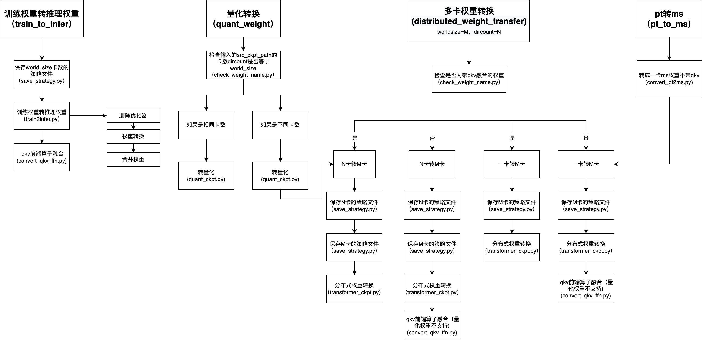

# 推理权重转换

## 入参说明

| 名称  | 缩写  |  参数说明 | 是否必须  |
| ------------ | ------------ | ------------ | ------------ |
| --function  | -f  | Choose the function you need from the following options: train_to_infer, quant_weight, distributed_weight_transfer, pt_to_ms  |  是 |
| --precision |  -p |  Set precision (fp16, w8a16, w8a8, w8a16c8, w8a8c8, fp16c8) |  是 |
| --world_size  |  -w  | Set the world size for distributed training (2, 4 or 8)  |  是  |
| --yaml_path  | -y  | Yaml path or model config path  |  是 |
|  --dataset_path | -dp  | Dataset path   |  否 |
|  --dataset_name | -d  | Dataset name (only support boolq, squad1.1 and wikitext2)   |  否 |
|  --train_strategy_file |  -ts  | Training strategy saved path  | 否  |
|  --infer_strategy_file | -is  |  Path to save inference strategy  | 否  |
|  --src_ckpt_path |  -sc | Source ckpt path  |  是 |
|  --dst_ckpt_path  | -dc  |  Destination ckpt path |  否 |
| --pipeline_stage  | -pp  | Pipeline_stage set during training   | 否  |
|  --help | -h  |   Print this help message| 否  |

## 整体流程图



## 1. 训练权重转fp16推理权重 **train_to_infer**

### 1.1 转换步骤

#### 1.1.1 配置项说明

必须配置项：

- `--function train_to_infer --precision fp16 --world_size 4/8`
- `--yaml` 为fp16推理的yaml文件路径
- `--src_ckpt_path` 为训练权重路径
- `--train_strategy_file` 为训练策略文件路径
- `--pipeline_stage` 训练时配置的pp值

可配置项

- `--infer_strategy_file` 生成策略文件的保存地址，不设置此参数时，策略文件保存在当前路径下`"./infer_strategy/fp16_xp"`
- `--dst_ckpt_path` 生成权重文件的保存地址，不设置此参数时策略文件保存在当前路径下`./infer_ckpt/fp16_xp`

#### 1.1.2 流程说明

- 根据 `--yaml，--world_size` 生成相应的策略文件保存在`--infer_strategy_file`
- 根据 `--src_ckpt_path --train_strategy_file --world_size --pipeline_stage` 生成fp16的推理权重保存在`--dst_ckpt_path`，其中流程包括：删除优化器、转换、合并、添加前端qkv融合

### 1.2 样例

```shell
# fp16
bash ckpt_convert.sh -f train_to_infer -p fp16 -w 8 -y /home/checkpoint_download/llama57b/predict_llama2_57b_910b.yaml  -sc /home/predict/57B/checkpoint/2024-05-20-283200 -ts /home/predict/57B/0520_strategy/strategy -is /home/predict/convert_ckpt_stage_0703/infer_strategy -dc /home/predict/convert_ckpt_stage_0703/infer_ckpt -pp 7
```

### 1.3 注意事项

暂无

## 2. fp16推理权重转量化推理权重 **quant_weight**

### 2.1 转换步骤

#### 2.1.1 配置项说明

必须配置项：

- `--function quant_weight --precision w8a16/w8a8/w8a16c8/w8a8c8/fp16c8 --world_size 2/4/8`
- `--yaml` 为量化推理的yaml文件路径
- `--src_ckpt_path` 为fp16的权重路径
- `-d` 转量化权重时必要配置的数据集名称，当前只支持 `boolq、squad1.1、wikitext2` 三个数据集，
- `-dp` 转量化权重时必要配置的数据集路径，例如 './boolq/dev.jsonl'

可配置项：

- `--infer_strategy_file` 生成策略文件的保存地址，不设置此参数时，策略文件保存在当前路径下`"./infer_strategy/"`；
- `--dst_ckpt_path` 生成量化权重文件的保存地址，不设置此参数时策略文件保存在当前路径下`./infer_ckpt/`

#### 2.1.2 流程说明

- 检查`--src_ckpt_path`路径下的rank数`dir_count`是否与`--world_size`一致
- 若一致，则将fp16的权重转换为量化权重
- 若不一致：
    - 生成 `dir_count` 卡数的量化权重文件
    - 多卡转换中的多卡转多卡流程：
        - 生成 `dir_count` 卡数的策略文件
        - 生成 `world_size` 卡数的策略文件
        - 生成 `world_size` 卡数的量化权重文件

### 2.2 样例

```shell
# w8a16 fp16-8p 转 w8a16_4p
bash ckpt_convert.sh -f quant_weight -p w8a16 -w 4 -y /home/checkpoint_download/llama57b_quant_w8a16/predict_llama2_57b_910b.yaml  -sc /home/predict/convert_ckpt_stage_0703/infer_ckpt/fp16_8p -d boolq -dp ./boolq/dev.jsonl -is /home/predict/convert_ckpt_stage_0703/infer_strategy -dc /home/predict/convert_ckpt_stage_0703/infer_ckpt
```

```shell
# w8a8 fp16-8p 转 w8a8_4p
bash ckpt_convert.sh -f quant_weight -p w8a8 -w 4 -y /home/checkpoint_download/llama57b_quant_w8a8/predict_llama2_57b_910b.yaml  -sc /home/predict/convert_ckpt_stage_0703/infer_ckpt/fp16_8p  -d boolq -dp ./boolq/dev.jsonl
```

```shell
# w8a8c8 fp16-8p 转 w8a8c8_8p
bash ckpt_convert.sh -f quant_weight -p w8a8c8 -w 8 -y /home/checkpoint_download/llama57b_quant_w8a8c8/predict_llama2_57b_910b.yaml  -sc /home/predict/convert_ckpt_stage_0703/infer_ckpt/fp16_8p  -d boolq -dp ./boolq/dev.jsonl
```

### 2.3 注意事项

转量化权重流程不支持单卡权重作为输入

## 3. 多卡转化 **distributed_weight_transfer**

### 3.1 转换步骤

#### 3.1.1 配置项说明

必须配置项：

- `--function distributed_weight_transfer --precision fp16/w8a16/w8a8/w8a16c8/w8a8c8/fp16c8 --world_size 2/4/8`
- `--yaml` 为该精度推理的yaml文件路径
- `--src_ckpt_path` 为输入的权重路径

可配置项：

- `--infer_strategy_file` 生成策略文件的保存地址，不设置此参数时，策略文件保存在当前路径下 `"./infer_strategy/"`
- `--dst_ckpt_path` 生成量化权重文件的保存地址，不设置此参数时策略文件保存在当前路径下 `./infer_ckpt/`

#### 3.1.2 流程说明

- 检查权重是否是含有qkv前端算子融合的，是：`qkv_concat=true`, 否：`qkv_concat=false`
- 若`dir_count == 1`, 进入一卡转多卡流程:
    - 生成`world_size`卡数的策略文件
    - 生成`world_size`卡数的权重
    - 若`qkv_concat==false`且`precision==fp16`，添加qkv前端算子融合
- 若`dir_count != 1`, 进入多卡转多卡流程：
    - 生成`dir_count`卡数的策略文件
    - 生成`world_size`卡数的策略文件
    - 生成`world_size`卡数的权重
    - 若`qkv_concat==false`且`precision==fp16`，添加qkv前端算子融合

### 3.2 样例

```shell
# fp16 fp16-8p 转 fp16-4p
bash ckpt_convert.sh -f distributed_weight_transfer -p fp16 -w 4 -y /home/checkpoint_download/llama57b/predict_llama2_57b_910b.yaml  -sc /home/predict/convert_ckpt_stage_0703/infer_ckpt/fp16_8p
```

### 3.3 注意事项

- 输入的权重精度与设置的precision一致
- 若输入的权重为单卡权重，需要将权重路径修改形式为：/path/rank_0/**.ckpt, 输入的 --src_ckpt_path=/path/
- 不支持给量化权重做qkv前端算子融合

## 4. huggingface权重转mindspore的fp16推理权重 **pt_to_ms**

### 4.1 转换步骤

#### 4.1.1 配置项说明

环境设置：

- pip install transformers
- export LD_PRELOAD=/root/miniconda3/envs/py310/lib/python3.10/site-packages/torch/lib/../../torch.libs/libgomp-6e1a1d1b.so.1.0.0:$LD_PRELOAD

必须配置项：

- `--function pt_to_ms --precision fp16 --world_size 2/4/8`
- `--yaml` 为fp16推理的yaml文件路径
- `--src_ckpt_path`为huggingface的bin文件路径, 路径下必须有: config.json, pytorch_model.bin.index.json 和 pytorch_model-*-of-*.bin文件

可配置项：

- `--infer_strategy_file`生成策略文件的保存地址，不设置此参数时，策略文件保存在当前路径下`"./pt_to_ms/"`；
- `--dst_ckpt_path` 生成权重文件的保存地址，不设置此参数时策略文件保存在当前路径下`./pt_to_ms/`

#### 4.1.2 流程说明

- 将huggingface的bin权重文件转换成mindspore的完整ckpt权重文件
- 一卡转多卡流程:
    - 生成`world_size`卡数的策略文件
    - 生成`world_size`卡数的权重
    - 添加qkv前端算子融合

### 4.2 样例

```shell
# pytorch to mindspore
bash ckpt_convert.sh -f pt_to_ms -p fp16 -w 8  -y /home/checkpoint_download/llama57b/predict_llama2_57b_910b.yaml  -sc /path/to/pytorch/
```

### 4.3 注意事项

- pytorch转mindspore的ckpt只支持转换到fp16的精度

## 5. ckpt转safetensors

### 5.1 直接调用

```shell
python ckpt_to_safetensors.py --src_ckpt_path=/infer_ckpt/fp16_8p --dst_safetensors_path=/infer_ckpt/fp16_8p_safetensors
```
