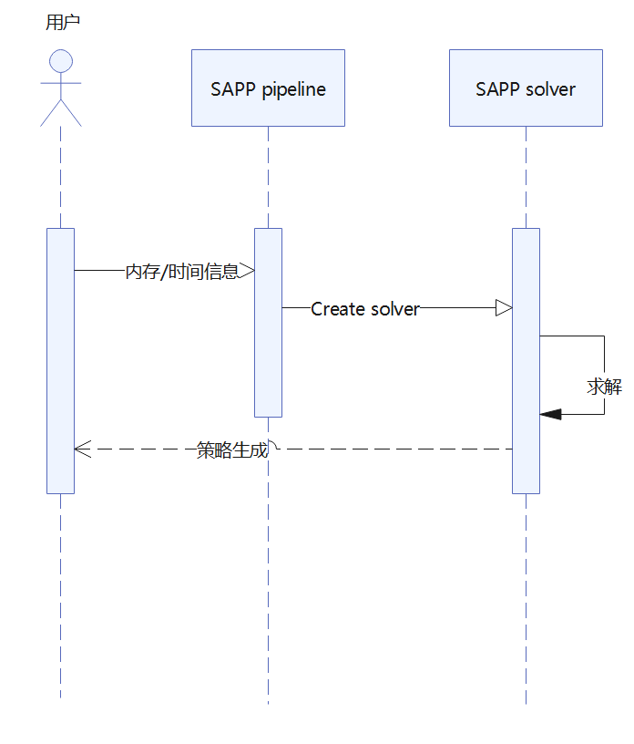

# SAPP流水线负载均衡

流水线并行（pipeline parallelism）可以将神经网络模型切分为不同部分，映射到不同阶段，每个stage部署到集群上不同的节点。从而让集群可以跑下更大的模型。
目前，计算负载和stage切分会影响时间上的不均衡，而内存负载和重计算策略会带来空间上的不均衡。要达到最佳效果，必须同时均衡计算和内存的负载。SAPP流水线负载均衡工具则可以自动生成策略达成均衡。

使用工具的总体流程如下：


用户需要给工具提供一个json文件用以描述模型的内存和时间信息（下文将介绍如何填写json文件），工具基于这些信息自动构建线性规划问题，通过全局求解给出一个最优的重计算+offset策略。

## 策略生成

使用SAPP流水线负载均衡工具需要在./layers下面新增一个json文件，如命名为llama2_70b.json。这个json中体现了工具所需要的所有信息。

### 字段解释

type: 主流的模型架构都由head、body和tail构成。body体现为重叠的layer，比如llama的body就是多层相同的decoder。
nb_layer：head、body或tail有多少层。
time: 一个step中head、body或tail的执行时间。
memory_parameter：与权重相关的内存量。在head、body和tail中的值是不一样的，因为头尾可能有embedding或lm_head等。
memory_actication：前向计算的中间结果。
memory_recompute：开启了完全重计算后activation的内存量。
memory_select_comm：开启了通信重计算后activation的内存量。
memory_select_rec：开启了选择重计算后activation的内存量。

### json文件示例

用户使用时只需更改layers_description中的对应字段即可。

```json
{
    "name": "llama2_70b_prof",
    "pre_defined_layer": {
      "LlamaEmbedding": 0,
      "LlamaRMSNorm": -1
    },
    "auto_partition_layer": {
      "LLamaDecodeLayer": 96
    },
    "layers_description":[
        {
          "name": "LlamaEmbedding",
          "model_name": "LLaMA_prof",
          "type": "HEAD",
          "time": 4.5808,
          "nb_layer": 1,
          "memory_parameter": 1245.8
        },
        {
          "name": "LLamaDecodeLayer",
          "model_name": "LLaMA_prof",
          "type": "BODY",
          "time": 1.31479,
          "nb_layer": 80,
          "memory_activation": 440.34,
          "memory_parameter": 1947.29999,
          "memory_recompute": 16.23999
        },
        {
          "name": "LlamaRMSNorm",
          "model_name": "LLaMA_prof",
          "type": "TAIL",
          "time": 0.74015,
          "nb_layer": 1,
          "memory_parameter": 3127.6
        }
    ]
}
```

填写完之后，执行：

```bash
python run_pipeline_balance.py -m <json_file_name> -mb <micro_barch_num> -mem <max_mem> -s <stage_num>
```

在输出结果中可以看到策略：

```plain
- INFO -
To put in yaml configuration:
        offset: [0, 0, 0, 0, 0, 0, 0, 0]
        recompute: [8, 8, 7, 7, 7, 6, 5, 4]
        pp_interleave_num: 1
```

