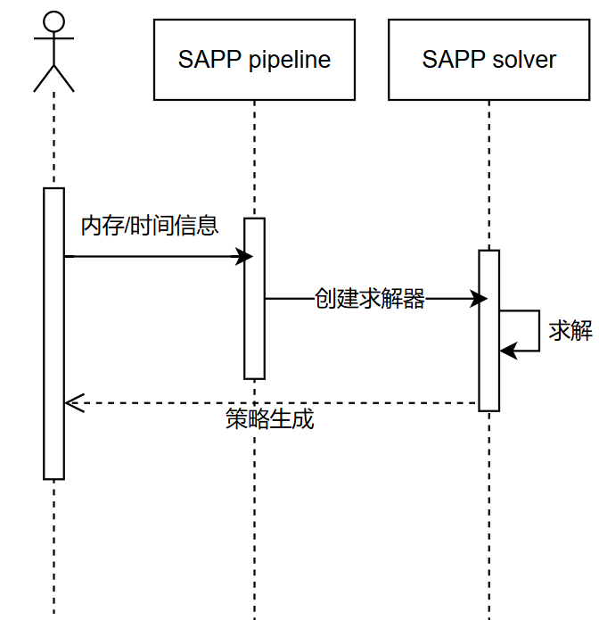
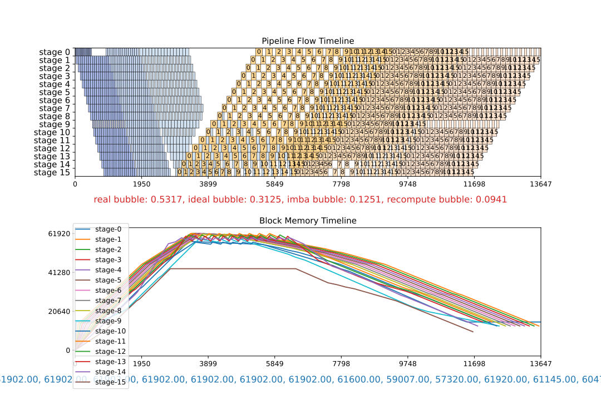
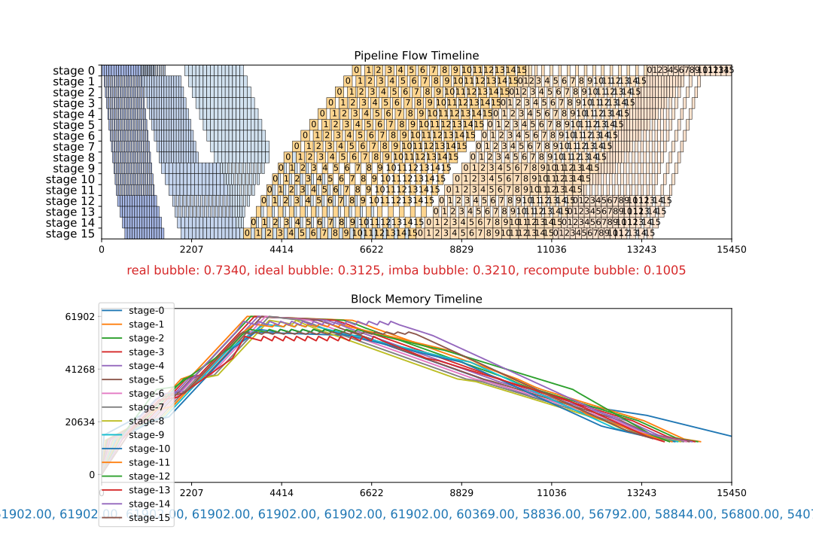
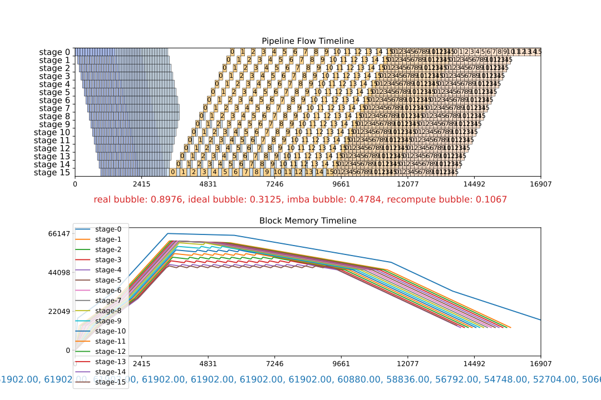
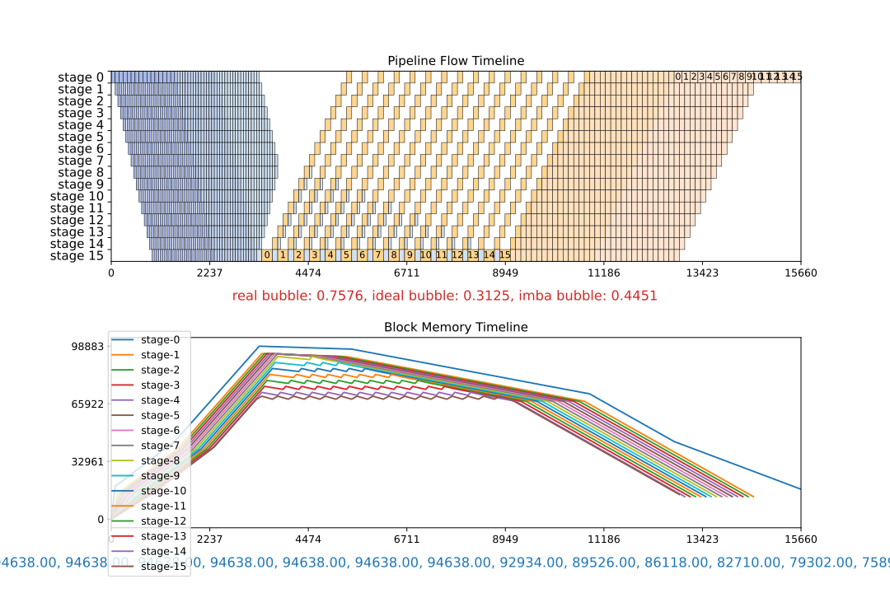
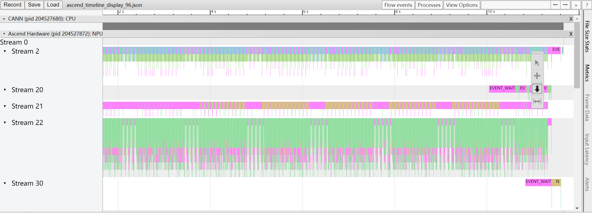
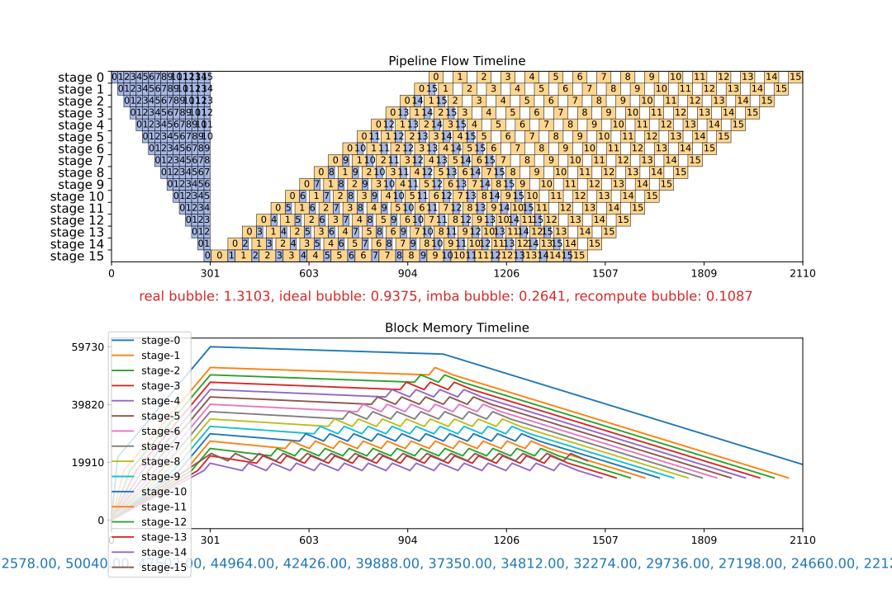
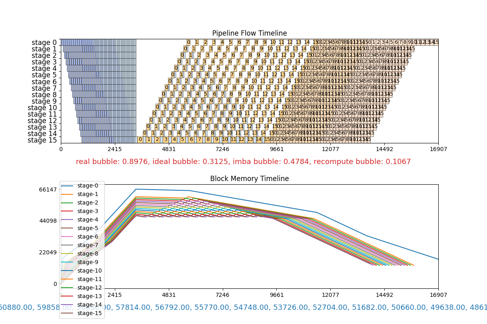
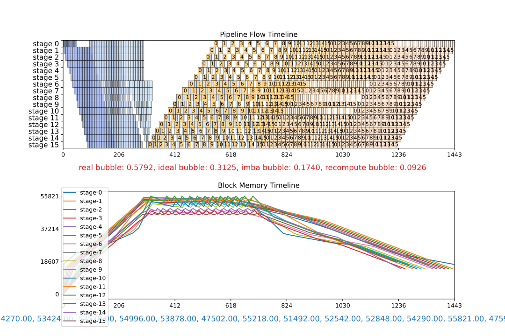

# SAPP流水线负载均衡

流水线并行（pipeline parallelism）可以将神经网络模型切分为不同部分，映射到不同阶段，每个stage部署到集群上不同的节点。从而让集群可以容纳更大的模型。目前的流水线并行编排方式会带来不同设备上计算和内存开销的不均衡。要达到最佳性能，必须同时均衡计算和内存的负载。

在训练和微调阶段，大模型需要切分到4个及以上的流水线stage时，手工调优很难短时间找到最优解。如果引入流水线交织（pipeline interleave）技术，则调优难度更大。此时就需要使用SAPP流水线负载均衡工具自动生成最优策略。

使用工具的总体流程如下：


用户需要给工具提供一个yaml文件用以描述模型的内存和时间信息（下文将介绍如何填写yaml文件），工具基于这些信息自动构建线性规划问题，通过全局求解给出一个最优的重计算和负载偏置（offset）策略。

## 使用指南

### 基本步骤

Step1. 使用SAPP流水线负载均衡工具需要在一个init文件（该文件采取yaml格式，下面是一个init文件的样例）中给定关于模型的时间和内存信息。得到这些信息可能需要Profiling和DryRun，可见下文[显存信息和时间信息的收集](#显存信息和时间信息的收集)。

```yaml
# pipeline_config
pipeline_config:
  pipeline_num: 16
  num_layer: 96
  offset: [-1, 1, -1, 1, -1, 1, -1, 1, -1, 1, -1, 1, -1, 1, -1, 1]

# time_config
time_config:
  head: 90
  body: 90
  tail: 180

# recompute_config
recompute_config:
  recompute: false
  select_recompute: [1, 0, 0, 0, 1, 1, 2, 0, 0, 0, 1, 1, 2, 0, 0, 1]
  select_comm_recompute: [1, 0, 0, 0, 0, 0, 0, 1, 1, 2, 1, 1, 2, 0, 0, 1]

# head memory and tail memory are necessary.
# num of body memories = type of recompute + 2 --> the influence of implicit constant memory is not considered
# num of body memories = type of recompute + 3 --> the influence of implicit constant memory is considered
memory_usage:
  head_memory: 77698
  tail_memory: 21822
  body_memories:
    stage_id: [6,9,10,11,12,13]
    memories: [49732,50435,32341,41228,23134,30998]
```

yaml中的字段含义如下：

| 参数名 | 含义 | 取值范围 |
|  ----  | ----  | ---- |
| `pipeline_config` | 流水线的基本配置 |
| `pipeline_num` | 流水线并行的stage数 | int |
| `num_layer` | 模型层数 | int |
| `offset` | 配置的负载偏置 | 支持list、list of lists以及数字0作为输入。list中的数表示每个stage的偏置。list of lists用于[需要提前运行多轮的情形](#需要提前运行多轮的情形)。0表示没有负载偏置。 |
| `time_config` | 模型各部分的时间关系 |
| `head_time` | 最开始的embedding层前向时间 | float, int |
| `body_time` | 中间迭代的decoder layer时间 | float, int |
| `tail_time` | 结尾的rmsnorm等时间 | float, int |
| `recompute_config` | 配置的重计算策略 |
| `recompute` | 完全重计算配置 | 支持list，bool或list of lists作为输入。|
| `select_recompute` | 选择重计算配置 | 支持list，bool或list of lists作为输入|
| `select_comm_recompute` | 通信重计算配置 | 支持list，bool或list of lists作为输入|
| `memory_usage` | 模型运行结束后得到显存占用 |
| `head_memory` | 第一个stage的显存占用，单位为MB | int |
| `tail_memory` | 最后一个stage的显存占用，单位为MB | int |
| `body_memories` | 中间stage的显存占用 |
| `stage_id` | 被选定用于内存分解计算的stage的序号, 选择的stage数量应等于 3 + 纳入建模的重计算种类（如完全重计算、选择重计算就是两种不同的重计算） | 支持list或list of lists |
|`memories`| stage_id中对应stage的显存占用 |支持list或list of lists |

其中memory的部分可以借助DryRun，time部分可以通过Profiling信息获得。

Step2. 有了这个yaml文件后，在环境变量PYTHONPATH中添加MindFormers根目录的绝对路径。随后执行：

```python
export PYTHONPATH=<MindFormers_dir>

python run_pipeline_balance.py --init <init_file> -m <model_name> -mb <micro_barch_num> -mem <max_mem> -s <stage_num> -i <vpp_num> -lm <1/0> -t <time_limit>
```

工具涉及的参数含义如下：

| 参数 | 含义 | 取值范围 |
|----|----|:----:|
| `--init` | init文件的相对位置 | str，使用该参数时必须要提供文件路径 |
| `-m` | 模型名称（自定义），init分析后存成一个同名json文件提供给算法接口 | str，默认"model_name" |
| `-mb` | micro batch数 | int，默认4 |
| `-mem` | 最大可用显存，单位为mb | int，默认56000 |
| `-s` |流水线stage数| int，默认4 |
| `-i` |pipeline interleave数 |int，默认1|
| `-lm` |大小内存 | int, 仅在pipeline interleave > 1的时候生效，0为大内存，1为小内存，二者为两种不同的流水线调度方式，小内存方案的调度方式可以节省更多的峰值内存。默认为大内存。|
| `-t` | 求解器搜索时间的上限，以秒为单位，达到时间上限后求解器停止搜索 | int，默认90 |
| `-naive` | 是否对naive配置进行模拟（详见下文[比较不同的策略](#比较不同的策略)） | 0或1，默认关闭 |
| `-manual` | 手工并行策略配置的路径（详见下文[比较不同的策略](#比较不同的策略)） | str，默认关闭 |

Step3. 在输出结果中可以看到推荐策略，以及这个策略的流水线bubble：

```plain
To put in yaml configuration:
        offset: [[-2, -1, -1, 0, 0, 0, 0, 0, 0, 0, 1, 1, 1, 1, 1, -1]]
        recompute: [[0, 0, 0, 0, 0, 0, 0, 0, 0, 0, 0, 0, 0, 0, 0, 0]]
        select_recompute: [[0, 0, 0, 6, 0, 3, 2, 4, 2, 0, 0, 0, 0, 0, 0, 0]]
        select_comm_recompute: [[3, 5, 4, 6, 6, 4, 3, 1, 0, 0, 0, 0, 0, 0, 0, 0]]

————————————— pp: 8, vp: 1, micro: 32 ————————————
--------------------  bubble  --------------------
   real    =   ideal   +   imba    + recompute
  0.5743   =  0.2188   +  0.2947   +  0.0608
```

bubble一栏各项所表达的含义如下：

`real`为流水线并行中的总bubble；

`ideal`为理论最小bubble；

`imba`为各stage间计算不平衡带来的bubble；

`recompute`为重计算引入的bubble。

### 需要提前运行多轮的情形

注意，由于工具的内存算法基于方程组求解（详见[内存分解原理](#内存分解原理)），当运行一次提供不了足够的stage数据的时候就需要运行多轮。以pp=4为例可以按如下方式提供，需要关注offset、recompute和memory中的部分字段改成了list of lists的格式：

```yaml
# pipeline_config
pipeline_config:
  pipeline_num: 4
  num_layer: 80
  offset: [[0,1,-1,0],[0,-1,1,0]] #通过list of lists的方式提供两轮数据

# recompute_config
recompute_config:
  recompute: [[1,2,1,1],[1,3,4,1]]
  select_recompute: [false,false]
  select_comm_recompute: [false,false]

memory_usage:
  head_memory: 66502
  tail_memory: 25599
  body_memories:
    stage_id: [[1,2],[1,2]]
    memories: [[52536,35595],[45439,35700]]
```

## 比较不同的策略

为了在调优时判断SAPP工具生成的策略是否较优，我们提供了接口对不同策略进行模拟，并生成模拟结果以供比较。工具可生成两种结果作为对照：一种是基于两个naive策略的结果，另一种是基于用户提供的手工策略的结果。二者可同时与工具结果进行比较。

> 注意：如果在init文件中只配置了某种重计算，那么模拟的时候是无法考虑其它重计算的。比如init的时候yaml文件中只提供了完全重计算，那么无法生成考虑了选择重计算的naive或者手工策略。

1. 自动生成naive策略

当模型层数能被流水线层数与流水线interleave数的乘积所整除的时候，且init的时候提供了完全重计算的显存开销。在执行时加上`-naive 1`即会自动给出重计算开满和重计算不开这两种情形下模拟器的模拟结果。

```bash
python run_pipeline_balance.py --init ./cfgs/init_demo.yaml -m demo -s 16 -i 3 -mb 16 -mem 62000 -t 150 -naive 1
```

同时除了求解出的推荐策略之外，会在`output`目录下生成另外两个svg文件，result_naive_no_recomp以及result_naive_all_recomp：

```bash
$ ls ./output

result.svg result_naive_no_recomp.svg result_naive_all_recomp.svg
```

2. 生成人工策略的结果

```bash
python run_pipeline_balance.py --init ./cfgs/init_demo.yaml -m demo -s 16 -i 3 -mb 16 -mem 62000 -t 150 -manual cfgs/manual.yaml
```

manual.yaml的格式如下：

```yaml
# simulate configs
manual1:
  offset:  [[-1, -1, -1, -1, -1, -1, -1, -1, -1, -1, -1, -1, 0, 0, 0, 0], [-1, 0, 0, 0, 0, 0, 0, 0, 0, 1, 1, 1, 0, 0, 1, 1], [1, 1, 1, 1, 1, 1, 1, 1, 1, 0, 0, 0, 0, 0, 0, -1]]
  recompute: false
  select_recompute: [[1, 1, 1, 1, 1, 1, 1, 1, 1, 1, 1, 1, 2, 2, 2, 2], [1, 2, 2, 2, 2, 2, 2, 2, 2, 3, 3, 3, 2, 2, 3, 3], [3, 3, 3, 3, 3, 3, 3, 3, 3, 2, 2, 2, 2, 0, 1, 0]]
  select_comm_recompute: [[1, 1, 1, 1, 1, 1, 1, 1, 1, 1, 1, 0, 1, 2, 2, 2], [1, 2, 2, 2, 2, 2, 2, 2, 2, 3, 3, 3, 2, 2, 3, 3], [3, 3, 3, 3, 3, 3, 3, 3, 3, 2, 2, 2, 2, 0, 1, 0]]
  interleave_num: 3
  show: True
  file_name: "manual1.svg"
```

下图展示了推荐策略和naive、人工策略的比较。图片的上半部分是流水线的模拟，下半部分是各个stage内存占用的演化。上半部分的横坐标代表着时间，通过横坐标的最大值可以比较不同策略的性能。

可以看到重计算开满的时候性能会比较差，而不开重计算则会超过显存上限。工具求出的策略则会在显存上限的约束下得到最优的性能，这可以通过和人工策略的比较得到确证。见下图：
|算法结果             |  手工调优|
|:-------------------------:|:-------------------------:|
 | |

| 全量使用重计算             |  关闭重计算|
|:-------------------------:|:-------------------------:|
|||

## 内存数据和性能数据的收集

在调优过程中，profiling可以给出模型执行的性能数据，而DryRun可以给出具体Device的内存数据。这两项技术对于调优有重大意义，这里简述使用方法。

### 使用Profiling获取性能数据

在mindformers训练任务的config中配置如下字段可以激活profiling。

```yaml
profile: True # 开启或关闭profiling
profile_start_step: 3 # 在某个step开始
profile_stop_step: 4 # 在某个step结束
```

生成的`trace_view.json`可以在`chrome://tracing`中展示。可视化算子级的性能数据。如图：



如果想要得到第一个stage的信息就打开rank0的profiling，最后一个rank的profiling可以代表最后一个stage的信息。查看profiling是为了获得init文件中需要的head、body和tail时间。其中head的时间一般体现为embedding算子所占的时间，body的时间是一层decode layer的时间，tail的时间是最后lm_head和loss所占的时间。只要在profiling中查找对应的算子即可。

详细文档也可见[mindspore的profiling指南](https://www.mindspore.cn/docs/zh-CN/master/model_train/optimize/profiler.html)。

### 使用DryRun获取内存数据

DryRun对模型进行模拟编译，可以给出被模拟的device的内存占用。

设置如下环境变量，即可开启DryRun。

```bash
export MS_SIMULATION_LEVEL=1
export MS_KERNEL_LAUNCH_SKIP=all
export MS_MEMORY_STATISTIC=1
```

工具也提供了一个Dryrun的[参考脚本](./utils/dryrun.sh)，执行：

```bash
bash dryrun.sh "python run_mindformer.py --config <config_file> " <rank_size> <stage_num>
```

其中，

`config_file`是MindFormers的训练任务配置文件，`rank_size`是训练的总卡数，`stage_num`是流水线stage数。

执行结束后会在output_dryrun目录下面产生每个stage（即每个stage的第一个rank）的日志。日志的末尾会给出内存信息，可以通过`grep -rn 'Used peak'`进行收集。如下，Used peak可以认为是模型内存占用的理论值，而Actual peak则是加上了由于碎片等内存分配机制带来的额外开销后的真实值。

```plain
Device MOC memory size: 62432M
MindSpore Used memory size: 59392M
MindSpore memory base address: 0
Used peak memory usage (without fragments): 48874M
Actual peak memory usage (with fragments): 48874M
```

## 算法原理

工具在构建线性规划的时候，需要有流水线各个阶段的内存数据作为输入，这里将简述内存计算的原理，以及第一次执行该如何配置。

### 内存分解原理

内存是通过线性方程组的求解得以分解的。 假设有一个stage数为$pp$的流水线，每个stage的内存值为$M_i$，stage中的layer数为$n_i$，重计算层数为$r_i$，$i$为stage id。

内存将被分解为如下几项：

`mem_par`: 每个layer由参数带来的内存

`mem_act`: 每个layer前向算出的激活值占的内存

`mem_rec`: 开启重计算之后mem_act所占的内存

`mem_head`: 首stage的额外内存（比如embedding带来的内存）

`mem_tail`: 尾stage的额外内存（比如LM_head带来的内存）

`mem_const`: 每个stage中由优化器等带来的固定开销。

这些内存构成构成如下关系：

$$
m_i = n_i \times mem\_par + (pp - i) \times (r_i \times mem\_rec + (n_i-r_i) \times mem\_act) + mem\_const
$$

$$
M_i =
\begin{cases}
m_i + mem\_head \quad i = 0 \\
m_i + mem\_tail \quad i = pp - 1 \\
m_i \quad else
\end{cases}
$$

这里涉及了6个未知量，也就需要建立6个方程去求解。如果涉及不止一种重计算，比如同时有完全重计算和选择重计算，此时就需要有7个stage的数据才能求解。

综上需要如下stage的显存开销：

第一个stage和最后一个stage，加上 (3 + 重计算种类) 个中间stage。重计算种类有完全重计算、选择重计算和通信重计算。

注意，此时这些中间stage的offset不能配置成完全一样，否则方程组无法求出`mem_const`。

如果只提供了 (2 + 重计算种类) 个中间stage，那么工具会放弃计算`mem_const`，可能会带来内存误差。

### 有解配置

为了让工具能够分解模型的内存，需要先运行一次模型得到各个stage的内存。这一次运行的配置比较随意，只要重计算和offset的配置能让上述的线性方程组有解即可。

#### pp >= 6

只需要给出一个有解的配置即可。比如重计算配置为[1,1,1,2,2,...,1]。具体的数字其实不影响结果。

#### pp < 6

此时运行一轮无法提供足够的stage数据，所以要运行多轮。

以pp=4为例，第一轮的完全重计算配置为[1,1,2,1]。

第二轮的完全重计算配置为[1,3,4,1]。

这时候取第一轮的数据加上第二轮中间两个stage的数据，工具就可以分解出内存。

### 求解模式：线性规划

内存分解了之后，和模型的时间信息整合起来构成了模型抽象的符号化表达。工具会把这些符号进行编排，构建出内存和模型执行的约束，在这些约束下以最小化端到端时间为优化方向求解线性规划问题，最后得到最优的offset和重计算策略。

## llama调优实例

下面以MindFormers中提供的llama2模型为基础，通过负载均衡工具调优一个175B的llama2网络。

调优的模型有参数如下：

```yaml
model:
  model_config:
    type: LlamaConfig
    batch_size: 1 # add for increase predict
    seq_length: 8192
    hidden_size: 12288
    num_layers: 96
    num_heads: 96
    vocab_size: 160000
    intermediate_size: 53248
    ffn_dim_multiplier: 3.25
    n_kv_heads: 16
    multiple_of: 256
    rms_norm_eps: 1.0e-5
    bos_token_id: 1
    eos_token_id: 2
    pad_token_id: -1
    ignore_token_id: -100
    compute_dtype: "bfloat16"
    layernorm_compute_type: "float32"
    softmax_compute_type: "float16"
    rotary_dtype: "float32"
    param_init_type: "float32"
    res_dtype: "float32"
    use_flash_attention: True
    concat_qkv: False
    pp_interleave_num: 1
    fine_grain_interleave: 2
    offset: 0
```

注意，当`pp_interleave_num`为1的时候，需要将`pipeline_config`中的`pipeline_interleave`设置成false。

为了模拟编译（dryrun）之后可以分解出各项内存值，按如下配置修改config：

```yaml
offset: [-1, 1, -1, 1, -1, 1, -1, 1, -1, 1, -1, 1, -1, 1, -1, 1]
recompute: false
select_recompute: [1, 0, 0, 0, 1, 1, 2, 0, 0, 0, 1, 1, 2, 0, 0, 1]
select_comm_recompute: [1, 0, 0, 0, 0, 0, 0, 1, 1, 2, 1, 1, 2, 0, 0, 1]
```

使用本工具utils下提供的dryrun.sh脚本进行dryrun。

```bash
export PYTHONPATH=<MindFormers_dir>
cp utils/dryrun.sh ../../
cd ../../ # back to the main folder of MindFormers
bash dryrun.sh "python run_mindformer.py --config ./configs/llama2/llama_175B.yaml" 16384 16
```

按如下方式收集memory usage：

```bash
grep -rn 'Used peak' output_dryrun
```

得到结果如下：

```plain
rank_0/mindformer.log:13340: Used peak memory usage (without fragments): 77698M
rank_6144/mindformer.log:13340: Used peak memory usage (without fragments): 49732M
rank_9216/mindformer.log:13340: Used peak memory usage (without fragments): 50435M
rank_10240/mindformer.log:13340: Used peak memory usage (without fragments): 32341M
rank_11264/mindformer.log:13340: Used peak memory usage (without fragments): 41228M
rank_12288/mindformer.log:13112: Used peak memory usage (without fragments): 23134M
rank_13312/mindformer.log:14897: Used peak memory usage (without fragments): 30998M
rank_15360/mindformer.log:12948: Used peak memory usage (without fragments): 21822M
```

在pipeline_balance/cfgs中新建文件init_llama.yaml，将结果填入其中：

```yaml
# pipeline_config
pipeline_config:
  pipeline_num: 16
  num_layer: 96
  offset: [-1, 1, -1, 1, -1, 1, -1, 1, -1, 1, -1, 1, -1, 1, -1, 1]

# time_config
time_config:
  head: 90
  body: 90
  tail: 180

# recompute_config
recompute_config:
  recompute: false
  select_recompute: [1, 0, 0, 0, 1, 1, 2, 0, 0, 0, 1, 1, 2, 0, 0, 1]
  select_comm_recompute: [1, 0, 0, 0, 0, 0, 0, 1, 1, 2, 1, 1, 2, 0, 0, 1]

# head memory and tail memory are necessary.
# num of body memories = type of recompute + 2 --> the influence of implicit constant memory is not considered
# num of body memories = type of recompute + 3 --> the influence of implicit constant memory is considered
memory_usage:
  head_memory: 77698
  tail_memory: 21822
  body_memories:
    stage_id: [6,9,10,11,12,13]
    memories: [49732,50435,32341,41228,23134,30998]
```

执行：

```bash
python run_pipeline_balance.py --init ./cfgs/init_llama.yaml -m demo -s 16 -i 3 -mb 16 -t 30 -mem 64000 -lm 1 -t 600
```

输出日志中给出最优策略：

```plain
To put in yaml configuration:
        offset: [[-1, 0, 0, 0, 0, 0, 0, 0, 0, 0, 0, 0, -1, 0, 0, 0], [0, 0, 0, 0, 0, 0, 0, 0, 0, 0, 0, 0, 0, 0, 0, 0], [0, 0, 0, 0, 0, 0, 0, 0, 1, 1, 1, 0, 1, 0, 0, -2]]
        recompute: [[0, 0, 0, 0, 0, 0, 0, 0, 0, 0, 0, 0, 0, 0, 0, 0], [0, 0, 0, 0, 0, 0, 0, 0, 0, 0, 0, 0, 0, 0, 0, 0], [0, 0, 0, 0, 0, 0, 0, 0, 0, 0, 0, 0, 0, 0, 0, 0]]
        select_recompute: [[0, 2, 2, 2, 2, 2, 0, 2, 2, 0, 2, 0, 1, 2, 2, 2], [2, 2, 0, 2, 2, 2, 2, 2, 0, 0, 2, 2, 2, 1, 1, 2], [2, 0, 2, 2, 0, 1, 2, 2, 0, 3, 0, 0, 0, 1, 2, 0]]
        select_comm_recompute: [[0, 2, 2, 2, 2, 2, 2, 2, 2, 2, 2, 2, 1, 2, 2, 2], [2, 2, 2, 2, 2, 2, 2, 2, 2, 2, 2, 2, 0, 1, 0, 0], [2, 2, 2, 2, 2, 1, 2, 0, 3, 2, 2, 2, 0, 1, 0, 0]]
```

把生成的策略配置到模型yaml文件中的对应配置项。

同样是vpp3，算法得出的策略相比于重计算全开的配置在计算层面性能可以提高6%。相比于vpp1则可以提高26%。

| vpp1全量使用重计算  | vpp3全量使用重计算 | 算法结果|
|:-------------------------:|:-------------------------:|:-------------------------:|
||||
